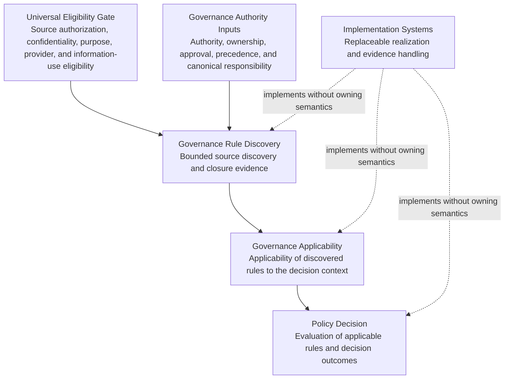
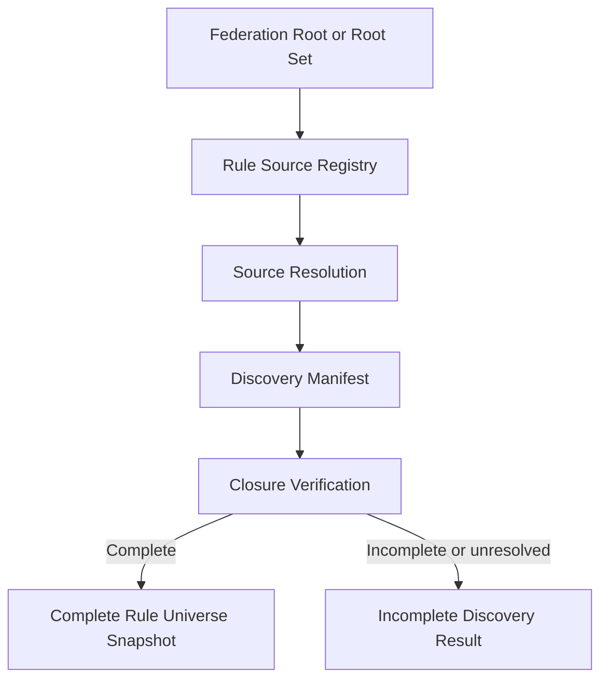
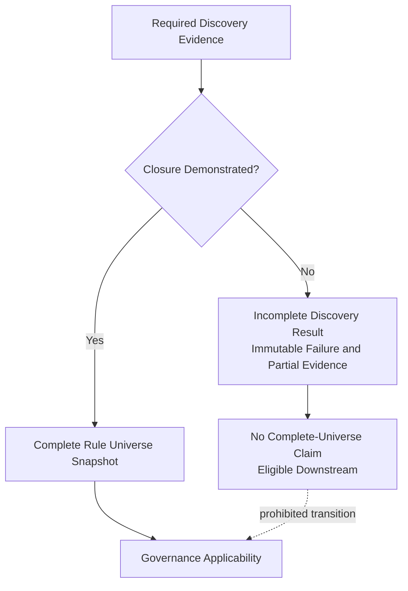

# Governance Rule Discovery Architecture Decision Proposal

## 1. Document Control

| Field | Value |
| --- | --- |
| Title | Governance Rule Discovery Architecture Decision Proposal |
| Document type | Architecture Decision Proposal |
| Status | Draft Architecture Decision Proposal |
| Version | 0.1.1 |
| Date | 2026-07-24 |
| Architecture domain | Governance Rule Discovery |
| Decision owner | Unassigned — requires designation by eligible human governance |
| Review state | Revised — Pending Independent Verification of Review Corrections |
| Approval state | Not approved |
| Effectiveness state | Not effective |
| Normative status | Non-normative |
| Implementation authority | None |
| Contract-defining effect | None |
| Design Freeze effect | None |
| Selected proposal family | Governed Bounded-Closed Federation |

### 1.1 Source Revision Bindings

| Source | Bound revision | Use |
| --- | --- | --- |
| [Foundation Architecture](../FOUNDATION_ARCHITECTURE.md) | Version 0.2.0; Git object `005f1e0a9fca7d4c75b69a013f0d24710348a866` | Foundational authority, canonical-source, confidentiality, fail-closed, history, lifecycle, product-independence, and provider-neutral boundaries |
| [Governance Document Model](../GOVERNANCE_DOCUMENT_MODEL.md) | Git object `a6159918a2fbb7acc3af8927552ec00d2f02b2a7` | Document-class and authority separation |
| [Governance Authority Model Architecture Design Proposal](../proposals/GOVERNANCE_AUTHORITY_MODEL_ADP.md) | Version 0.3.0 Draft; Git object `03a3452c95362837e8c465788c57103678a58ad9` | Non-normative architecture context for decision-scoped authority and domain separation |
| [Canonical Artifact Contract](../contracts/CANONICAL_ARTIFACT_CONTRACT.md) | Version 0.1.0 Draft; Git object `6a921cd40b1ada8c27dae5853f8eae5ef081d7cf` | Canonical identity, revision, lineage, provenance, and derived-representation ownership |
| [Authority and Delegation Contract](../contracts/AUTHORITY_AND_DELEGATION_CONTRACT.md) | Version 0.1.1 Draft; Git object `309b948c76e887ab2c1fc156d648c5027edb3b39` | Authority eligibility, delegation, scope, and non-delegable-boundary ownership |
| [Policy Decision Contract](../contracts/POLICY_DECISION_CONTRACT.md) | Version 0.1.1 Draft; Git object `d2c660f7f7fc6c019fd2b66a542f2ff780d2924b` | Final Policy Decision outcome ownership |
| [Governance Lifecycle Contract](../contracts/GOVERNANCE_LIFECYCLE_CONTRACT.md) | Version 0.1.1 Draft; Git object `d144e88c3504aefec23eb76787cc63644ea7a572` | Approval, effectiveness, adoption, disposition, and temporal lifecycle ownership |
| [Approval Record Contract](../contracts/APPROVAL_RECORD_CONTRACT.md) | Version 0.1.1 Draft; Git object `5f40a3bc330f95b44edbe882722bcd9e6b503c4a` | Approval-evidence ownership and separation from document existence |
| [Design Freeze Contract](../contracts/DESIGN_FREEZE_CONTRACT.md) | Version 0.1.1 Draft; Git object `bea15a91bc628333ecbbb2a7f931255ab3e44cdb` | Design Freeze ownership and separation from architecture proposal status |
| [Governance Rule Discovery Architecture Research Report](../research/GOVERNANCE_RULE_DISCOVERY_ARCHITECTURE_RESEARCH_REPORT.md) | Version 0.1.0; Git object `a4780aed2129ae5e9d2395a534f958a66319dad5` | Architecture research, candidate families, risks, and conceptual evidence |
| [Governance Rule Discovery Research Closure Assessment under ARCD v0.2.1](../governance/GOVERNANCE_RULE_DISCOVERY_RESEARCH_CLOSURE_V2.md) | Version 0.1.0; Git object `4a80d59a6657c1be506961630c96ba5f74caec2a` | Current research-readiness basis and controlled deferrals |
| [Governance Rule Discovery Architecture Options Analysis](GOVERNANCE_RULE_DISCOVERY_ARCHITECTURE_OPTIONS_ANALYSIS.md) | Version 0.1.0; Git object `f1a1cc4b9871b043f024ec665d864b95c670e926` | Comparative analysis and recommended architecture family |

The historical [Governance Rule Discovery Research Closure Decision](../governance/GOVERNANCE_RULE_DISCOVERY_RESEARCH_CLOSURE.md) produced under ARCD v0.1.0 is historical evidence only. It is not the current closure basis and is not amended, overwritten, or reinterpreted by this proposal.

No additional research was performed, and no architecture family beyond the five families in the completed research and AOA was introduced.

### 1.2 Authority and Effect Notice

This document proposes architecture for independent review. It does not:

- approve the proposed architecture;
- make the proposal Effective, Adopted, implemented, or Design Frozen;
- authorize implementation, migration, deployment, execution, or procurement;
- define or amend a contract;
- create a schema, API, registry value, repository layout, workflow, database, or interface;
- create governance authority, approver eligibility, a Product Binding, or product-specific rules;
- modify Foundation or existing contract ownership; or
- make its proposed invariants effective merely because the document exists, is committed, reviewed, or published.

Normative keywords in this proposal describe the behavior that the architecture would require if it were later approved and made effective through independently valid CADP governance. They have no current normative effect.

## 2. Executive Summary

CADP must determine a complete, bounded, attributable, temporally valid, and reproducible set of governance rule sources before downstream applicability evaluation can claim that it has considered the full governed rule universe for a specific decision context.

Search alone cannot prove completeness. A central registry can create a closure root but concentrates ownership. Federation preserves local ownership but cannot independently prove that every federation member was consulted. An operation manifest preserves processing evidence but cannot prove that its input list was complete.

This ADP proposes the **Governed Bounded-Closed Federation** architecture family.

Under the proposal:

- rule ownership may remain distributed across platform, product, repository, component, tenant-bound, restricted, and externally referenced domains;
- Universal Eligibility Gate and Governance Authority results remain distinct upstream inputs whose semantics discovery does not own;
- an independently governed Federation Root or root set bounds the source declarations eligible for a declared discovery context;
- governed source declarations and exact canonical revisions are composed deterministically;
- an operation-bound Discovery Manifest records the discovery activity;
- closure evidence demonstrates whether every closure-relevant source route and membership-changing condition was accounted for;
- a Complete Rule Universe Snapshot exists only when bounded closure is demonstrated;
- missing or unverifiable mandatory evidence produces explicit incompleteness and fails closed; and
- discovery remains separate from applicability, Policy Decision, final governance authority, and implementation.

The selected family is preferred because it combines bounded closure, federated ownership, reproducibility, confidentiality-aware participation, auditability, and governed extensibility. It accepts greater governance and evidence complexity to satisfy those properties.

This proposal does not decide detailed root topology, final artifact classes, approving authorities, contract fields, assurance levels, implementation technology, APIs, schemas, storage, workflow, or final external-obligation interpretation. Those matters remain deferred or out of scope.

## 3. Decision Statement

**Proposed decision:** CADP will use a **Governed Bounded-Closed Federation** as the architecture family for Governance Rule Discovery.

For each declared discovery context, the proposed architecture will:

1. consume independently established Universal Eligibility Gate and Governance Authority results without owning or redefining them;
2. begin from a Federation Root or root set whose eligibility and authority are established outside discovery;
3. bound discovery to governed source declarations reachable through authorized and reproducible relationships;
4. preserve distributed rule ownership and canonical source identity;
5. bind participating sources to exact revisions, scope, provenance, and temporal evidence;
6. compose an operation-bound discovery record deterministically;
7. distinguish demonstrated closure from incomplete or unverifiable discovery;
8. expose a Complete Rule Universe Snapshot only when every closure-relevant route and required evidence condition is satisfied; and
9. provide that Complete Rule Universe Snapshot to downstream Governance Applicability without deciding applicability, policy outcomes, or final governance authority.

This is a proposed architecture decision, not an approved architecture decision.

## 4. Problem Definition

CADP must determine the complete, bounded, attributable, temporally valid, and reproducible set of governance rules eligible for downstream applicability evaluation.

The problem is not simply locating documents. It requires establishing:

- which source domains are permitted to contribute rules for the declared context;
- why those source domains participate;
- whether every closure-relevant source route and membership-changing condition has been resolved;
- which canonical source revisions were used;
- whether source evidence was valid for the evaluation time;
- whether restricted sources were accounted for through eligible paths;
- whether duplicate, conflicting, stale, missing, or unavailable source evidence changes membership;
- whether the same evidence basis can be reconstructed later; and
- whether incompleteness remains visible rather than becoming permission.

A discovered source is not automatically authoritative or eligible for information use. A participating authoritative source is one whose Universal Eligibility Gate results and independently governed authority, identity, scope, lifecycle, effective interval, canonical responsibility, and revision are separately valid for the evaluated context.

A complete rule universe is not every rule that may exist in the world. It is the bounded set of eligible source contents accounted for under an exact, independently governed discovery boundary.

## 5. Decision Scope

This proposal decides the following architecture-level matters:

1. **Governance source discovery boundaries:** discovery occurs within an explicit, context-bound domain rather than an uncontrolled search space.
2. **Federated source participation:** source ownership may remain distributed, while participation is connected through governed relationships.
3. **Authoritative source-of-sources behavior:** discovery begins from an independently eligible Federation Root or root set that identifies governed source routes without creating their underlying authority.
4. **Discovery-universe closure:** completeness is demonstrated against the bounded source graph, not inferred from search success or the number of discovered rules.
5. **Source identity and provenance expectations:** every participating source is canonically attributable and traceable to its origin and discovery evidence.
6. **Temporal and revision binding:** discovery binds exact source revisions and relevant temporal evidence to the declared context.
7. **Incomplete-universe behavior:** missing, inaccessible, invalid, conflicting, or unverifiable mandatory discovery evidence prevents a complete-universe claim.
8. **Reproducibility expectations:** a later eligible reviewer can reconstruct the boundary, source participation, exact revisions, unresolved conditions, and closure basis.
9. **Cross-repository composition principles:** independently governed repository and shared-source boundaries compose only through explicit, revision-bound relationships.
10. **Separation of concerns:** discovery supplies bounded source evidence without deciding rule applicability, final Policy Decision outcomes, or governance authority.
11. **Upstream prerequisite separation:** Universal Eligibility Gate and Governance Authority results are distinct inputs that discovery consumes without owning or redefining their semantics.

## 6. Out of Scope

The proposal does not decide:

- detailed Governance Applicability evaluation;
- policy or rule conflict resolution;
- Policy Decision outcome semantics;
- final governance decision authority;
- implementation technology;
- storage engine;
- API design;
- schema design;
- user interface;
- workflow orchestration;
- repository layout;
- query, indexing, caching, or traversal algorithms;
- final interpretation of external obligations;
- legal or regulatory determinations;
- contract-level field definitions;
- registry values;
- product-specific or tenant-specific rules;
- approval, effectiveness, adoption, migration execution, or Design Freeze; or
- the final resolution of Category B deferrals.

## 7. Architecture Context

### 7.1 Domain Relationships

### 7.2 Dependency Direction

The Universal Eligibility Gate is a distinct upstream dependency. Under the independently retained ownership of Foundation and applicable governance, it determines whether information may participate in the declared operation and purpose. Its results cover source authorization, confidentiality eligibility, purpose eligibility, provider eligibility where applicable, and any other independently established information-use eligibility required for the evaluated context. It does not determine governance authority, ownership, approval, precedence, or canonical responsibility.

Governance Authority is a separate upstream input. It determines authority, ownership, approval, precedence, canonical responsibility, delegation, and related governance semantics where independently assigned. It does not own or replace the Universal Eligibility Gate.

Governance Rule Discovery consumes the exact eligibility and authority results required by its fixed context. It owns neither result, cannot redefine or repair either result, cannot infer eligibility from source presence, and cannot infer authority from registration or discovery. Unresolved required eligibility prevents closure for every source or evidence path that depends on that eligibility.

Governance Rule Discovery identifies and records the eligible discovered corpus and its closure state. Governance Applicability consumes a Complete Rule Universe Snapshot to determine which discovered rules apply to the declared context.

Policy Decision consumes applicable rules and other independently governed inputs. It retains ownership of final provider-neutral outcomes. Discovery does not produce those outcomes.

Implementation systems may realize discovery, applicability, or Policy Decision behavior. They do not own authority, closure meaning, applicability meaning, or decision semantics.

### 7.3 Non-Circular Ownership

The proposed architecture prohibits these ownership cycles:

- a Federation Root cannot establish its own governance authority;
- a Rule Source Registry cannot make its entries authoritative by registration alone;
- a source, registry, resolver, manifest, Complete Rule Universe Snapshot, or Incomplete Discovery Result cannot create its own information-use eligibility;
- Governance Authority cannot substitute for or silently supply a missing Universal Eligibility Gate result;
- a discovered rule cannot add itself or another source to the active boundary without an already eligible relationship;
- a Discovery Manifest cannot prove its own completeness;
- a Complete Rule Universe Snapshot cannot repair invalid source identity or provenance; and
- a downstream applicability or Policy Decision result cannot retroactively validate incomplete discovery.

Root-establishment authority belongs to independently applicable governance and remains a Category B deferral. This proposal does not assign that authority.

## 8. Proposed Architecture

### 8.1 Governed Federation

The proposed family combines a governed discovery root with federated ownership.

Federated source owners retain their independently governed responsibilities. The Federation Root or root set identifies which governed source declarations may participate for a declared context. It references source routes and ownership boundaries; it does not centralize every rule or transfer canonical ownership.

### 8.2 Bounded Discovery Domain

A discovery domain is bounded by the declared decision context and the independently valid source relationships applicable to it.

At architecture level, the boundary includes:

- the Governed Operation or decision subject;
- target and requested scope;
- purpose;
- evaluation time;
- the exact Universal Eligibility Gate results governing source authorization, confidentiality, purpose, provider use where applicable, and other required information use;
- applicable platform and Product Binding baselines;
- Federation Root or root-set revision;
- inheritance, overlay, external-incorporation, legacy, and cross-repository relationships;
- separately resolved Governance Authority inputs governing authority, ownership, approval, precedence, and canonical responsibility; and
- exact source identities and revisions resolved through those relationships.

The future contracts may define how these categories are represented. This ADP defines no fields or wire format.

### 8.3 Federation Root or Root Set

The Federation Root or root set is the independently governed starting boundary for source discovery.

Its architecture responsibility is to identify the governed source declarations and subordinate catalogs eligible for the declared context. Its authority, ownership, lifecycle, approval, scope, temporal validity, and canonical identity must be established outside the discovery result.

This proposal intentionally does not decide whether CADP ultimately uses one global root, independently governed roots, or a composed root set. Every permitted topology must satisfy the same closure, confidentiality, determinism, provenance, and fail-closed invariants.

### 8.4 Registered Source Participation

A source participates through a governed declaration or reference reachable from the valid boundary.

Registration or reference:

- identifies a candidate route for discovery;
- preserves the source owner and canonical source;
- does not approve the source;
- does not make the source Effective;
- does not establish rule applicability; and
- does not create a new authority tier.

### 8.4.1 Source-Route Closure Relevance

Source-route closure relevance is determined for the fixed Decision Context through independently governed evidence, not by registry placement, resolver preference, retrieval success, or a descriptive label.

- A **closure-relevant source route** is any registered, declared, nested, cross-repository, external, inherited, or otherwise governed route capable of adding, removing, narrowing, replacing, or changing source membership for the fixed Decision Context.
- A **conditionally closure-relevant source route** is a route whose membership effect depends on an independently governed condition. The condition and its evidence must be resolved for the fixed Decision Context; while they remain unresolved, the route is closure-relevant and discovery remains incomplete.
- A **route proven non-membership-changing** is excluded from closure only when independently governed, attributable, scope-bound, temporally coherent, and revision-bound evidence demonstrates that it cannot change the Rule Corpus for the fixed Decision Context.

Labels such as `optional`, `advisory`, `supplemental`, or `informational` do not by themselves remove a route from closure relevance. A registry, resolver, declaration, manifest, or source cannot self-declare a route irrelevant without the required independent evidence.

### 8.5 Source Identity and Provenance

Every participating source must be attributable to a stable canonical identity and exact revision under existing Canonical Artifact governance or an independently eligible external-source relationship.

Provenance connects the source, declaration, resolver activity, owning scope, eligibility results, authority inputs, revision evidence, temporal basis, and operation-bound discovery record. Provenance is evidence; it does not grant eligibility or authority.

### 8.6 Revision and Temporal Binding

An evaluation uses a fixed discovery boundary and exact source revisions.

Source or boundary changes create a new prospective evidence state. They do not silently alter the basis of an open or completed evaluation. Applicable future governance determines whether a change affects future operations, requires reevaluation, or relates to a historical interval.

### 8.7 Discovery Closure

Closure is demonstrated only when:

- every required Universal Eligibility Gate result is valid for the information and evidence path that depends on it;
- the eligible root or root set is resolved;
- every closure-relevant route, including every conditionally closure-relevant route, has a resolved membership outcome;
- every excluded route has independently governed evidence proving that it cannot change source membership for the fixed context;
- every participating source has valid identity, revision, scope, and provenance evidence;
- inheritance, incorporation, legacy, and cross-repository relationships are resolved;
- duplicate identities and competing revisions are either normalized or explicitly unresolved;
- restricted sources are accounted for through eligible evidence paths;
- no discovery conflict could change source membership; and
- the operation-bound evidence is reproducible.

Closure is bounded to the declared context. It is not a claim of global legal, regulatory, contractual, or factual completeness.

### 8.8 Deterministic Composition

Given the same declared context, Universal Eligibility Gate results, Governance Authority inputs, eligible boundary revision, exact source revisions, temporal evidence, and governed relationships, the architecture must produce the same source-membership result and the same discovery-closure classification.

Provider-specific traversal, storage, or evaluation mechanisms may differ. They cannot change the architecture’s membership, closure, provenance, or failure semantics.

### 8.9 Fail-Closed Behavior

When mandatory eligibility, identity, authority, source, route-relevance, relationship, revision, temporal, confidentiality, purpose, provider, or provenance evidence is missing, invalid, unavailable, conflicting, stale, or unverifiable, the architecture records explicit incomplete discovery.

Incomplete discovery cannot be represented as a complete Applicable Rule Universe and cannot be repaired through inference, model confidence, search success, prior outcomes, elapsed time, or downstream evaluation.

## 9. Architectural Components

These components are conceptual architecture responsibilities. They are not implementation classes, services, APIs, database tables, schemas, deployment units, or required repository folders.

| Conceptual component | Architecture-level responsibility | Explicit ownership boundary |
| --- | --- | --- |
| Federation Root | Establish the governed starting boundary or participate in a composed root set for the declared context. | Does not create its own authority or approve source contents. |
| Rule Source Registry | Identify governed source declarations or references within a bounded ownership scope. | Registration does not create authority, applicability, approval, or canonical ownership. |
| Rule Source Descriptor | Express the architecture-level identity, ownership, scope, revision, temporal, relationship, and provenance categories needed to resolve a source. | Does not define a contract shape or field format in this ADP. |
| Source Resolver | Resolve a declared source to canonical evidence admitted by the required Universal Eligibility Gate results for the fixed context. | Does not decide information-use eligibility, governance authority, route relevance by itself, applicability, conflict precedence, or policy outcomes. |
| Rule Corpus | Represent the rule-containing content resolved from an eligible source. | Content remains owned by its canonical source and domain governance. |
| Discovery Boundary | Bind the declared context to eligibility results, authority inputs, eligible roots, route-relevance evidence, relationships, scope, time, and source constraints. | Cannot be narrowed because a closure-relevant source is inconvenient, repeatedly unavailable, or descriptively labeled optional. |
| Discovery Manifest | Record the source routes considered, route-relevance determinations, resolved sources, exact revisions, exclusions, eligibility results, and unresolved conditions for one discovery attempt. | Records processing evidence but cannot prove its own completeness. |
| Complete Rule Universe Snapshot | Preserve the bounded Rule Corpus, manifest, closure evidence, provenance, and exact revisions only after complete and valid closure is demonstrated. | Is the only discovery artifact eligible to proceed downstream as a complete-universe input; it does not decide which rules apply or produce Policy Decision outcomes. |
| Incomplete Discovery Result | Preserve the resolved corpus if any, unresolved routes, failures, provenance gathered, eligibility evidence, revision and temporal bindings, closure status, and reasons completeness was not established. | Is immutable diagnostic, audit, remediation, review, and reassessment evidence; it cannot be represented or consumed as a complete Rule Universe Snapshot. |
| Closure Evidence | Support the claim that every closure-relevant route and membership-changing condition in the bounded domain was accounted for. | Does not create authority, approval, or legal completeness. |
| Provenance Record | Preserve attributable lineage among roots, declarations, source evidence, resolution activities, the Complete Rule Universe Snapshot, or the Incomplete Discovery Result. | Evidence remains non-authorizing. |
| Temporal Binding | Relate boundary, source, lifecycle, and operation evidence to the relevant evaluation and effective times. | Does not redefine lifecycle or supersession semantics. |
| Discovery Failure Evidence | Preserve individual missing, unavailable, invalid, conflicting, stale, adversarial, or unverifiable discovery conditions within an Incomplete Discovery Result. | Cannot be treated as a successful or permissive completeness result. |

## 10. Source-of-Sources Model

### 10.1 Root Establishment

Roots are established and revised only through independently applicable governance. The discovery architecture consumes separately established Universal Eligibility Gate results and Governance Authority, approval, lifecycle, scope, revision, and temporal evidence without redefining those inputs.

This ADP does not define:

- who may approve a root;
- which human decisions are non-delegable;
- whether one or multiple roots are ultimately adopted; or
- which artifact class carries the root.

### 10.2 Source Registration and Reference

A valid root identifies governed source declarations or bounded subordinate catalogs. A declaration may reference a canonical rule source, a locally owned source catalog, an inherited source set, an external-incorporation relationship, or another bounded source route already eligible under the root. Presence in the root establishes a governed route to evaluate; it does not by itself establish information-use eligibility, authority, applicability, or non-membership-changing status.

Reference membership is explicit and revision-bound. File proximity, repository naming, code imports, hyperlinks, search ranking, conversational mention, or model memory does not create membership.

### 10.3 Bounded Nested Sources

Nested discovery may proceed only through relationships authorized by the fixed boundary.

Every nested relationship must preserve:

- attributable source ownership;
- canonical identity;
- exact revision;
- scope;
- temporal eligibility;
- source authorization;
- confidentiality eligibility and constraints;
- purpose eligibility;
- provider eligibility where applicable;
- bounded traversal; and
- visible failure evidence.

An unresolved or unbounded cycle prevents closure. The exact cycle policy remains deferred.

### 10.4 Cross-Repository Participation

Cross-repository sources participate through explicit, versioned dependencies or composition relationships. Each repository retains its own canonical artifacts and local governance. One repository’s completeness cannot repair another repository’s incomplete source boundary.

### 10.5 Duplicate Normalization

Duplicate references are normalized against canonical identity, lineage, and exact revision. Normalization preserves every discovery path and does not silently discard provenance.

If candidate references cannot be reconciled to one canonical identity or compatible revisions, the discovery result records a conflict and remains incomplete where membership could change.

### 10.6 Unavailable Mandatory Sources

An unavailable closure-relevant source remains part of the bounded discovery domain. Unavailability cannot be interpreted as absence, irrelevance, non-membership-changing status, or permission to omit the route.

Unless independently applicable governance supplies an eligible and verifiable alternative evidence path, the closure result is incomplete.

### 10.7 Unregistered Sources

An unregistered or unreferenced source does not automatically join an active discovery boundary.

If evidence indicates that the source may be mandatory for the declared context, the architecture records a governance or discovery gap and cannot claim complete closure until the source’s participation or exclusion is resolved through independently applicable governance.

An unknown source is not automatically accepted, ignored, or made authoritative.

## 11. Rule Universe Lifecycle

The lifecycle below describes conceptual architecture behavior. It is not an implementation workflow, orchestration design, state-machine schema, or prescribed execution sequence. Every discovery attempt produces immutable discovery evidence, but only demonstrated closure produces a Complete Rule Universe Snapshot.

1. **Establish eligible discovery context:** bind the exact Governed Operation or decision context, target, scope, purpose, time, governing baselines, and required Universal Eligibility Gate results. Information that has not passed the applicable gate cannot be used as source content, authority evidence, Rule Corpus input, or downstream decision input. The attributable eligibility result or failure may be retained only as protected evidence under the independently applicable eligibility and confidentiality controls.
2. **Resolve Federation Root:** obtain the exact root or root-set revision using separately valid eligibility and Governance Authority inputs.
3. **Enumerate and classify source routes:** identify every governed source route reachable from the fixed boundary and resolve whether it is closure-relevant, conditionally closure-relevant, or independently proven non-membership-changing.
4. **Resolve source revisions:** obtain exact canonical or independently eligible external source revisions.
5. **Validate source identity and eligibility:** confirm identity, scope, lineage, temporal state, provenance, source authorization, confidentiality, purpose, provider eligibility where applicable, and any other required information-use eligibility without redefining those upstream semantics.
6. **Collect candidate rule artifacts:** assemble the rule-containing corpus without deciding rule applicability.
7. **Produce Discovery Manifest:** record routes, results, revisions, exclusions, duplicates, conflicts, and failures.
8. **Verify closure:** determine whether every closure-relevant route and membership-changing condition is resolved and every exclusion has valid independent evidence.
9. **Produce a Complete Rule Universe Snapshot on success:** bind the complete corpus, boundary, manifest, closure evidence, provenance, exact revisions, and temporal basis.
10. **Produce an Incomplete Discovery Result on failure or uncertainty:** bind the resolved corpus if any, unresolved routes, failures, provenance gathered, revisions, temporal basis, and reasons closure was not established.
11. **Apply the downstream boundary:** provide only a Complete Rule Universe Snapshot as a complete-universe input to Governance Applicability. An Incomplete Discovery Result is restricted to eligible diagnostics, audit, remediation, review, and later reassessment.

## 12. Closure and Completeness Model

### 12.1 Closure Properties

For the proposed architecture, a discovery universe is:

- **bounded** when its permitted source routes are fixed by the declared context and eligible root revision;
- **closed for the declared context** when every closure-relevant and conditionally closure-relevant route has a resolved membership outcome and every excluded route is proven non-membership-changing through independently governed evidence;
- **attributable** when root, declaration, source, resolution, and evidence responsibilities can be traced to eligible identities;
- **temporally bound** when evaluation and relevant source effective times are explicit and coherent;
- **revision bound** when roots, declarations, source contents, and relationships are fixed to exact revisions;
- **reproducible** when an eligible reviewer can reconstruct the membership result and closure basis from retained evidence; and
- **independently verifiable** when the closure claim does not depend solely on the manifest, source owner, resolver, or claimant asserting its own correctness.

The exact assurance model for independent verification remains deferred.

### 12.2 Discovery Conditions

| Condition | Architecture meaning | Downstream consequence |
| --- | --- | --- |
| Complete and valid | Every closure-relevant route and membership-changing condition in the bounded domain is resolved with valid evidence, and every excluded route is proven non-membership-changing. | A Complete Rule Universe Snapshot may be provided to Governance Applicability. |
| Incomplete | At least one required eligibility result, closure-relevant route, conditional route, exclusion, identity, revision, relationship, temporal state, scope, or required evidence remains unresolved. | Produce an immutable Incomplete Discovery Result; no complete snapshot or complete-universe claim may be provided downstream. |
| Conflicting source declarations | Declarations disagree about source identity, membership, scope, revision, ownership, or relationship. | Preserve the conflict; closure remains incomplete when membership could change. |
| Unavailable closure-relevant source, including a mandatory source | A required source cannot be resolved through an eligible evidence path. | Preserve the route and failure; do not omit it or claim completeness. |
| Invalid source identity | Canonical identity or lineage is invalid, ambiguous, or conflicts with another claim. | Do not include the source as resolved; record failure and prevent closure where mandatory. |
| Unverifiable provenance | Source origin, resolution activity, revision evidence, or attributable lineage cannot be verified. | Treat the source route as unresolved where provenance is mandatory. |
| Proven non-membership-changing route | Independently governed, attributable, scope-bound, temporally coherent, and revision-bound evidence demonstrates that the route cannot change the corpus for the fixed context. | Preserve the route and exclusion evidence without treating a descriptive label or resolver assertion as proof. |

These are proposed architecture conditions. They do not define contract enums, lifecycle states, database values, or Policy Decision outcomes.

## 13. Fail-Closed Semantics

### 13.1 Proposed Invariant

No downstream Governance Applicability or Policy Decision activity may claim that it consumed a complete Applicable Rule Universe when discovery closure has not been demonstrated for every closure-relevant route, required eligibility result, and membership-changing condition for the exact decision context.

Fail-closed discovery means:

- no permissive completeness claim;
- no silent source omission;
- no substitution of partial discovery for complete discovery;
- no inference that an inaccessible source contains no applicable rule;
- no inference that repeated or prolonged failure makes a route optional or non-membership-changing;
- no automatic acceptance of unknown or unregistered sources;
- no use of search success, model confidence, prior decision success, or elapsed time as closure evidence; and
- no downstream repair of an invalid discovery boundary.

This ADP does not define the final Policy Decision response to incomplete discovery. It requires that an incomplete attempt produce an immutable Incomplete Discovery Result, remain explicit, and never be represented as a Complete Rule Universe Snapshot. An Incomplete Discovery Result may support eligible diagnostics, audit, remediation, review, and later reassessment only; those uses remain subject to independently applicable eligibility and confidentiality controls.

### 13.2 Failure Boundary

## 14. Separation of Concerns

| Architecture domain | Responsibility | Must not own through this proposal |
| --- | --- | --- |
| Universal Eligibility Gate | Determine source authorization, confidentiality eligibility, purpose eligibility, provider eligibility where applicable, and other independently established information-use eligibility before information participates in discovery. | Governance authority, source ownership, approval, precedence, canonical responsibility, discovery completeness, or Policy Decision outcomes. |
| Governance Authority | Determine authority, ownership, precedence, approval, canonical responsibility, delegation, and non-delegable boundaries where assigned by independently applicable governance. | Universal Eligibility Gate semantics, discovery completeness, rule applicability, or Policy Decision outcomes merely because it establishes a root. |
| Governance Rule Discovery | Determine the eligible discovered rule corpus, operation-bound closure evidence, and explicit incompleteness for the bounded domain. | Underlying authority, rule applicability, normative conflict resolution, or final decision outcomes. |
| Governance Applicability | Determine which rules in a Complete Rule Universe Snapshot apply to the exact decision context. | Source-universe completeness, underlying authority creation, or final Policy Decision ownership. |
| Policy Decision | Evaluate applicable rules and other independently governed inputs and produce provider-neutral decision outcomes. | Retroactive validation of incomplete discovery or silent expansion of the source boundary. |
| Implementation systems | Realize approved architecture and retain evidence through replaceable technology. | Architecture semantics, governance authority, approval, or contract ownership. |

Discovery consumes Universal Eligibility Gate and Governance Authority results without redefining either domain. It may record duplicate rules, overlapping scopes, declaration conflicts, and competing revisions. Recording those conditions does not resolve normative precedence.

## 15. Architectural Invariants

If approved and made effective, the proposed architecture would require the following invariants:

1. **Bounded discovery:** every completeness claim is bound to an exact declared context and eligible Federation Root or root set.
2. **Attributable sources:** every participating source and source relationship has attributable identity and ownership evidence.
3. **Immutable revision binding:** roots, declarations, relationships, source contents, Complete Rule Universe Snapshots, and Incomplete Discovery Results bind to exact immutable revisions.
4. **Deterministic composition:** the same eligible inputs produce the same source-membership and closure result.
5. **Explicit incompleteness:** unresolved required discovery evidence remains visible as incomplete.
6. **No silent omission:** an inaccessible, confidential, unavailable, stale, or inconvenient closure-relevant source cannot be dropped from the boundary.
7. **No discovery-to-applicability collapse:** discovery cannot decide that a discovered rule applies.
8. **No discovery-to-Policy-Decision collapse:** discovery cannot produce or reinterpret final Policy Decision outcomes.
9. **No self-authorizing source:** roots, registries, declarations, manifests, Complete Rule Universe Snapshots, Incomplete Discovery Results, and discovered sources cannot create their own governance authority.
10. **Historical reproducibility:** retained evidence permits reconstruction of the boundary, sources, revisions, time, failures, and closure claim used for a historical decision.
11. **Fail-closed closure failure:** incomplete or unverifiable discovery cannot produce a complete-universe claim.
12. **Independently verifiable evidence:** closure cannot rely solely on the claimant’s unsupported assertion.
13. **Canonical ownership preservation:** discovery references or derives from canonical sources without silently transferring their ownership.
14. **Temporal stability:** an open attempt, Complete Rule Universe Snapshot, or Incomplete Discovery Result is not silently mutated by later source or boundary changes.
15. **Provider neutrality:** no model, database, policy engine, repository host, workflow product, or storage technology owns discovery semantics.
16. **Universal eligibility separation:** source authorization, confidentiality, purpose, provider, and other required information-use eligibility are independently resolved before dependent information enters discovery; discovery does not own or infer those semantics.
17. **Closure-relevant route coverage:** every route capable of changing membership remains closure-relevant until independently governed evidence proves otherwise.
18. **Complete-versus-incomplete artifact separation:** only demonstrated closure produces a Complete Rule Universe Snapshot; every unsuccessful or unresolved attempt produces an immutable Incomplete Discovery Result.
19. **Single semantic ownership boundary:** future contract decomposition may distribute representation or validation responsibilities but cannot fragment or duplicate canonical Governance Rule Discovery semantics.

These are proposed ADP invariants. They are not effective requirements until the architecture is independently approved and made effective.

## 16. Cross-Repository Composition

The proposed family supports composition across independently governed repositories without requiring one physical repository or centralized rule corpus.

### 16.1 Source Classes

- **Repository-local rules:** participate only through an eligible repository source declaration bound to stable repository identity, scope, and exact revision.
- **Platform-wide rules:** originate from the eligible CADP platform boundary and retain platform ownership.
- **Product-bound rules:** participate through an explicit, versioned Product Binding or successor governed relationship; repository naming or code import does not imply adoption.
- **Tenant-bound rules where applicable:** participate only through an explicitly governed tenant or customer scope relationship; they do not become universal product or platform rules.
- **Externally referenced obligations:** participate through attributable, scope-bound incorporation relationships without transferring legal interpretation authority to discovery.
- **Versioned inter-repository dependencies:** identify every participating repository, shared source, effective interval, and cross-scope relationship needed for the common decision context.

### 16.2 Composition Principles

1. One common decision-context identity binds the combined evaluation.
2. Every repository and shared boundary retains exact revision evidence.
3. Local completeness is necessary but not sufficient for combined completeness.
4. Shared platform, product, external, and coordinating sources remain explicit.
5. Cross-scope inheritance and precedence evidence is preserved but not decided by discovery.
6. Temporal evidence must be coherent for the declared evaluation.
7. One incomplete participating boundary makes the combined discovery result incomplete.
8. No repository’s complete local result can repair another repository’s missing closure-relevant source.

This ADP defines no repository layout, synchronization protocol, transaction model, or storage topology.

## 17. External Obligation Boundary

External obligations may exist independently of CADP recognition. Laws, regulations, licenses, contracts, customer commitments, and similar sources do not obtain their underlying force from CADP registration.

The proposed architecture distinguishes:

- **CADP-governed discovery completeness:** every external source route that independently applicable CADP governance has connected to the declared context is accounted for; and
- **legal or regulatory completeness:** a determination that all obligations binding in the external world have been identified and interpreted.

This ADP addresses only the first.

External references in the discovery boundary must be attributable to an eligible incorporation relationship, declared scope, temporal basis, and source or controlled source class. The discovery evidence preserves that relationship without claiming to interpret or exhaust the external legal universe.

Where an externally mandated source has been declared but its identity, revision, scope, retrieval, authority relationship, or eligible evaluation path is unresolved, discovery fails closed and cannot claim complete CADP-governed closure.

This proposal does not decide:

- which obligations require legal or specialist review;
- whether a particular obligation applies;
- whether CADP has found every obligation that exists independently of its governed incorporation relationships; or
- the legal consequence of omission or later discovery.

## 18. Temporal and Revision Semantics

### 18.1 Effective Date and Source Revision

Discovery binds exact source revisions and the temporal evidence independently governing their eligibility. Artifact creation, approval, effectiveness, adoption, supersession, discovery, evaluation, and decision times remain distinct.

### 18.2 Supersession

Supersession does not automatically remove a predecessor from historical or legacy discovery. A predecessor participates only where independently applicable lifecycle and legacy evidence preserves its relevance for the declared context and time.

Discovery records the revisions and lineage it consumed. It does not redefine supersession.

### 18.3 Historical Reconstruction

A historical reconstruction retains the original:

- root or root-set revision;
- source declarations and relationships;
- canonical source revisions;
- scope and decision context;
- evaluation and applicable effective times;
- exclusions and failures;
- closure evidence; and
- provenance.

Later evidence does not overwrite that record.

### 18.4 Retroactive Obligation Uncertainty

Later discovery of an obligation may create uncertainty about an earlier completeness claim or a need for current reassessment. The original evidence remains immutable.

This ADP proposes the separation between historical evidence and later assessment. It does not decide the exact temporal rule, legal effect, or reevaluation obligation for retroactively relevant sources.

### 18.5 Decision-Time Snapshot Binding

A Complete Rule Universe Snapshot binds the discovery evidence used for a specific downstream evaluation. An Incomplete Discovery Result binds the unsuccessful attempt and its evidence without becoming a complete-universe input. Later changes create a new prospective snapshot, result, or independently governed reassessment; they do not silently mutate the decision-time evidence.

## 19. Conflict and Duplication Boundary

Discovery may identify:

- duplicate rule references;
- aliases, mirrors, translations, and derived representations;
- overlapping source scopes;
- conflicting source declarations;
- competing canonical claims;
- incompatible revisions;
- inconsistent temporal evidence; and
- rules whose contents appear incompatible.

Discovery records these conditions with attributable source and provenance evidence.

Discovery may normalize duplicate references only when canonical identity, lineage, and revision evidence support the equivalence. Every discovery path remains traceable.

Discovery does not resolve normative precedence or determine which conflicting rule controls unless that behavior is assigned by another approved architecture domain and supplied as an independently governed input.

A conflict about source membership, identity, revision, or relationship prevents closure where its resolution could change the discovered corpus. A conflict among rules after complete discovery remains a downstream applicability or Policy Decision concern.

## 20. Category B Deferrals

All 19 Category B items from the current closure assessment remain explicitly deferred. This ADP contains their uncertainty but does not silently resolve them or convert them into effective requirements.

| ID | Deferred question | Containment in this ADP | Architectural assumption | Future owner or architecture domain | Reopening or mandatory-resolution trigger | Why the proposal remains valid |
| --- | --- | --- | --- | --- | --- | --- |
| GRD-01 | Artifact class governing the source-of-sources | Treat the root as a conceptual responsibility only. | Artifact class cannot create authority. | Governance Document Model and future artifact-governance decision. | Before normative ownership or artifact relationships are approved. | The family is independent of packaging. |
| GRD-02 | Higher authority eligible to establish or revise the boundary | Require independently valid authority and fail closed when absent. | No root may authorize itself. | Governance Authority architecture and applicable human governance. | Before any root is adopted or changed; research reopens only upon evidence of a new family-level dependency. | Authority assignment can vary without changing bounded federation. |
| GRD-03 | One global root or independently governed roots | Permit a Federation Root or root set subject to identical closure invariants. | Every root and composition edge is explicit and eligible. | Governance Rule Discovery architecture decision process. | Before root topology is approved. | The proposed family supports both topologies. |
| GRD-04 | Trust evidence for negative source declarations | Unsupported negative evidence remains unresolved and incomplete. | Attribution, scope, time, and integrity are necessary but assurance detail is deferred. | Closure Evidence and assurance architecture. | Before negative declarations can support a complete claim. | Fail-closed containment prevents false completeness. |
| GRD-05 | Acyclic relationships and harmless bounded cycles | Require bounded, resolvable traversal; unresolved cycles prevent closure. | Composition must terminate deterministically. | Rule Discovery graph-composition architecture and future contract domain. | Before relationship semantics are made normative. | Exact cycle rules refine rather than replace the family. |
| GRD-06 | Restricted sources not disclosed to the requester | Require an eligible non-disclosing evidence path or remain incomplete. | Confidentiality does not permit silent omission. | Security, confidentiality, provenance, and closure-evidence domains. | Before restricted-source closure evidence is approved. | The federation preserves restricted ownership and fail-closed participation. |
| GRD-07 | External-incorporation decisions requiring legal or specialist review | Treat missing required eligibility as unresolved. | Specialist eligibility is independently governed. | External-obligation domain governance. | Before responsibility for external-incorporation decisions is approved. | Review allocation does not change the architecture family. |
| GRD-08 | Jurisdiction, customer, contract, and tenant scope expression | Use conceptual scope-bound incorporation; do not define detailed semantics. | External references never become universal by registration. | External-obligation, Product Binding, and tenant-scope architecture domains. | Before external-scope relationships are made normative. | Explicit unresolved scope fails closed. |
| GRD-09 | Later-discovered historically effective obligations | Preserve original snapshots and separate later reassessment. | Later discovery cannot rewrite history. | Temporal, lifecycle, and external-obligation architecture domains. | When evidence shows the proposed temporal separation cannot contain a mandatory obligation; exact policy required before adoption. | The snapshot and history model remains valid across reevaluation policies. |
| GRD-10 | Alias, mirror, translation, and derived-source reconciliation | Normalize only under canonical identity and lineage evidence; otherwise record conflict. | Canonical sources remain controlling. | Canonical Artifact and Provenance architecture domains. | Before identity-reconciliation behavior is made normative. | Identity variation does not change bounded federation. |
| GRD-11 | Conflict evidence allocation | Preserve separate discovery, applicability, and Policy Decision records. | Discovery owns membership conflicts, not final normative precedence. | Rule Discovery, Governance Applicability, and Policy Decision architecture domains. | Before output ownership and domain handoffs are approved. | The separation invariant contains allocation uncertainty. |
| GRD-12 | Exact scope relationships across governance layers | Require explicit versioned relationships; unresolved composition is incomplete. | Scope cannot be inferred from location or naming. | Product Binding and cross-scope composition architecture. | Before permitted relationship types are approved. | Relationship vocabulary refines the family. |
| GRD-13 | Minimum evidence for local completeness | A local source set without sufficient closure evidence remains incomplete. | Enumeration alone does not prove local completeness. | Closure Evidence and future applicable contract domain. | Before local completeness can contribute to a combined complete claim. | Global closure cannot become permissive while the threshold is deferred. |
| GRD-14 | Self-issued negative declarations or independent verification | Require applicable assurance eligibility; unresolved independence prevents closure. | A declaration cannot be its sole unsupported proof. | Governance Authority, review, and assurance architecture domains. | Before protected-scope assurance rules are approved. | Assurance variants fit the same closure family. |
| GRD-15 | Emergency source incorporation | Preserve active snapshots; treat emergency change and reevaluation separately. | Urgency cannot mutate an active boundary or create standing authority. | Emergency governance, delegated variance, and temporal architecture domains. | Before any emergency discovery path is approved. | Prospective change preserves the family’s temporal invariant. |
| GRD-17 | Legacy decisions without reconstructable boundaries | Preserve missing evidence explicitly and keep current assessment separate. | Modern evidence cannot be fabricated retroactively. | Migration and historical-assessment architecture. | Before legacy assessment classifications or migration rules are approved. | Unknown historical closure does not invalidate prospective architecture. |
| GRD-18 | Fundamental non-delegable human decisions | Consume existing authority rules and fail closed on missing eligibility. | Boundary-changing operations require independently valid authority. | Authority and Delegation governance. | Before root and source-boundary operations receive authority assignments. | Delegability policy does not change discovery composition. |
| GRD-19 | Registry topology and granularity | Keep registries conceptual and subordinate to canonical source authority. | Registration and technical placement never create authority. | Registry, derived-representation, and source-of-truth architecture domains. | Before registry responsibilities or source-of-truth relationships are approved. | Central, federated, and hybrid representations can realize the family. |
| GRD-20 | Cross-repository snapshot consistency mechanism | Require exact revisions, common context identity, coherent time, and reproducibility without selecting a mechanism. | Incompatible evidence produces incomplete composition. | Cross-repository, temporal, and provenance architecture domains. | Before a consistency or attestation model is approved. | Multiple mechanisms can satisfy the same invariant. |

### 20.1 Deferral Boundary

For every Category B item:

- the assumption and containment remain required inputs to review;
- a future decision may specialize the proposal only while preserving the proposed invariants;
- a mandatory-resolution trigger does not itself reopen research;
- reopening requires new attributable evidence, probable material architectural impact, and satisfaction of the ARCD Category A burden of proof; and
- this proposal does not approve the named future owner, contract, or control.

## 21. Category C Items

### 21.1 GRD-16 — Cache Invalidation Detail

Caching is optional and outside the current Decision Boundary. The proposed architecture remains correct by requiring fresh discovery unless separately approved cache-equivalence and invalidation semantics later exist.

This ADP defines no cache.

### 21.2 GRD-21 — Formal Comparative Weighting

Formal numeric or weighted comparison may support future analysis presentation, but it does not change the represented architecture families, failure modes, or the proposal’s family-level rationale.

This ADP relies on the completed qualitative AOA and defines no weighting framework.

## 22. Alternatives Considered

The AOA evaluates five architecture families:

| Family | Current-scope disposition | Concise rationale |
| --- | --- | --- |
| Open Discovery | Not proposed as the primary family | Supports exploration and gap detection but cannot prove bounded completeness or reproducible omission evidence. |
| Central Authoritative Rule Registry | Not proposed as the primary family | Provides a simple closure root but centralizes independently governed product, repository, restricted, and external-source responsibilities. |
| Federated Rule Registries | Not proposed alone | Preserves local ownership and scales, but cannot identify the complete federation membership without an additional governed root. |
| Operation-Bound Rule Manifest | Not proposed alone | Preserves exact processing evidence but cannot prove that the manifest’s input list was complete. |
| Governed Bounded-Closed Federation | Proposed | Combines a bounded root, federated ownership, operation evidence, reproducibility, fail-closed closure, auditability, and governed extensibility. |

The non-proposed families remain valid within bounded roles:

- Open Discovery may identify possible governance gaps.
- Central registries may serve controlled catalogs or derived inspection.
- Federated registries may remain scope-owned source collections.
- Operation manifests may serve as operation-bound closure and audit evidence.

The proposal incorporates their useful properties without declaring those patterns universally invalid.

## 23. Consequences

### 23.1 Positive Consequences

- A completeness claim becomes bounded and evidence-based.
- Rule ownership can remain distributed.
- Missing closure-relevant sources remain visible.
- Discovery becomes reproducible across providers and evaluators.
- Restricted source contents need not be centralized.
- Cross-repository composition can preserve local ownership and exact revisions.
- Historical decisions can retain their original evidence basis.
- Applicability and Policy Decision remain independent downstream domains.
- New source domains can be added prospectively through governed relationships.

### 23.2 Negative Consequences

- The architecture introduces more governance concepts than open search or a single manifest.
- Root and source declarations require continued maintenance.
- Federation relationships can become complex.
- Closure evidence requires attributable provenance and exact revisions.
- Confidentiality-separated and cross-repository composition requires additional assurance.
- Incomplete source evidence blocks a complete-universe claim even when discovered rules appear sufficient.
- Deferred authority, topology, evidence, and temporal questions must be resolved before adoption.

### 23.3 Operational Consequences

Future operations would need to:

- maintain eligible root and source relationships;
- preserve exact source and boundary revisions;
- retain Discovery Manifests, Complete Rule Universe Snapshots, Incomplete Discovery Results, provenance, and failure evidence;
- expose stale, unavailable, conflicting, or incomplete source conditions;
- reevaluate after governed boundary changes when independently required; and
- prevent partial discovery from being presented as complete.

These are architecture consequences, not an implementation workflow.

### 23.4 Governance Consequences

Future governance must identify ownership and authority for roots, declarations, closure evidence, temporal bindings, and migration. Existing eligibility, authority, approval, lifecycle, Canonical Artifact, Product Binding, confidentiality, and Policy Decision domains retain their current ownership.

The proposal creates no authority tier. Registries, manifests, snapshots, incomplete results, provenance, and closure evidence remain subordinate to independently applicable governance and one coherent Governance Rule Discovery semantic ownership boundary.

### 23.5 Migration Consequences

Migration would require a separately reviewed strategy to inventory candidate sources without declaring premature completeness, establish prospective boundaries, preserve historical evidence, identify missing ownership, and avoid retroactive fabrication of closure records.

This proposal does not authorize or design that migration.

### 23.6 Future Architecture Consequences

The proposed family creates future architecture work for governance ownership, applicability boundaries, contract domains, validation, security, migration, and independent review.

It also provides a stable family-level boundary so those later decisions can specialize the architecture without reopening broad family research unless new Category A evidence emerges.

### 23.7 Explicit Complexity

| Concept | Complexity introduced | Reason it exists |
| --- | --- | --- |
| Registries | Membership, ownership, revision, and staleness governance | Preserve federated discovery routes without transferring source authority |
| Manifests | Per-context recording of traversal, exact revisions, exclusions, and failures | Make discovery activity attributable and reproducible |
| Provenance | Lineage across roots, declarations, sources, activities, complete snapshots, and incomplete results | Distinguish evidence from unsupported claims |
| Complete snapshots and incomplete results | Immutable, explicitly classified binding of successful or unsuccessful discovery evidence | Prevent later changes from mutating decision-time inputs and prevent incomplete evidence from being presented as complete |
| Closure evidence | Demonstration that every closure-relevant bounded route and membership-changing condition was accounted for | Distinguish complete discovery from complete processing of an arbitrary list |
| Federation governance | Explicit composition across independently governed scopes | Preserve distributed ownership while supporting combined closure |

## 24. Risks and Mitigations

| Risk | Architecture consequence | Proposed mitigation boundary |
| --- | --- | --- |
| Stale source registry | A newly governed or changed source may be omitted. | Bind exact registry revisions, require freshness evidence where applicable, and treat unresolved staleness as incomplete. |
| Missing closure-relevant source | A Complete Rule Universe Snapshot could omit a governing Rule Corpus. | Preserve the route as unresolved and prohibit a complete-universe claim. |
| Unavailable repository | A participating source cannot be resolved. | Retain closure relevance, use only independently eligible alternative evidence, and otherwise remain incomplete. |
| Intentional, persistent, or adversarial mandatory-source unavailability | Fail-closed discovery can create an availability or denial-of-service consequence for every operation whose bounded universe depends on the source. | Safety takes precedence over an unsupported completeness claim. Preserve the route and repeated failure explicitly; elapsed time, repetition, or administrative override cannot make it optional or bypass closure. A continuity or alternative-evidence path requires independently governed, attributable, revision-bound evidence and must satisfy the same eligibility, provenance, scope, temporal, and closure requirements. Detailed resilience, operational, contract, and implementation mechanisms remain future work unless they would change an architecture invariant. |
| Forged or ambiguous provenance | Source origin or resolution evidence cannot be trusted. | Require independently verifiable lineage and fail closure where mandatory provenance is invalid. |
| Source duplication | Rules may be counted twice or divergent copies may compete. | Normalize through canonical identity and lineage; preserve all paths; record unresolved identity conflicts. |
| Revision drift | Sources may change during evaluation or historical replay. | Fix exact revisions and decision-time snapshots; treat changes prospectively. |
| Unbounded federation | Recursive discovery may not terminate or may silently expand. | Traverse only governed edges from the fixed boundary; unresolved or unbounded cycles prevent closure. |
| Accidental legal-completeness claim | CADP-governed closure may be mistaken for complete legal discovery. | State the external-obligation limitation in manifests, snapshots, reviews, and future contracts. |
| Governance-root ambiguity | The root may self-authorize or have conflicting owners. | Require independently established authority and fail closed until root eligibility is resolved. |
| Excessive administrative overhead | Source declarations and evidence may become costly or stale. | Keep ownership federated, define proportional future controls, preserve derived projections, and do not weaken closure-relevance invariants. |

The mitigations are proposed architecture boundaries. Detailed controls remain for future review and contract design.

## 25. Adoption Preconditions

This ADP does not approve adoption. Before future adoption could be considered, at minimum:

1. governance ownership must be identified without creating circular authority;
2. Federation Root or root-set authority must be externally established under applicable governance;
3. the Category B questions required for adoption must be resolved or validly carried under approved containment;
4. future contract design must preserve one coherent Governance Rule Discovery semantic ownership boundary and be completed and reviewed;
5. the validation model must be completed;
6. migration strategy and legacy treatment must be reviewed;
7. security, confidentiality, authorization, and external-egress implications must be reviewed;
8. external-obligation limitations and responsible decision forums must be explicit;
9. independent architecture review must pass;
10. required human architecture approval must be attributable to an eligible decision owner;
11. effectiveness and adoption decisions must occur independently; and
12. any Design Freeze must be separately proposed, approved, scoped, and recorded.

Meeting these preconditions would establish eligibility for later governance actions only. It would not make adoption automatic.

## 26. Validation Strategy

If the proposal advances, architecture validation should evaluate conceptual behavior across representative scenarios without assuming an implementation.

| Validation area | Architecture question |
| --- | --- |
| Representative source topologies | Can one-root, composed-root, central-catalog, and federated-catalog topologies preserve the proposed invariants? |
| Root migration | Can a prospective change from one root revision or topology to another preserve every historical Complete Rule Universe Snapshot, Incomplete Discovery Result, provenance chain, and decision-time boundary without designing or assuming a migration mechanism? |
| Missing-source scenarios | Does every missing closure-relevant route remain explicit and prevent a complete-universe claim? |
| Persistent mandatory-source unavailability | Do intentional, repeated, prolonged, and adversarial source failures remain explicit and incomplete without becoming optional through time, repetition, administrative action, or partial success? |
| Conflicting declarations | Are membership, identity, scope, revision, and ownership conflicts preserved without silent selection? |
| Historical replay | Can an eligible reviewer reconstruct the boundary, exact sources, time, failures, and closure basis? |
| Cross-repository resolution | Do local, shared, product-bound, and external sources compose without transferring ownership or repairing an incomplete participant? |
| Failure injection | Do unavailable, stale, ambiguous, cyclic, confidential, or unverifiable sources remain fail closed? |
| Provenance verification | Can closure evidence be verified independently from the actor or artifact asserting completeness? |
| Reproducibility checks | Do equivalent immutable inputs produce the same membership and closure result across providers? |

This strategy defines no tests, tooling, implementation, pass thresholds, or test data.

## 27. Future Contracts

The proposed architecture is likely to require future bounded contract domains. This ADP does not create, define, approve, or assign final ownership to any contract.

The listed future contracts are candidate decompositions only. They do not independently acquire ownership of Governance Rule Discovery semantics. Closure, provenance, source identity, temporal binding, discovery failure, manifest, Complete Rule Universe Snapshot, and Incomplete Discovery Result semantics remain subordinate to one coherent semantic ownership boundary.

Contract decomposition may distribute representation, evidence, or validation responsibilities without fragmenting canonical semantic ownership. No candidate contract may redefine another contract's canonical semantics or the independently retained semantics of Foundation, Universal Eligibility, Governance Authority, Canonical Artifact, lifecycle, applicability, or Policy Decision. Any future proposal to split, relocate, or duplicate semantic ownership requires explicit governance and independent architecture review.

Potential contract domains include:

| Potential future contract | Candidate subject only |
| --- | --- |
| Rule Source Registry Contract | Governance boundaries for source membership and registry relationships |
| Rule Source Descriptor Contract | Architecture categories needed to identify and resolve a source |
| Discovery Manifest Contract | Operation-bound discovery activity evidence |
| Complete Rule Universe Snapshot Contract | Immutable binding of the completely discovered corpus and demonstrated closure state |
| Incomplete Discovery Result Contract | Immutable preservation of partial corpus, unresolved routes, failures, provenance, bindings, and reasons closure was not established |
| Closure Evidence Contract | Evidence supporting complete or incomplete bounded discovery |
| Provenance Contract | Attributable lineage across roots, declarations, sources, activities, complete snapshots, and incomplete results |
| Temporal Binding Contract | Relationship among evaluation time, effective intervals, revisions, and reassessment |

Contract necessity, consolidation, names, ownership, fields, conformance, compatibility, and lifecycle remain future decisions.

## 28. Review Questions

The independent Architecture Review should answer:

1. Is the federation boundary sufficiently closed for a declared decision context?
2. Are Universal Eligibility, Governance Authority, and source-of-sources bootstrap independently and coherently separated?
3. Are fail-closed semantics and Complete-versus-Incomplete artifact boundaries sufficient to prevent permissive completeness claims?
4. Is Governance Rule Discovery properly separated from Governance Applicability?
5. Is Governance Rule Discovery properly separated from Policy Decision and final governance authority?
6. Are external-obligation limitations explicit and non-misleading?
7. Can historical decisions and their discovery evidence be reproduced without rewriting history?
8. Are all 19 Category B items safely contained without being silently resolved?
9. Do the proposed invariants remain valid across the deferred topology and assurance choices?
10. Does the proposal create hidden implementation, interface, schema, workflow, or contract semantics?
11. Does any conceptual component create a circular or unintended authority tier?
12. Are cross-repository, confidentiality, and temporal failure boundaries sufficiently explicit?
13. Are the adoption preconditions proportionate and separated from approval and effectiveness?
14. Does the proposal remain consistent with Foundation and current contract ownership?

## 29. Decision Status

**Revised — Pending Independent Verification of Review Corrections**

This Draft Architecture Decision Proposal is not approved, not effective, not normative, not implementation-authorizing, not contract-defining, and not a Design Freeze. It has no architectural or governance effect until an eligible human decision is recorded through the applicable CADP governance process and every independently required lifecycle condition is satisfied.

## 30. Revision History

| Version | Date | Revision purpose | Architecture and governance effect |
| --- | --- | --- | --- |
| 0.1.0 | 2026-07-24 | Initial Architecture Decision Proposal for the Governed Bounded-Closed Federation family. | Draft proposal only; no approval, effectiveness, adoption, implementation, contract, authority, or Design Freeze effect. |
| 0.1.1 | 2026-07-24 | Maintenance revision following the independent Architecture Review outcome `ACCEPT WITH MINOR REVISIONS`. Resolves all five Minor Findings by separating Universal Eligibility from Governance Authority, defining source-route closure relevance, separating Complete Rule Universe Snapshots from Incomplete Discovery Results, recording mandatory-source denial-of-service risk, and preserving one semantic ownership boundary across candidate contract decompositions. Adds the non-blocking prospective root-migration validation scenario. | No architecture-family change, Decision Boundary expansion, Category B reclassification, contract or implementation design, architecture approval, effectiveness, adoption, governance authority, or Design Freeze effect. Pending independent verification of the corrections. |

### 30.1 Maintenance Finding Resolution

| Review finding | Resolution in Version 0.1.1 | Boundary preserved |
| --- | --- | --- |
| MINOR-01 — Universal Eligibility Gate | Models Universal Eligibility Gate and Governance Authority as distinct upstream inputs; discovery consumes but does not own, infer, or redefine either result. | Foundation and existing governance retain eligibility and authority ownership. |
| MINOR-02 — Source-route closure relevance | Defines closure-relevant, conditionally closure-relevant, and independently proven non-membership-changing routes; descriptive labels and self-assertion cannot remove closure relevance. | No contract fields, registry values, or traversal algorithm introduced. |
| MINOR-03 — Incomplete-discovery artifact model | Separates the Complete Rule Universe Snapshot from the immutable Incomplete Discovery Result throughout components, lifecycle, closure, failure, and downstream semantics. | No schema, storage model, or Policy Decision outcome introduced. |
| MINOR-04 — Mandatory-source availability risk | Records intentional, persistent, and adversarial source unavailability as an availability and denial-of-service consequence while preserving fail-closed closure and governed alternative evidence. | Resilience mechanism remains future contract, operational, or implementation work. |
| MINOR-05 — Single semantic ownership boundary | Treats future contracts as candidate decompositions subordinate to one coherent Governance Rule Discovery semantic ownership boundary. | Final packaging, number, location, and contract contents remain undecided. |

The non-blocking root-migration observation is addressed through an architecture validation scenario only. The optional Category B risk-table observation is not applied; the 19 Category B classifications, assumptions, containment, owners, triggers, and historical closure evidence remain unchanged.
