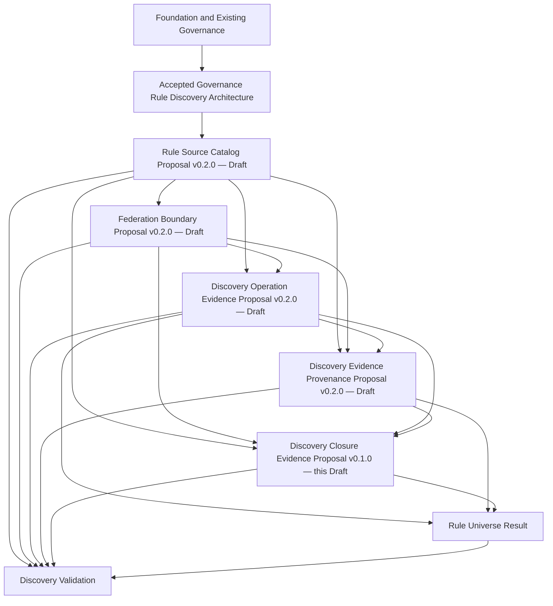

# Discovery Closure Evidence Contract Proposal

## 1. Document Control

| Field | Value |
| --- | --- |
| Contract identity | `CADP-CONTRACT-DISCOVERY-CLOSURE-EVIDENCE` |
| Title | Discovery Closure Evidence Contract |
| Document type | Contract Proposal |
| Version | 0.1.0 |
| Status | Draft Contract Proposal |
| Review state | Initial Draft — Pending Independent Review |
| Date | 2026-07-25 |
| Architecture domain | Governance Rule Discovery |
| Contract domain | Discovery Closure Evidence |
| Primary responsibility | Canonical semantics of the evidence basis supporting a bounded discovery-closure determination |
| Proposed canonical semantic owner | This contract |
| Repository | `dchaschin79-sys/cliff-ai-development-platform` |
| Source baseline | `8578f24bdb6ad6221dd58778504a67c46f437206` |
| Methodology constraint | Contract Governance Framework Version 0.3.0 and Contract Decomposition Plan Version 0.2.0 are fixed and are not revised or extended |
| Acceptance | Not created |
| Publication | Not created |
| Effectiveness | Not created |
| Normative effect | None |
| Implementation authority | None |
| Supersedes | None — initial proposal |
| Superseded by | None known |

This document is the fifth Draft Contract Proposal developed under the CADP Contract Governance Framework Version 0.3.0 and the Governance Rule Discovery Contract Decomposition Plan Version 0.2.0.

It is not Accepted, not Published, not Effective, not implementation-authorizing, and not a Design Freeze. Its existence, authorship, review, Git history, repository publication, or downstream use does not create Contract Acceptance, Publication, Effectiveness, adoption, or normative authority.

Normative keywords describe the semantics this contract would require only if the proposal later completes the applicable Independent Review, Maintenance Revision where required, Verification, human Acceptance, semantic-equivalent Publication, and Effectiveness stages. They have no current normative effect.

## 2. Authoritative Source Bindings

| Authoritative input | Exact binding | Use |
| --- | --- | --- |
| [Foundation Architecture](../FOUNDATION_ARCHITECTURE.md) | Version 0.2.0; Git object `005f1e0a9fca7d4c75b69a013f0d24710348a866`; commit `84052beb7e7d270e2aeba797c039e5f3a0b3ccc4` | Canonical identity, immutable revisions, authority separation, confidentiality, provider neutrality, deterministic interpretation, historical preservation, and fail-closed boundaries |
| [Governance Rule Discovery Architecture Decision Proposal](../architecture/GOVERNANCE_RULE_DISCOVERY_ARCHITECTURE_DECISION_PROPOSAL.md) | Version 0.1.1; Git object `5fc17613f5ef78fb5f546f17bdeded75465da9c0`; commit `e324fd4e84d7d08ea83c6cf6812596a6c0cb764e` | Accepted closure criteria, route-relevance boundary, bounded discovery, evidence separation, Decision Boundary, deterministic composition, failure semantics, and Category B containment |
| [Governance Rule Discovery Architecture Acceptance Record](../architecture/GOVERNANCE_RULE_DISCOVERY_ARCHITECTURE_ACCEPTANCE_RECORD.md) | Record `CADP-AAR-GRD-0001`, Version 1.0.0; Git object `19995bca6768b1de01c3db2055bc618404dbc9ec`; commit `b5feb2bd00f21e955070c8d8a202117972c5eb1f` | Architecture Acceptance and authorization for Contract Design and contract review only |
| [CADP Contract Governance Framework](../governance/CONTRACT_GOVERNANCE_FRAMEWORK.md) | Version 0.3.0; Git object `7d6ced000bb6135fe3ff6a4c3331fa9f6a458e74`; commit `24feb4baa0d89a91a157ab2746c9d4e175fa6c9d` | Contract identity, lifecycle, ownership, review, Verification, human Acceptance, Publication, Effectiveness, versioning, change, and traceability methodology |
| [Governance Rule Discovery Contract Decomposition Plan](GOVERNANCE_RULE_DISCOVERY_CONTRACT_DECOMPOSITION_PLAN.md) | Version 0.2.0; Git object `c4c1fb6c459d72227b0f3342d6af388ba954a5cd`; commit `f26e52f63a9118991f8620cbe733bb6b80722664` | Discovery Closure Evidence primary responsibility, provenance separation, dependencies, sequence, exclusions, and Category B impact |
| [Rule Source Catalog Contract Proposal](RULE_SOURCE_CATALOG_CONTRACT_PROPOSAL.md) | Contract `CADP-CONTRACT-RULE-SOURCE-CATALOG`; Version 0.2.0 Draft; Git object `f1c80b2d51b4e5e01eec14e30ff1a63cd0cf3f20`; commit `1e1e34ac7f7b53ea452536b3d303985df7bf286d` | Exact upstream candidate meanings for catalog and source identity, revision, scope, declaration, participation, relationships, eligibility references, lifecycle references, and metadata ownership |
| [Federation Boundary Contract Proposal](FEDERATION_BOUNDARY_CONTRACT_PROPOSAL.md) | Contract `CADP-CONTRACT-FEDERATION-BOUNDARY`; Version 0.2.0 Draft; Git object `f9dff838f7ecbea1e9eea4e31fece117203799c1`; commit `f6d8b79f301531df7156659bbd4304c2f57a1a43` | Exact upstream candidate meanings for Federation Identity, boundary revision, scope, root or root set, membership, composition, Decision Context binding, eligibility references, and ownership preservation |
| [Discovery Operation Evidence Contract Proposal](DISCOVERY_OPERATION_EVIDENCE_CONTRACT_PROPOSAL.md) | Contract `CADP-CONTRACT-DISCOVERY-OPERATION-EVIDENCE`; Version 0.2.0 Draft; Git object `5c5f8447ef9aa49e8ecd869d928c530b85d7b868`; commit `f2f68a78b9c2427e1c23aff45381b1e6c56cab48` | Exact upstream candidate meanings for Discovery Operation identity, Evidence Revision, context binding, attribution, manifest, route treatment, resolution activity, observations, and attempted-route evidence |
| [Discovery Evidence Provenance Contract Proposal](DISCOVERY_EVIDENCE_PROVENANCE_CONTRACT_PROPOSAL.md) | Contract `CADP-CONTRACT-DISCOVERY-EVIDENCE-PROVENANCE`; Version 0.2.0 Draft; Git object `dec1891e2f3944ff89ddf9b3739bba4772cdcabb`; commit `2db12ae1454137e51b4323e6e5b23ea3b796f175` | Exact upstream candidate meanings for attributable lineage, evidence identity and revision continuity, Temporal Provenance Binding, Unresolved Required-Lineage Conditions, and Provenance Reconstruction Basis |
| [Discovery Evidence Provenance Contract Acceptance Record](DISCOVERY_EVIDENCE_PROVENANCE_CONTRACT_ACCEPTANCE_RECORD.md) | Record `CADP-CONTRACT-ACCEPTANCE-DISCOVERY-EVIDENCE-PROVENANCE-0001`; Version 0.1.0; status `Pending Human Attestation`; Git object `d5c65d32530e67ddc88361b208772278f4a57d55`; commit `8578f24bdb6ad6221dd58778504a67c46f437206` | Verified upstream evidence and explicit confirmation that human Contract Acceptance, Publication, Effectiveness, and implementation authority remain absent |

No other source is used to define this proposal.

The four upstream Contract Proposals remain Draft artifacts. The Discovery Evidence Provenance Acceptance Record remains `Pending Human Attestation` and does not make the provenance proposal Accepted, Published, or Effective. This proposal consumes the exact identified Draft meanings only as fixed upstream design dependencies for Draft authoring. It does not accept them, repair missing governance evidence, inherit Acceptance, or acquire their semantic ownership.

If an upstream proposal changes, fails to complete required governance, or acquires a condition affecting this boundary, this proposal must be reevaluated under the Contract Governance Framework before its own human Acceptance. Downstream review or Acceptance cannot repair missing upstream ownership, Verification, or Acceptance.

## 3. Purpose

The Discovery Closure Evidence Contract establishes the canonical provider-neutral semantics of the evidence basis that may support a bounded discovery-closure determination for one exact Decision Context, Federation Boundary revision, discovery operation evidence state, and provenance state.

The contract exists so downstream Rule Universe Result, Discovery Validation, audit, review, and historical-reconstruction domains can consume one deterministic closure-evidence boundary without:

- redefining Rule Source Catalog, Federation Boundary, Discovery Operation Evidence, or Discovery Evidence Provenance meanings;
- treating a manifest, search result, source list, model response, resolver outcome, repository state, or assertion as self-proving closure evidence;
- collapsing evidence presence, evidence completeness, bounded sufficiency, closure determination, result classification, Validation, Applicability, or Policy Decision into one meaning;
- inferring that an unavailable, restricted, conflicting, stale, inconvenient, or unidentified source route is absent or non-membership-changing;
- treating an attributable completeness assertion as proof that the evidence is sufficient or independently verified;
- allowing later source, boundary, operation, provenance, or assessment evidence to rewrite a historical closure-evidence basis;
- resolving any Category B deferral by convenience; or
- selecting an API, schema, database, graph technology, storage model, workflow, provider, or implementation topology.

This contract owns Discovery Closure Evidence only.

## 4. Primary Responsibility and Ownership Boundary

### 4.1 Single Primary Responsibility

The single primary responsibility of this contract is:

> Define the canonical semantics of the evidence basis supporting a bounded discovery-closure determination.

Every owned concept is subordinate to that evidence-basis responsibility. The contract may classify the semantic condition of closure-supporting evidence. It does not perform the downstream determination that discovery closure has been demonstrated, does not create a Rule Universe Result, and does not validate itself.

### 4.2 Owned Semantic Concepts

This proposal defines the canonical meaning of:

1. Discovery Closure Evidence;
2. Closure Evidence Identity;
3. Closure Evidence Revision;
4. Closure Evidence Context Binding;
5. Closure Evidence Attribution;
6. Closure Evidence Requirement Boundary;
7. Closure Evidence Item Binding;
8. Closure Evidence Composition;
9. Bounded Sufficiency Relationship;
10. Explicit Evidence Completeness Assertion;
11. Supported Closure Evidence;
12. Incomplete Closure Evidence;
13. Unresolved Closure Condition;
14. Insufficient Closure Evidence;
15. Deterministic Closure Evidence Interpretation; and
16. Closure Evidence Reconstruction Basis.

These are semantic concepts, not fields, types, objects, schemas, interfaces, APIs, files, records, messages, graphs, database structures, storage structures, services, jobs, workflow steps, or runtime components.

### 4.3 Explicit Ownership Boundary

This contract owns:

- the distinction between one logical Closure Evidence Identity and one exact immutable Closure Evidence Revision;
- the relationship binding one Closure Evidence Revision to one exact externally owned Decision Context, Federation Boundary revision, discovery operation evidence state, and provenance state;
- attribution of closure-evidence composition and completeness assertions without creating authority or assurance;
- the closure-evidence requirement boundary for one fixed context, expressed through exact references to accepted architecture criteria and independently governed evidence obligations;
- evidence-item bindings that preserve externally owned identity, revision, scope, attribution, provenance, temporal, confidentiality, and integrity meanings;
- composition of closure-supporting evidence without copying or redefining upstream semantics;
- bounded relationships stating whether an exact evidence item supports an exact declared closure-evidence requirement;
- attributable assertions about whether every requirement in the fixed evidence boundary is represented;
- supported, incomplete, unresolved, and insufficient evidence meanings within the closure-evidence domain;
- deterministic interpretation of the evidence condition for equivalent exact inputs;
- fail-closed preservation of missing, conflicting, stale, restricted, ambiguous, unauthorized, ineligible, or unverifiable required closure evidence; and
- the immutable reconstruction basis for historical closure-evidence review.

This contract does not own:

- Rule Source, catalog, source identity, source revision, source declaration, Source Participation, source category, source relationship, source eligibility, source lifecycle, source content, or Source Metadata Ownership;
- Federation Identity, Federation Boundary revision, boundary scope, root, root set, member, membership, composition, ownership, or cross-repository topology;
- Discovery Operation identity, operation Evidence Revision, Operation Context Binding, Operation Attribution, Discovery Operation Manifest, Presented Source Route, Source Route Treatment Evidence, Source Resolution Activity Evidence, Operation Observation, or Attempted Source Route Set;
- Discovery Evidence Provenance, Provenance Record Identity, Provenance Record Revision, Provenance Subject Binding, Provenance Attribution, Provenance Relationship, Discovery Evidence Lineage, evidence identity or revision continuity, Temporal Provenance Binding, Unresolved Required-Lineage Condition, or Provenance Reconstruction Basis;
- Decision Context identity, contents, construction, lifecycle, validation, scope vocabulary, purpose meaning, evaluation-time meaning, or applicable-baseline meaning;
- Universal Eligibility, confidentiality, purpose eligibility, provider eligibility, information-use eligibility, Governance Authority, delegation, approval, lifecycle, supersession, or Product Binding semantics;
- canonical artifact identity, revision identity, source-of-truth, integrity, or general derived-representation semantics;
- the downstream determination that discovery closure is demonstrated or accepted;
- Complete Rule Universe Snapshot, Incomplete Discovery Result, Rule Corpus, or Rule Universe Result semantics;
- Discovery Validation or any conformance outcome;
- Governance Applicability, normative conflict precedence, or Policy Decision outcomes; or
- implementation.

## 5. Discovery Closure Evidence

| Semantic aspect | Definition |
| --- | --- |
| Purpose | Establish the exact, attributable, revision-bound, context-bound, and reconstructable evidence basis that may support a bounded discovery-closure determination. |
| Canonical definition | Discovery Closure Evidence is the immutable semantic evidence composition that relates exact upstream discovery evidence to the fixed closure-evidence requirement boundary for one exact context without itself determining closure, result validity, Validation, Applicability, or Policy Decision correctness. |
| Semantically required invariants | Discovery Closure Evidence MUST have one Closure Evidence Identity, one exact Closure Evidence Revision, one exact Closure Evidence Context Binding, explicit Closure Evidence Attribution, one fixed Closure Evidence Requirement Boundary, and a Closure Evidence Composition preserving every supported item and every incomplete, unresolved, or insufficient condition. It MUST NOT infer evidence from implementation success, search success, model confidence, repetition, elapsed time, prior outcomes, repository location, or downstream acceptance. |
| Relationships | Discovery Closure Evidence is fixed by Closure Evidence Revision, bound through Closure Evidence Context Binding, attributable through Closure Evidence Attribution, composed from Closure Evidence Item Bindings, related to exact requirements through Bounded Sufficiency Relationships, and reconstructed through Closure Evidence Reconstruction Basis. |
| Ownership boundary | This contract owns closure-supporting evidence semantics only. Every evidence subject, criterion input, authority input, eligibility input, provenance relationship, downstream determination, result, and Validation outcome retains its independent owner. |
| Explicit non-goals | This concept does not define a closure engine, resolver, manifest generator, source graph, evidence store, validation process, result classifier, query, report, schema, serialization, API, database, or runtime workflow. |

Discovery Closure Evidence is evidence, not a governance decision and not a result. A well-formed or supported evidence basis does not establish that discovery is Accepted, that closure has been finally determined, that a Rule Universe Result is valid, that any rule applies, or that any Policy Decision is correct.

Discovery Closure Evidence is not self-validating. A manifest, source owner, resolver, provenance asserter, closure-evidence asserter, repository owner, AI system, implementation, or downstream artifact cannot establish the correctness or sufficiency of its own evidence merely by asserting it.

## 6. Closure Evidence Identity and Revision

### 6.1 Closure Evidence Identity

| Semantic aspect | Definition |
| --- | --- |
| Purpose | Distinguish one logical body of Discovery Closure Evidence from every other body and from its revisions or representations. |
| Canonical definition | Closure Evidence Identity is the stable logical identity of one bounded closure-evidence basis across its Closure Evidence Revisions and derived representations. |
| Semantically required invariants | One logical closure-evidence basis MUST have one Closure Evidence Identity within its governed identity boundary. Equivalent subjects, contexts, evidence items, criteria, content, locations, or conclusions MUST NOT establish identity equivalence. Representation, repository location, custody, or revision change MUST NOT create a second logical owner. |
| Relationships | Closure Evidence Identity is the subject of Closure Evidence Revision and the stable evidence identity referenced by downstream consumers. |
| Ownership boundary | This contract owns logical closure-evidence identity only. Foundation and Canonical Artifact governance retain canonical identity integrity, source-of-truth, and exact revision evidence. |
| Explicit non-goals | This concept does not define identifier syntax, namespaces, hashes, keys, addresses, repository paths, identity providers, or identity-resolution algorithms. |

### 6.2 Closure Evidence Revision

| Semantic aspect | Definition |
| --- | --- |
| Purpose | Distinguish one exact immutable semantic state of Discovery Closure Evidence from every earlier or later state. |
| Canonical definition | Closure Evidence Revision is the exact immutable state of one Closure Evidence Identity, including its context binding, attribution, requirement boundary, evidence-item bindings, composition, sufficiency relationships, completeness assertions, evidence conditions, and reconstruction basis. |
| Semantically required invariants | A Closure Evidence Revision MUST belong to exactly one Closure Evidence Identity. Correction, supplementation, reassessment, newly available evidence, changed upstream revision, or changed interpretation input MUST create a new revision and MUST NOT mutate an earlier revision. Equivalent content MUST NOT be assumed to identify the same revision without canonical revision evidence. |
| Relationships | Closure Evidence Revision fixes the exact evidence basis and every supported, incomplete, unresolved, or insufficient condition available to downstream consumers at that revision. |
| Ownership boundary | This contract owns the distinction between logical closure-evidence identity and exact evidence state. It does not own upstream revision meaning, lifecycle, approval, Publication, Effectiveness, or supersession outside closure-evidence revision continuity. |
| Explicit non-goals | This concept does not define version numbering, hashes, commits, persistence, synchronization, Publication, Effectiveness, archival, retention, or migration mechanisms. |

A later Closure Evidence Revision may add attributable evidence or record that a prior condition is resolved only by preserving the predecessor revision and exact revision-continuity evidence. It cannot rewrite what an earlier revision contained, omitted, could not establish, or presented to a historical downstream evaluation.

## 7. Closure Evidence Context Binding

| Semantic aspect | Definition |
| --- | --- |
| Purpose | Fix the exact externally governed context and upstream evidence state for which the closure-evidence basis is assembled. |
| Canonical definition | Closure Evidence Context Binding is the closure-evidence-owned relationship connecting one Closure Evidence Revision to one exact Decision Context identity, Federation Boundary revision, applicable Rule Source Catalog revision or source declarations, Discovery Operation Evidence revision, Discovery Evidence Provenance revision, and every independently governed eligibility, authority, scope, temporal, confidentiality, and integrity reference required to interpret the evidence basis. |
| Semantically required invariants | Every binding MUST preserve the upstream owner, exact identity, exact revision, scope, purpose, evaluation time, and applicable boundary reference required by the source meaning. Missing, conflicting, stale, restricted, ambiguous, unauthorized, ineligible, or unverifiable context evidence MUST remain explicit and fail closed. Equivalent labels, content, locations, or technical handles MUST NOT substitute for exact governed bindings. |
| Relationships | The binding constrains the Closure Evidence Requirement Boundary, every evidence-item binding, sufficiency relationship, completeness assertion, and deterministic interpretation. |
| Ownership boundary | This contract owns only the relationship to the external context and evidence state. Decision Context, source, boundary, operation, provenance, eligibility, authority, scope, confidentiality, lifecycle, and temporal meanings remain externally owned. |
| Explicit non-goals | This concept does not define a Decision Context, source catalog, Federation Boundary, discovery operation, provenance record, evaluation time, effective interval, eligibility result, authority decision, scope vocabulary, or integrity mechanism. |

One Closure Evidence Revision cannot combine evidence from different Decision Context identities, incompatible boundary revisions, unrelated operation attempts, or incoherent provenance revisions by convenience. Cross-repository participation remains permitted only through exact compatible bindings under the accepted architecture.

## 8. Closure Evidence Attribution

| Semantic aspect | Definition |
| --- | --- |
| Purpose | Make the assembly and assertions within one Closure Evidence Revision attributable without creating authority, assurance, or self-validation. |
| Canonical definition | Closure Evidence Attribution is the explicit relationship associating one Closure Evidence Revision, its composition, each Bounded Sufficiency Relationship, each Explicit Evidence Completeness Assertion, and each Unresolved Closure Condition with the exact independently governed identity reference accountable for making that evidence assertion. |
| Semantically required invariants | Attribution MUST be explicit, revision-bound, scope-bound, context-bound, and temporally qualified through exact external evidence. The asserter MUST remain distinguishable from every evidence subject, source owner, activity actor, provenance asserter, repository owner, custodian, reviewer, validator, approver, or downstream decision owner. |
| Relationships | Closure Evidence Attribution qualifies evidence assertions and may consume external identity, eligibility, authority, independence, conflict-of-interest, integrity, and temporal references without redefining them. |
| Ownership boundary | This contract owns only attribution of closure-evidence assertions. Identity eligibility, authority, independence, assurance, authentication, integrity, custody, review eligibility, and approval remain externally owned. |
| Explicit non-goals | This concept does not define a person, organization, AI system, agent, process identity, reviewer, validator, approver, authority tier, credential, signature, assurance level, independence test, or authentication method. |

Attribution is not authority, independence, assurance, or proof. An attributed assertion does not become supported merely because the asserter is identifiable, and it cannot validate its own completeness or sufficiency.

Missing, ambiguous, conflicting, or unverifiable Closure Evidence Attribution makes the affected assertion unresolved and prevents it from supporting a Bounded Sufficiency Relationship.

## 9. Closure Evidence Requirement Boundary

### 9.1 Canonical Meaning

| Semantic aspect | Definition |
| --- | --- |
| Purpose | Fix the exact set of closure-evidence obligations against which one evidence composition is interpreted. |
| Canonical definition | Closure Evidence Requirement Boundary is the immutable, context-specific set of evidence obligations derived from the accepted Governance Rule Discovery architecture and every independently applicable external criterion for the exact bound context. |
| Semantically required invariants | The boundary MUST bind each requirement to its authoritative source, exact revision, scope, context, and applicable temporal evidence. It MUST preserve unresolved criteria and Category B limitations. A manifest, operation, source, resolver, provenance record, evidence claimant, implementation, or downstream consumer MUST NOT narrow, expand, repair, or self-declare the boundary. |
| Relationships | The boundary is fixed by Closure Evidence Context Binding, is addressed through Closure Evidence Item Bindings, and is the target of Bounded Sufficiency Relationships and Explicit Evidence Completeness Assertions. |
| Ownership boundary | This contract owns only the closure-evidence requirement composition for the fixed context. The meaning, validity, applicability, authority, eligibility, and assurance threshold of every referenced criterion remain with their authoritative owners. |
| Explicit non-goals | This concept does not define new eligibility rules, authority rules, source membership, route relevance criteria, scope vocabularies, assurance thresholds, legal obligations, Validation rules, or Policy Decision requirements. |

### 9.2 Required Evidence Categories

For one exact bound context, the requirement boundary preserves evidence obligations for:

1. every required Universal Eligibility Gate result applicable to an information or evidence path;
2. the exact eligible Federation Root or root set and Federation Boundary revision;
3. every independently governed source-route closure-relevance or conditional-relevance determination used by the evidence basis;
4. every closure-relevant and conditionally closure-relevant route and its externally owned membership outcome;
5. every route exclusion and the independently governed evidence that the route cannot change source membership for the fixed context;
6. every participating source identity, exact revision, scope, lifecycle reference, eligibility reference, and attributable provenance;
7. every inheritance, incorporation, legacy, and cross-repository relationship required by the fixed boundary;
8. every duplicate identity, competing revision, or membership-changing conflict and its externally governed resolution or unresolved state;
9. every restricted source route and its eligible, confidentiality-preserving evidence path;
10. the exact Discovery Operation Evidence describing the bounded attempt, route treatment, resolution activities, observations, and attempted-route evidence;
11. the exact Discovery Evidence Provenance and Temporal Provenance Binding needed to reconstruct the lineage and time basis of the evidence;
12. evidence supporting reproducibility of the operation-bound evidence basis; and
13. every unresolved condition that could change the evidence available for a closure determination.

This list defines evidence categories, not evidence values, schemas, algorithms, thresholds, or a conclusion that the categories are satisfied.

An evidence obligation not discoverable because the authoritative requirement boundary itself is missing, conflicting, stale, restricted, ambiguous, or unverifiable remains an Unresolved Closure Condition. It cannot be silently omitted.

## 10. Closure Evidence Item Binding

| Semantic aspect | Definition |
| --- | --- |
| Purpose | Bind one closure-evidence assertion to one exact externally owned evidence subject and one exact requirement without duplicating either meaning. |
| Canonical definition | Closure Evidence Item Binding is the closure-evidence-owned relationship connecting one exact evidence subject or explicit unavailable-evidence condition to one exact requirement in the Closure Evidence Requirement Boundary under the same context and Closure Evidence Revision. |
| Semantically required invariants | A binding MUST identify the requirement, evidence subject owner, logical identity, exact revision where required, context, scope, attribution, provenance, applicable temporal evidence, confidentiality boundary, and integrity reference available for interpretation. A label, path, copy, alias, search result, model output, technical handle, or summary MUST NOT substitute for exact governed evidence. |
| Relationships | Evidence-item bindings form Closure Evidence Composition and participate in Bounded Sufficiency Relationships, Explicit Evidence Completeness Assertions, evidence-condition semantics, and reconstruction. |
| Ownership boundary | This contract owns only the relationship between the evidence item and closure-evidence requirement. Every subject and requirement retains its canonical semantic owner. |
| Explicit non-goals | This concept does not define the evidence subject, repair missing identity, establish route relevance, determine eligibility, disclose restricted evidence, create provenance, validate integrity, or select a storage or reference format. |

Restricted evidence may be represented only through an independently eligible non-disclosing evidence reference. Confidentiality does not permit silent omission, and this contract does not define disclosure, redaction, access, encryption, or non-disclosing assurance semantics.

## 11. Closure Evidence Composition

| Semantic aspect | Definition |
| --- | --- |
| Purpose | Compose the exact evidence-item bindings and explicit evidence conditions associated with one fixed closure-evidence requirement boundary. |
| Canonical definition | Closure Evidence Composition is the immutable set of Closure Evidence Item Bindings, Bounded Sufficiency Relationships, Explicit Evidence Completeness Assertions, and incomplete, unresolved, or insufficient evidence conditions fixed by one Closure Evidence Revision. |
| Semantically required invariants | Composition MUST preserve every known requirement and every associated supported, missing, unresolved, restricted, conflicting, stale, ambiguous, or insufficient evidence condition. It MUST NOT drop an inconvenient requirement, merge incompatible contexts, infer a missing item, substitute a later revision, or treat an implementation representation as canonical evidence. |
| Relationships | Composition addresses the Closure Evidence Requirement Boundary and forms the Closure Evidence Reconstruction Basis consumed by downstream contracts. |
| Ownership boundary | This contract owns composition of closure-supporting evidence only. It does not own the evidence subjects, criteria, provenance, result classification, Validation, Applicability, or Policy Decision meaning. |
| Explicit non-goals | This concept does not define an array, graph, manifest, document layout, database, object model, traversal, query, collection algorithm, ordering algorithm, deduplication algorithm, or execution sequence. |

Closure Evidence Composition may contain multiple evidence items for one requirement and one evidence item may support multiple requirements only through separate explicit Bounded Sufficiency Relationships. Repetition does not increase assurance, establish independence, or repair an invalid item.

## 12. Bounded Sufficiency Relationship

| Semantic aspect | Definition |
| --- | --- |
| Purpose | State the bounded evidentiary relationship between one exact evidence item and one exact closure-evidence requirement. |
| Canonical definition | A Bounded Sufficiency Relationship is an attributable, revision-bound, context-bound, and temporally qualified closure-evidence assertion that one exact evidence item satisfies one exact, independently established evidentiary criterion within the fixed Closure Evidence Requirement Boundary. |
| Semantically required invariants | The relationship MUST bind one exact requirement, one exact evidence-item binding, the authoritative criterion and revision, scope, context, attribution, provenance, temporal evidence, and every applicable limitation. It MUST NOT be asserted when the criterion, threshold, evidence identity, evidence revision, provenance, attribution, eligibility, temporal basis, or integrity evidence is missing or unresolved. |
| Relationships | Bounded Sufficiency Relationships support evidence interpretation and may be referenced by an Explicit Evidence Completeness Assertion without becoming closure, a result, or Validation. |
| Ownership boundary | This contract owns only the relationship between evidence and an externally established criterion. Criterion meaning, criterion authority, assurance threshold, reviewer eligibility, source meaning, closure determination, Rule Universe Result, and Validation remain externally owned. |
| Explicit non-goals | This concept does not define general evidentiary law, assurance levels, proof standards, statistical thresholds, confidence scores, reviewer independence, Validation methods, or decision algorithms. |

`Bounded` means the relationship is valid only for its exact requirement, context, scope, evidence revision, criterion revision, and temporal basis. It cannot be generalized to another source route, boundary, context, requirement, time, or downstream decision.

Where an applicable criterion or minimum threshold is deferred, including under Category B, this contract cannot manufacture a Bounded Sufficiency Relationship. The affected requirement remains unresolved or insufficient as supported by the exact available evidence.

## 13. Explicit Evidence Completeness Assertion

| Semantic aspect | Definition |
| --- | --- |
| Purpose | Make explicit and attributable the claim that every requirement in one fixed Closure Evidence Requirement Boundary is represented in one exact Closure Evidence Composition. |
| Canonical definition | Explicit Evidence Completeness Assertion is an attributable, revision-bound, context-bound assertion that the composition contains an evidence-item binding or explicit unresolved condition for every requirement in the fixed requirement boundary. |
| Semantically required invariants | The assertion MUST identify the exact Closure Evidence Revision, requirement boundary, composition, context, attribution, temporal basis, and every declared limitation. It MUST NOT omit unresolved requirements and MUST NOT be inferred from enumeration size, manifest completion, search success, absence of errors, implementation success, or model confidence. |
| Relationships | The assertion describes representation coverage within the evidence basis and participates in Deterministic Closure Evidence Interpretation and historical reconstruction. |
| Ownership boundary | This contract owns only the representation-coverage assertion. It does not establish that each item is sufficient, valid, independently assured, or accepted and does not determine that discovery closure has been demonstrated. |
| Explicit non-goals | This concept does not define global completeness, legal completeness, source-universe completeness, Rule Universe Result validity, Validation, Applicability, or Policy Decision correctness. |

An Explicit Evidence Completeness Assertion is not self-proving. It cannot substitute for Bounded Sufficiency Relationships, independent assurance evidence, unresolved-condition preservation, downstream evaluation, or Validation.

A composition may have an explicit completeness assertion while still containing Unresolved Closure Conditions or Insufficient Closure Evidence. Such an assertion means only that the fixed requirement boundary is represented without silent omission.

## 14. Closure Evidence Condition Semantics

### 14.1 Supported Closure Evidence

| Semantic aspect | Definition |
| --- | --- |
| Purpose | Identify an exact closure-evidence item or composition that is eligible to support its declared requirement under the fixed evidence boundary. |
| Canonical definition | Supported Closure Evidence is an exact evidence-item binding, or an exact composition of such bindings, for which every applicable identity, revision, context, attribution, provenance, temporal, eligibility, confidentiality, integrity, and Bounded Sufficiency Relationship requirement is explicit and supported by the supplied authoritative evidence. |
| Semantically required invariants | Supported evidence MUST remain bounded to the exact requirement and context. An aggregate composition is supported only when every requirement has at least one supported Bounded Sufficiency Relationship and no incomplete, unresolved, or insufficient condition affects the basis. |
| Ownership boundary | Supported means eligible as closure-supporting evidence under this contract. It does not mean closure was determined, discovery was accepted, a Rule Universe Result is valid, Validation passed, a rule applies, or a Policy Decision is correct. |

### 14.2 Incomplete Closure Evidence

| Semantic aspect | Definition |
| --- | --- |
| Purpose | Preserve the known absence of required evidence from one exact closure-evidence composition. |
| Canonical definition | Incomplete Closure Evidence is the evidence-domain condition in which one or more known requirements in the fixed Closure Evidence Requirement Boundary lack a required evidence-item binding or explicit evidence component. |
| Semantically required invariants | Every known missing requirement MUST remain explicit, attributable where asserted, revision-bound, context-bound, and historically preserved. Missing evidence MUST NOT be inferred to mean the antecedent source, route, obligation, relationship, or rule does not exist. |
| Ownership boundary | This contract owns only the incomplete evidence condition. It does not classify an Incomplete Discovery Result, decide closure failure, or determine any downstream response. |

### 14.3 Unresolved Closure Condition

| Semantic aspect | Definition |
| --- | --- |
| Purpose | Preserve a fail-closed evidence condition when a required closure-evidence fact or relationship cannot be interpreted deterministically. |
| Canonical definition | Unresolved Closure Condition is an explicit, immutable, attributable, revision-bound, context-bound, and temporally qualified closure-evidence condition identifying a requirement, evidence item, relationship, criterion, or boundary whose required meaning cannot be established from the available governed evidence. |
| Semantically required invariants | The condition MUST identify the exact Closure Evidence Revision, affected requirement or boundary, available evidence subject identities, reason, evidence basis, attribution, context, temporal evidence, and every known limitation. It MUST NOT fabricate a source, endpoint, criterion, role, threshold, eligibility result, provenance relationship, or resolution. |
| Relationships | The condition participates in Closure Evidence Composition, Deterministic Closure Evidence Interpretation, and Closure Evidence Reconstruction Basis but never becomes Supported Closure Evidence or a Bounded Sufficiency Relationship. |
| Ownership boundary | This contract owns preservation of the unresolved closure-evidence fact only. It does not resolve the upstream ambiguity or determine a downstream result, Validation, Applicability, or Policy Decision consequence. |
| Explicit non-goals | This concept does not define remediation, retry, escalation, waiver, exception, authority, approval, assurance, result classification, or implementation behavior. |

When an endpoint, requirement, criterion, or evidence identity is only partially known, the condition preserves the exact available identity and the unknown boundary without creating a placeholder identity. When attribution for the condition itself cannot be established, no canonical Unresolved Closure Condition can be asserted and the Closure Evidence Revision cannot be treated as a supported evidence basis.

### 14.4 Insufficient Closure Evidence

| Semantic aspect | Definition |
| --- | --- |
| Purpose | Preserve the condition in which evidence is present and interpretable but does not satisfy an exact applicable evidentiary criterion. |
| Canonical definition | Insufficient Closure Evidence is an attributable, revision-bound, context-bound evidence condition stating that an exact evidence-item binding fails to satisfy one or more exact, independently established criteria in the fixed requirement boundary. |
| Semantically required invariants | Insufficiency MUST identify the exact item, requirement, criterion, criterion revision, context, attribution, evidence basis, and reason the Bounded Sufficiency Relationship cannot be supported. Insufficiency MUST NOT be inferred from provider confidence or unspecified expectations. |
| Ownership boundary | This contract owns only the evidence insufficiency condition relative to an exact external criterion. It does not create the criterion, threshold, closure decision, Rule Universe Result, Validation outcome, Applicability result, or Policy Decision consequence. |

Where no exact applicable criterion can be established, the condition is unresolved rather than insufficient. This contract does not invent a threshold to obtain a more convenient classification.

### 14.5 Condition Coexistence

Supported, incomplete, unresolved, and insufficient meanings apply to exact evidence items and requirements. Multiple incomplete, unresolved, and insufficient conditions may coexist in one Closure Evidence Revision and MUST all remain visible.

An aggregate Closure Evidence Composition is Supported Closure Evidence only when:

- every requirement in the fixed boundary is represented;
- every required evidence item and relationship is supported;
- every applicable Bounded Sufficiency Relationship is supported;
- no required criterion or threshold remains unresolved;
- no incomplete, unresolved, or insufficient condition affects the basis; and
- every required attribution, provenance, temporal, eligibility, confidentiality, scope, and integrity reference is explicit and supportable.

This aggregate evidence interpretation is still only evidence-domain semantics. It does not perform or authorize the downstream closure determination.

## 15. Deterministic Closure Evidence Interpretation

| Semantic aspect | Definition |
| --- | --- |
| Purpose | Ensure equivalent exact evidence inputs produce the same closure-evidence meanings independent of provider or representation. |
| Canonical definition | Deterministic Closure Evidence Interpretation is the provider-neutral interpretation of every requirement and evidence item in one exact Closure Evidence Revision as supported, incomplete, unresolved, insufficient, or unaffected, while preserving all coexisting conditions and without producing a downstream decision. |
| Semantically required invariants | Equivalent eligible immutable inputs under the same exact contract revisions, requirement boundary, context, scope, attribution, provenance, temporal evidence, criteria, and limitations MUST produce the same evidence interpretation. Missing or conflicting required interpretation inputs MUST remain unresolved and fail closed. No condition may be dropped to force a single favorable label. |
| Relationships | The interpretation consumes the fixed requirement boundary, evidence composition, sufficiency relationships, completeness assertions, and evidence conditions and forms part of Closure Evidence Reconstruction Basis. |
| Ownership boundary | This contract owns deterministic closure-evidence interpretation only. Rule Universe Result owns complete-versus-incomplete result classification; Discovery Validation owns conformance; Governance Applicability and Policy Decision retain their respective meanings. |
| Explicit non-goals | This concept does not define an evaluation algorithm, precedence engine, state machine, workflow, score, confidence model, result classifier, validation engine, or Policy Decision process. |

Deterministic interpretation does not collapse evidence condition, lifecycle state, acceptance, effectiveness, result status, Validation outcome, Applicability, and Policy Decision into one field or hierarchy.

## 16. Closure Evidence Reconstruction and Historical Preservation

### 16.1 Closure Evidence Reconstruction Basis

| Semantic aspect | Definition |
| --- | --- |
| Purpose | Define the exact semantic evidence basis from which an eligible reviewer can reconstruct what closure-supporting evidence was available and asserted. |
| Canonical definition | Closure Evidence Reconstruction Basis is the exact set of Closure Evidence Revision, context binding, attribution, requirement boundary, evidence-item bindings, composition, Bounded Sufficiency Relationships, completeness assertions, evidence conditions, provenance, temporal references, criteria, limitations, and interpretation used for one historical evidence state. |
| Semantically required invariants | The basis MUST remain bound to exact immutable revisions and MUST distinguish supported, missing, conflicting, restricted, stale, ambiguous, unresolved, and insufficient evidence. It MUST NOT claim closure, result validity, independent Validation, legal completeness, Applicability, or Policy Decision correctness. |
| Relationships | The basis supports downstream evaluation, audit, review, historical reconstruction, and Discovery Validation without determining their outcomes. |
| Ownership boundary | This contract owns reconstruction of the closure-evidence basis only. Access eligibility, review authority, assurance level, retention, result, Validation, Applicability, and Policy Decision remain externally owned. |
| Explicit non-goals | This concept does not define a replay process, query, report, graph traversal, audit procedure, storage package, export, interface, or validation algorithm. |

### 16.2 Historical Preservation

A historical Closure Evidence Revision must preserve:

- its exact Closure Evidence Identity and revision;
- its exact Closure Evidence Context Binding;
- every Closure Evidence Attribution;
- the exact Closure Evidence Requirement Boundary;
- every Closure Evidence Item Binding;
- the exact Closure Evidence Composition;
- every Bounded Sufficiency Relationship;
- every Explicit Evidence Completeness Assertion;
- every supported, incomplete, unresolved, or insufficient condition;
- every consumed upstream source, boundary, operation, provenance, eligibility, authority, scope, confidentiality, temporal, and integrity reference;
- every Category B limitation affecting interpretation;
- its Deterministic Closure Evidence Interpretation; and
- its relationship to every later Closure Evidence Revision without changing the earlier record.

Later source, boundary, operation, provenance, assurance, result, Validation, lifecycle, Applicability, or Policy Decision evidence does not overwrite the historical record. A later assessment may reference the earlier revision and create new evidence, but it cannot backfill or reinterpret what evidence supported the earlier state.

### 16.3 Reconstruction Boundary

Reconstruction demonstrates what evidence one exact Closure Evidence Revision contained and how this contract interpreted its evidence conditions. It does not independently prove:

- that the accepted architecture’s closure criteria were ultimately satisfied;
- that every externally existing obligation was discovered;
- that an evidence source, asserter, reviewer, or authority was eligible beyond the supplied external evidence;
- that assurance or reviewer independence was sufficient;
- that a Complete Rule Universe Snapshot or Incomplete Discovery Result is valid;
- that Discovery Validation passed;
- that any discovered rule applies; or
- that a Policy Decision is correct.

## 17. Contract Invariants

If later Accepted, Published, and made Effective, this contract would require:

1. **One primary responsibility:** Discovery Closure Evidence is the only primary responsibility.
2. **One evidence identity:** each logical closure-evidence basis has one Closure Evidence Identity.
3. **Immutable evidence revision:** every evidence state is fixed by one exact Closure Evidence Revision and never silently mutated.
4. **Exact context binding:** every revision binds one exact Decision Context, boundary revision, operation evidence state, provenance state, scope, and temporal basis.
5. **Attributable assertions:** composition, sufficiency, completeness, and unresolved-condition assertions have exact Closure Evidence Attribution.
6. **Attribution is not proof:** attribution creates no authority, assurance, independence, approval, Validation, or downstream decision ownership.
7. **Fixed requirement boundary:** every interpretation uses one exact authoritative requirement boundary.
8. **No self-defined boundary:** manifests, sources, operations, provenance records, claimants, implementations, and downstream consumers cannot narrow or expand the requirement boundary.
9. **Exact evidence-item binding:** every item preserves its upstream owner, identity, revision, context, scope, attribution, provenance, temporal evidence, confidentiality boundary, and integrity reference where required.
10. **No semantic capture:** evidence-item binding does not transfer source, boundary, operation, provenance, eligibility, authority, lifecycle, or canonical ownership.
11. **Explicit composition:** every known requirement and evidence condition remains represented without silent omission.
12. **Bounded sufficiency:** a sufficiency relationship applies only to one exact item, requirement, criterion, context, revision, scope, and temporal basis.
13. **No threshold invention:** missing or deferred criteria and thresholds remain unresolved.
14. **Completeness assertion is not closure:** representation coverage does not establish sufficiency, assurance, closure, result validity, or Validation.
15. **Supported evidence boundary:** Supported Closure Evidence establishes eligibility to support a declared requirement only.
16. **Explicit incompleteness:** known missing required evidence remains Incomplete Closure Evidence.
17. **Explicit unresolved state:** ambiguous, conflicting, stale, restricted, unauthorized, ineligible, or unverifiable required evidence remains an Unresolved Closure Condition.
18. **Explicit insufficiency:** present evidence that fails an exact external criterion remains Insufficient Closure Evidence.
19. **Condition coexistence:** all incomplete, unresolved, and insufficient conditions remain visible and are not collapsed into a favorable label.
20. **No absence inference:** missing evidence does not prove that a source, route, relationship, obligation, antecedent, or rule is absent.
21. **No closure decision:** this contract does not determine that discovery closure succeeded, failed, was accepted, or may be waived.
22. **No result capture:** this contract does not create, classify, validate, or reinterpret a Complete Rule Universe Snapshot, Incomplete Discovery Result, Rule Corpus, or Rule Universe Result.
23. **No Validation capture:** this contract does not validate itself or produce a conformance outcome.
24. **No Applicability capture:** this contract does not determine that a rule applies.
25. **No Policy Decision capture:** this contract does not select normative precedence or produce a Policy Decision outcome.
26. **No downstream inference:** an evidence condition does not determine a downstream result, Validation, Applicability, or Policy Decision consequence.
27. **Historical immutability:** later evidence creates a later revision and never rewrites an earlier evidence basis.
28. **No later repair:** downstream success, later evidence, or a favorable outcome cannot repair a historical gap in place.
29. **Deterministic interpretation:** equivalent eligible immutable inputs produce the same evidence-condition interpretation.
30. **Fail-closed ambiguity:** missing or unverifiable required interpretation evidence never becomes supported by inference.
31. **Provider neutrality:** no model, repository host, database, graph engine, policy engine, workflow system, storage product, or implementation owns closure-evidence semantics.
32. **Implementation independence:** files, logs, messages, tables, services, code, runtime behavior, and software success cannot redefine closure evidence.
33. **Category B preservation:** every mapped Category B item remains unresolved and unreclassified.
34. **Decision Boundary preservation:** this contract creates no architecture, authority, lifecycle, or downstream decision expansion.

## 18. Consumed Semantics and Upstream Dependencies

| Upstream source or domain | Consumed meaning | Retained ownership boundary |
| --- | --- | --- |
| Foundation Architecture | Canonical identity, immutable revisions, source-of-truth separation, authority separation, confidentiality gating, provider neutrality, deterministic interpretation, fail-closed behavior, and immutable history | Foundation meanings remain unchanged and outside this contract |
| Accepted Governance Rule Discovery architecture | Closure criteria, closure-relevance boundary, bounded discovery, complete-versus-incomplete separation, deterministic composition, historical reconstruction, and fail-closed incompleteness | Architecture family and Decision Boundary remain unchanged |
| Architecture Acceptance Record | Authorization for Contract Design and review within the accepted architecture | Does not approve this contract or authorize implementation |
| Contract Governance Framework Version 0.3.0 | Contract identity, lifecycle, ownership, review, Verification, human Acceptance, Publication, Effectiveness, versioning, and traceability methodology | Framework remains unchanged and outside this contract |
| Contract Decomposition Plan Version 0.2.0 | Discovery Closure Evidence ownership, dependencies, sequence, exclusions, provenance separation, and Category B impact | Plan remains a fixed planning source and is not redefined |
| Rule Source Catalog Proposal Version 0.2.0 | Catalog and source identity, exact revision, declaration, participation, scope, relationships, eligibility references, lifecycle references, canonical logical source identity, and metadata ownership | Draft source-catalog proposal retains every source and catalog meaning |
| Federation Boundary Proposal Version 0.2.0 | Federation Identity, exact boundary revision, scope, root or root set, membership, composition, Decision Context binding, eligibility references, and ownership preservation | Draft federation proposal retains every boundary meaning |
| Discovery Operation Evidence Proposal Version 0.2.0 | Discovery Operation Identity, Evidence Revision, context binding, attribution, manifest, route treatment, resolution activity, observations, attempted-route evidence, and immutable operation history | Draft operation proposal retains every operation-evidence meaning |
| Discovery Evidence Provenance Proposal Version 0.2.0 | Provenance identity and revision, subject binding, attribution, relationship roles, lineage, identity and revision continuity, temporal binding, unresolved required-lineage conditions, and reconstruction basis | Draft provenance proposal retains every provenance meaning |
| Discovery Evidence Provenance Acceptance Record Version 0.1.0 | Verification result `VERIFIED`, exact proposal binding, unresolved Category B preservation, and status `Pending Human Attestation` | Record is governance evidence only and does not create upstream Contract Acceptance |
| Decision Context as retained by the accepted architecture and upstream proposals | Governed Operation or decision subject, target, requested scope, purpose, evaluation time, applicable baselines, and required eligibility and authority references | Decision Context identity, facts, construction, lifecycle, and validation remain externally owned |
| Universal Eligibility, confidentiality, and Governance Authority as retained by the authoritative sources | Source authorization, confidentiality, purpose, provider, information-use eligibility, authority, ownership, approval, and disclosure evidence | This contract preserves exact references and creates no eligibility, disclosure, authority, or approval semantics |
| Lifecycle, Canonical Artifact, integrity, and assurance governance | Approval, effectiveness, adoption, disposition, canonical identity, revision, integrity, assurance criteria, reviewer eligibility, and source-of-truth evidence | This contract preserves exact evidence references and creates none of those meanings |

Every consumed meaning is referenced at an exact immutable revision where required. This contract does not copy it into a second canonical owner, repair missing upstream evidence, or convert a Draft dependency or pending Acceptance Record into an Accepted, Published, or Effective Contract.

## 19. Downstream Consumers

The planned downstream consumers are:

1. **Rule Universe Result Contract candidate** — consumes exact Closure Evidence Revision, context, requirement boundary, evidence interpretation, conditions, and reconstruction basis when owning Complete Rule Universe Snapshot and Incomplete Discovery Result semantics. It cannot redefine closure evidence or repair an evidence gap.
2. **Discovery Validation Contract candidate** — evaluates conformance of closure evidence and cross-contract relationships without acquiring closure-evidence ownership or making Contract Acceptance, Effectiveness, Applicability, or Policy Decisions.
3. **Audit, review, and historical-reconstruction consumers** — reconstruct the exact evidence basis under independently valid eligibility without treating reconstruction as closure, result classification, Validation, Acceptance, implementation authority, or a Policy Decision.

Governance Applicability and Policy Decision are not direct consumers of this contract as a complete-universe input. They consume only the appropriate downstream governed artifacts and cannot bypass Rule Universe Result ownership.

No downstream consumer may:

- alter a Closure Evidence Identity or Revision;
- create or infer a missing requirement, item, attribution, provenance relationship, criterion, threshold, temporal binding, or sufficiency relationship;
- convert an incomplete, unresolved, or insufficient condition into Supported Closure Evidence;
- treat an Explicit Evidence Completeness Assertion as proof of sufficiency, closure, result validity, or Validation;
- mutate historical evidence through a later source, boundary, operation, provenance, result, or lifecycle change;
- transfer upstream or downstream semantic ownership to closure evidence; or
- treat a representation, report, cache, index, graph, database, or implementation as the canonical closure-evidence owner.

This section defines semantic dependency direction only. It does not define software dependencies, calls, services, packages, messages, deployment, orchestration, evaluation order, or runtime sequence.

## 20. Cross-Contract Non-Overlap

### 20.1 Ownership Matrix

| Semantic concern | Upstream owner | Discovery Closure Evidence owner | Downstream owner |
| --- | --- | --- | --- |
| Source and catalog identity, revision, participation, scope, and relationships | Rule Source Catalog | References exact evidence only | References without redefinition |
| Federation identity, boundary revision, membership, composition, scope, and ownership | Federation Boundary | References exact evidence only | References without redefinition |
| Discovery Operation identity, Evidence Revision, context, attribution, manifest, treatment, activity, and observations | Discovery Operation Evidence | References exact evidence only | References without redefinition |
| Provenance identity, revision, attribution, lineage, continuity, temporal binding, and unresolved required-lineage conditions | Discovery Evidence Provenance | Consumes exact provenance without repair or reinterpretation | References without redefinition |
| Closure-evidence identity and revision | Does not own | Owns | Consumes |
| Closure-evidence context relationship | External context owners supply exact meanings | Owns only the evidence-to-context binding | Consumes |
| Closure-evidence requirement composition | Architecture and external criterion owners supply criteria | Owns only the fixed evidence-requirement boundary | Consumes |
| Closure-evidence item binding and composition | Evidence subjects remain externally owned | Owns | Consumes |
| Bounded sufficiency relationship | Criterion owners supply criterion meaning and authority | Owns only evidence-to-criterion relationship | Consumes |
| Representation-coverage assertion | Does not own | Owns Explicit Evidence Completeness Assertion | Consumes without treating it as closure |
| Supported, incomplete, unresolved, and insufficient closure-evidence conditions | Upstream owners retain underlying facts | Owns evidence-domain condition meaning | Consumers determine only their own downstream consequences |
| Complete-versus-incomplete Rule Universe result | Does not own | Does not own | Rule Universe Result owns |
| Conformance result | Does not own | Does not own | Discovery Validation owns |
| Rule applicability and Policy Decision | Retained external owners | Does not own | Governance Applicability and Policy Decision retain ownership |

### 20.2 Rule Source Catalog Separation

This contract does not define or alter a source or catalog concept.

An evidence-item binding cannot:

- create a Rule Source, Source Identity, Exact Source Revision Binding, Source Declaration, or Source Participation;
- decide that a source belongs to a catalog or Federation Boundary;
- establish that a source is closure-relevant, eligible, Effective, applicable, or authoritative;
- reconcile an alias, mirror, translation, or derived source; or
- repair missing or conflicting Source Metadata Ownership.

### 20.3 Federation Boundary Separation

This contract does not define or alter a federation concept.

Closure evidence cannot:

- create or modify a Federation Root, Root Set, Member, Membership, composition relationship, scope, or ownership boundary;
- infer a missing boundary edge from operation behavior or evidence success;
- make a boundary revision eligible, Accepted, Effective, or temporally valid;
- use evidence composition to narrow an inconvenient boundary; or
- repair missing authority, eligibility, composition, or ownership-preservation evidence.

### 20.4 Discovery Operation Evidence Separation

This contract does not define or alter operation evidence.

Specifically:

- closure evidence consumes exact Discovery Operation Identity and Evidence Revision without changing them;
- Closure Evidence Attribution does not replace Activity Actor Attribution or Evidence Asserter Attribution;
- an evidence-item binding does not create a Presented Source Route, treatment classification, activity assertion, observation, manifest, or Attempted Source Route Set;
- operation activity does not become closure-supporting merely because it was performed or recorded; and
- a manifest cannot prove its own completeness or the completeness of the closure-evidence requirement boundary.

### 20.5 Discovery Evidence Provenance Separation

This contract does not define or alter provenance.

Specifically:

- Closure Evidence Identity and Revision do not replace Provenance Record Identity or Revision;
- Closure Evidence Attribution does not replace Provenance Attribution;
- an evidence-item binding consumes exact Provenance Subject Bindings and relationships without creating them;
- Closure Evidence Composition does not infer, merge, traverse, or repair Discovery Evidence Lineage;
- an Unresolved Required-Lineage Condition remains provenance evidence and cannot be converted into a supported relationship by closure evidence;
- Temporal Provenance Binding remains upstream and cannot be redefined as a closure time rule; and
- a complete provenance representation does not itself establish closure sufficiency.

### 20.6 Result, Validation, Applicability, and Policy Separation

This contract supplies closure-supporting evidence but does not:

- determine that discovery closure succeeded, failed, was accepted, or may be waived;
- classify a discovery attempt or universe as complete or incomplete;
- create a Complete Rule Universe Snapshot or Incomplete Discovery Result;
- decide whether a Rule Universe Result is valid;
- validate closure evidence or any connected subject;
- decide remediation or retry behavior;
- determine rule applicability;
- select normative conflict precedence; or
- produce or reinterpret a Policy Decision.

If a semantic assertion cannot be assigned deterministically to one owner in this matrix, the proposal remains Draft and the ambiguity must be resolved through applicable contract review. No assertion may be duplicated for convenience.

## 21. Category B Unresolved Items

The Contract Decomposition Plan maps 13 accepted Category B items to Discovery Closure Evidence. They remain unresolved.

| Category B item | Effect on this proposal | Preserved boundary |
| --- | --- | --- |
| GRD-04 — Trust evidence for negative source declarations | Closure evidence may bind an exact negative declaration, attribution, scope, revision, temporal evidence, provenance, and available assurance references. | This proposal does not define trust, assurance level, independent verification, or when a negative declaration is sufficient. Without an exact applicable criterion, sufficiency remains unresolved. |
| GRD-06 — Restricted sources not disclosed to the requester | Closure evidence may preserve an eligible non-disclosing evidence reference and its exact provenance without exposing protected content. | This proposal defines no disclosure, redaction, access, confidentiality classification, or non-disclosing sufficiency rule. Missing eligible evidence cannot be silently omitted. |
| GRD-07 — External-incorporation decisions requiring legal or specialist review | Closure evidence may preserve exact specialist-review evidence and externally governed eligibility references. | This proposal assigns no specialist role, authority, eligibility rule, review requirement, or legal conclusion. |
| GRD-08 — Jurisdiction, customer, contract, and tenant scope expression | Evidence bindings remain qualified by exact externally governed scope references. | This proposal defines no scope vocabulary, hierarchy, inference, product-specific meaning, or external applicability rule. |
| GRD-09 — Later-discovered historically effective obligations | Historical Closure Evidence Revisions remain immutable; later evidence creates a new prospective revision or reassessment reference. | This proposal does not decide retroactivity, legal effect, reevaluation obligations, or the validity of an earlier result. |
| GRD-10 — Alias, mirror, translation, and derived-source reconciliation | Closure evidence preserves exact canonical identity and provenance references and any unresolved conflict. | This proposal defines no equivalence, canonicalization, reconciliation, translation, merge, or conflict-resolution rule. |
| GRD-11 — Conflict evidence allocation | Closure evidence preserves exact membership-changing conflicts, evidence bindings, and unresolved states. | This proposal does not decide source membership, identity reconciliation, normative precedence, Rule Universe Result, Applicability, or Policy Decision consequences. |
| GRD-12 — Exact scope relationships across governance layers | Closure evidence preserves exact external scope-relationship references where they qualify evidence. | This proposal defines no relationship vocabulary, precedence, inheritance, overlay, or cross-layer composition rule. |
| GRD-13 — Minimum evidence for local completeness | A Bounded Sufficiency Relationship cannot be asserted without an exact independently established minimum criterion. | This proposal selects no evidence threshold and cannot declare local or combined completeness while the required threshold is unresolved. |
| GRD-14 — Self-issued negative declarations or independent verification | Closure Evidence Attribution keeps claimant, evidence subject, provenance asserter, assurance evidence, reviewer, and validator roles distinguishable. | This proposal establishes no independence model, reviewer eligibility, separation-of-duty rule, assurance threshold, or closure outcome. |
| GRD-15 — Emergency source incorporation | Closure evidence remains bound to exact historical and prospective boundary, source, operation, provenance, authority, lifecycle, and temporal revisions. | Urgency cannot mutate an active evidence basis, create standing authority, waive evidence requirements, or validate emergency evidence. |
| GRD-17 — Legacy decisions without reconstructable boundaries | Missing historical closure evidence remains explicit and cannot be fabricated or backfilled with current evidence. | This proposal defines no legacy classification, migration, presumption, legal consequence, or substitute for missing historical evidence. |
| GRD-20 — Cross-repository snapshot consistency mechanism | Closure evidence requires exact repository revisions, one common context identity, coherent temporal references, attributable provenance, and explicit inconsistency evidence. | This proposal selects no consistency, synchronization, transaction, attestation, storage, or coordination mechanism. |

No Category B classification, assumption, containment boundary, future owner, or reopening trigger is changed by this proposal.

Category B impact identifies where uncertainty must remain visible. It does not make this contract the owner of the deferred question, import another domain’s primary responsibility, or authorize a resolution.

GRD-16, Cache Invalidation Detail, and GRD-21, Formal Comparative Weighting, remain Category C and outside this Decision Boundary.

## 22. Decision Boundary

### 22.1 Inside the Proposal Boundary

This proposal includes only:

- Discovery Closure Evidence identity and exact immutable revision semantics;
- exact binding to one externally owned context, boundary, operation evidence state, provenance state, and applicable external evidence references;
- attribution of closure-evidence assertions without authority or assurance ownership;
- a fixed closure-evidence requirement boundary derived from authoritative criteria;
- evidence-item bindings to externally owned subjects;
- closure-evidence composition without upstream semantic capture;
- Bounded Sufficiency Relationships to exact externally established criteria;
- Explicit Evidence Completeness Assertions limited to requirement representation;
- supported, incomplete, unresolved, and insufficient closure-evidence condition meanings;
- deterministic interpretation of evidence conditions without a downstream decision;
- immutable Closure Evidence Reconstruction Basis;
- fail-closed preservation of missing or unverifiable required evidence;
- provider-neutral and implementation-independent semantics; and
- containment of the 13 mapped Category B items without resolution.

### 22.2 Outside the Proposal Boundary

This proposal excludes:

- changes to the accepted architecture family or Decision Boundary;
- changes to Foundation, the Contract Governance Framework, or the Contract Decomposition Plan;
- Acceptance, Publication, Effectiveness, adoption, approval, Design Freeze, Product Binding, or governance authority;
- resolution or reclassification of any Category B item;
- Rule Source Catalog semantics;
- Federation Boundary semantics;
- Discovery Operation Evidence semantics;
- Discovery Evidence Provenance semantics;
- Decision Context semantics;
- Universal Eligibility, confidentiality, purpose eligibility, provider eligibility, information-use eligibility, Governance Authority, delegation, lifecycle, or approval semantics;
- canonical artifact identity, revision identity, integrity, and source-of-truth semantics;
- general assurance, review independence, or Validation semantics;
- the downstream determination that discovery closure is demonstrated;
- Complete Rule Universe Snapshot, Incomplete Discovery Result, Rule Corpus, or Rule Universe Result semantics;
- discovery Validation or conformance outcomes;
- Governance Applicability, normative conflict precedence, or Policy Decision outcomes;
- product-specific, tenant-specific, repository-specific, or provider-specific rules; and
- implementation, runtime behavior, APIs, schemas, storage, databases, algorithms, or deployment.

The accepted Governance Rule Discovery architecture Decision Boundary remains unchanged. This proposal decomposes one contract domain within it and creates no new architecture decision.

## 23. Explicit Non-Goals

This proposal does not define:

- Rule Sources or catalogs;
- source identity, revision, declaration, participation, category, relationship, eligibility, lifecycle, metadata ownership, content, or authority;
- Federation Identity, boundary revision, root, root set, membership, composition, scope, ownership, or repository topology;
- Discovery Operation identity, Evidence Revision, context binding, attribution, manifest, route treatment, activity, observation, or attempted-route semantics;
- Discovery Evidence Provenance identity, revision, attribution, relationships, lineage, continuity, temporal binding, unresolved condition, or reconstruction semantics;
- Decision Context;
- Universal Eligibility Gate semantics;
- confidentiality or disclosure policy;
- Governance Authority or delegation;
- lifecycle, approval, Acceptance, Publication, Effectiveness, adoption, supersession, archival, or retirement;
- general canonical artifact identity, revision identity, integrity, provenance, or source-of-truth semantics;
- route discovery, traversal, search, retrieval, or source resolution;
- route membership or closure-relevance classification;
- legal, regulatory, contractual, or factual completeness;
- assurance levels or reviewer-independence rules;
- the final discovery-closure determination;
- Complete Rule Universe Snapshots;
- Incomplete Discovery Results;
- Rule Corpus;
- Rule Universe Results;
- Discovery Validation or conformance outcomes;
- rule applicability;
- conflict precedence;
- Policy Decision outcomes;
- remediation;
- retry;
- escalation;
- exceptions or variances;
- clocks;
- timestamp formats;
- time zones;
- ordering algorithms;
- evaluation algorithms;
- traversal algorithms;
- scoring;
- confidence thresholds;
- schemas;
- fields;
- APIs;
- interfaces;
- events;
- messages;
- serialization;
- protocols;
- files;
- logs;
- telemetry;
- traces;
- storage;
- databases;
- caches;
- indexes;
- graph technologies;
- transactions;
- synchronization;
- services;
- source code;
- runtime behavior;
- workflows;
- deployment;
- infrastructure;
- provider-specific behavior;
- registry values; or
- product-specific rules.

## 24. Fail-Closed Closure-Evidence Semantics

Discovery Closure Evidence fails closed at its own semantic boundary.

When a required Closure Evidence Identity, Revision, context binding, attribution, requirement, evidence-item binding, upstream identity, exact revision, scope, provenance relationship, temporal reference, eligibility reference, confidentiality reference, integrity reference, criterion, threshold, Bounded Sufficiency Relationship, completeness assertion, or reconstruction element is missing, conflicting, stale, restricted, ambiguous, unauthorized, ineligible, insufficient, or unverifiable:

- the affected evidence cannot be interpreted as Supported Closure Evidence;
- every known missing element remains Incomplete Closure Evidence;
- every non-determinable element remains an Unresolved Closure Condition;
- every present element that fails an exact applicable criterion remains Insufficient Closure Evidence;
- the condition remains bound to the exact Closure Evidence Revision, context, evidence basis, attribution, and temporal state;
- no absent evidence, source, route, relationship, obligation, antecedent, or rule may be inferred;
- no requirement may be dropped because it is confidential, inaccessible, inconvenient, repeated, delayed, or costly;
- an Explicit Evidence Completeness Assertion cannot repair a sufficiency or assurance defect;
- a later evidence revision cannot silently repair or mutate the historical record;
- downstream consumers must preserve every evidence condition; and
- this contract does not determine the resulting closure, Rule Universe Result, Validation, Applicability, or Policy Decision consequence.

If attribution or context for an unresolved condition itself cannot be established, no canonical Unresolved Closure Condition can be asserted and the Closure Evidence Revision cannot be treated as supported.

Fail-closed closure evidence does not itself classify the overall discovery result as complete or incomplete, determine that closure failed or succeeded, produce a Validation outcome, decide Applicability, or determine a Policy Decision response. The downstream owner applies its own contract to the preserved evidence state.

No amount of repetition, elapsed time, provider confidence, model confidence, administrative convenience, implementation success, prior decision success, or favorable downstream outcome changes incomplete, unresolved, or insufficient evidence into Supported Closure Evidence.

## 25. Provider Neutrality and Implementation Independence

Discovery Closure Evidence semantics do not depend on:

- an AI model or provider;
- a repository host;
- a source-control system;
- a database;
- a graph database or query language;
- a ledger;
- a storage system;
- an audit platform;
- a policy engine;
- a search engine;
- an identity provider;
- a workflow or orchestration product;
- an API style;
- a schema language;
- a serialization format;
- a service topology;
- a network protocol;
- a logging or telemetry platform;
- a synchronization or transaction mechanism;
- a deployment model;
- a user interface; or
- a programming language.

Different providers or future mechanisms may represent or process closure evidence only when separately authorized. Equivalent eligible immutable evidence under the same exact requirement boundary, context, contract revisions, criteria, attribution, provenance, temporal basis, and limitations has the same semantic interpretation regardless of producer, representation, or mechanism.

Files, manifests, logs, traces, messages, commits, database rows, graph edges, API payloads, model outputs, generated summaries, and reports are not automatically Discovery Closure Evidence. Their canonical relationship, eligibility, attribution, provenance, revision binding, temporal qualification, integrity, and bounded sufficiency must be independently governed.

This proposal defines no implementation, runtime, API, schema, storage, algorithm, service, workflow, database, graph technology, or provider requirement.

## 26. Traceability

### 26.1 Architecture Traceability

| Proposal responsibility | Architecture or decomposition basis | Preserved boundary |
| --- | --- | --- |
| One Discovery Closure Evidence domain | ADP Sections 5, 8.4.1, 8.7, 9, 11–15, 18, 20, and 27; Decomposition Plan Sections 5.8, 6, and 7 | Evidence remains separate from source, boundary, operation, provenance, result, Validation, Applicability, and Policy Decision |
| Fixed context and requirement boundary | ADP Sections 8.4.1, 8.7, 10, 12, 15, 16, and 18 | Evidence binds authoritative criteria without creating their meanings |
| Closure-supporting evidence composition | ADP Sections 8.7, 9, 11, 12, 13, and 15; Decomposition Plan Sections 5.8 and 7 | Composition does not become a closure result or Validation |
| Bounded sufficiency relationships | ADP Sections 8.7, 12, 13, 15, and 20 | No assurance or threshold is invented where Category B remains unresolved |
| Explicit evidence completeness assertion | ADP Sections 8.7, 9, 12, 13, and 15 | Representation coverage is not proof of sufficiency or closure |
| Supported, incomplete, unresolved, and insufficient evidence | ADP Sections 8.7–8.9, 10.6–10.7, 12, 13, and 15 | Evidence conditions remain separate from Rule Universe Result classification |
| Historical evidence reconstruction | Foundation immutable-history principle; ADP Sections 15 and 18 | Later evidence creates a new revision and cannot rewrite historical evidence |
| Category B containment | ADP Section 20; Decomposition Plan Section 11 | All 13 mapped items remain unresolved and unreclassified |
| Provider neutrality and implementation independence | Foundation Sections 2.6 and 2.9; ADP Sections 8.8, 13, and 15; Decomposition Plan Section 14 | Mechanism cannot redefine closure evidence |

### 26.2 Contract Dependency Traceability

Rule Source Catalog, Federation Boundary, Discovery Operation Evidence, and Discovery Evidence Provenance are each direct upstream dependencies of Discovery Closure Evidence. The authoritative dependency allocation is governed by Section 18 of this proposal and the Governance Rule Discovery Contract Decomposition Plan Version 0.2.0.

The diagram represents semantic dependency direction, not implementation flow, runtime sequence, acceptance inheritance, or authority delegation. A downstream contract cannot repair an upstream Draft, missing Acceptance, invalid revision, or semantic ambiguity.

### 26.3 Required Future Traceability

Any later revision, review, Acceptance Record, Published Contract, or Effectiveness evidence for this contract must preserve:

- contract identity and semantic version;
- exact immutable source revision;
- accepted architecture and Architecture Acceptance Record bindings;
- Contract Governance Framework Version 0.3.0 and Contract Decomposition Plan Version 0.2.0 bindings;
- exact upstream Rule Source Catalog, Federation Boundary, Discovery Operation Evidence, and Discovery Evidence Provenance proposal or future Effective Contract bindings;
- the pending provenance Acceptance Record status and any later immutable successor evidence;
- every owned and excluded semantic boundary;
- every Category B deferral and Category C exclusion;
- Decision Boundary;
- review, finding, resolution, Verification, and human Acceptance lineage;
- compatibility and supersession evidence; and
- explicit statements for Publication, Effectiveness, implementation authority, and Design Freeze.

## 27. Quality Gate Record

| Quality criterion | Proposal result |
| --- | --- |
| Exactly one repository file created | Satisfied — this Contract Proposal only |
| Exactly one primary responsibility | Satisfied — Discovery Closure Evidence only |
| Deterministic semantic owner | Satisfied — every owned concept is subordinate to the closure-supporting evidence basis |
| Rule Source Catalog overlap | None — exact source and catalog meanings are consumed only |
| Federation Boundary overlap | None — exact boundary meanings are consumed only |
| Discovery Operation Evidence overlap | None — exact operation-evidence meanings are consumed only |
| Discovery Evidence Provenance overlap | None — exact provenance meanings are consumed only |
| Temporal Binding ownership | Preserved upstream under Discovery Evidence Provenance |
| Closure determination | Excluded — this contract supplies evidence only |
| Rule Universe Result ownership | Excluded |
| Discovery Validation ownership | Excluded |
| Applicability and Policy Decision ownership | Excluded |
| Self-validating evidence | Prohibited |
| Provider neutrality | Preserved |
| Implementation independence | Preserved |
| Category B preserved unresolved | Satisfied — 13 mapped items |
| Category C excluded | Satisfied — GRD-16 and GRD-21 remain outside |
| Foundation changed | No |
| Accepted architecture changed | No |
| Decision Boundary changed | No |
| Contract Governance Framework changed | No |
| Contract Decomposition Plan changed | No |
| Upstream Contract Proposals changed | No |
| Upstream Acceptance status changed | No |
| Acceptance created | No |
| Publication created | No |
| Effectiveness created | No |
| Implementation created or authorized | No |

## 28. Contract Lifecycle and Next Governance Action

| Lifecycle evidence | Current state |
| --- | --- |
| Proposal | Draft Contract Proposal Version 0.1.0 |
| Independent Review | Not created |
| Maintenance Revision | Not created |
| Verification | Not created |
| Acceptance Record | Not created |
| Acceptance | Not created |
| Publication | Not created |
| Effectiveness | Not created |
| Supersession | None |
| Archival | No |

The next permitted governance action is Independent Contract Review of this exact Version 0.1.0 Draft revision.

Independent Review should verify:

- one primary responsibility and deterministic ownership;
- semantic completeness of closure-evidence identity, revision, context, attribution, requirement boundary, item binding, composition, bounded sufficiency, completeness assertion, evidence conditions, and reconstruction;
- exact consumption of Rule Source Catalog, Federation Boundary, Discovery Operation Evidence, and Discovery Evidence Provenance meanings;
- separation from the final closure determination, Rule Universe Result, Discovery Validation, Governance Applicability, and Policy Decision;
- fail-closed handling of incomplete, unresolved, and insufficient closure evidence;
- preservation of upstream Temporal Provenance Binding and immutable historical evidence;
- preservation of all 13 mapped Category B items and exclusion of Category C;
- provider neutrality and implementation independence; and
- no Foundation, architecture, Framework, decomposition, upstream contract, lifecycle, or implementation change.

Independent Review does not create Acceptance, Publication, Effectiveness, implementation authority, adoption, or Design Freeze.

## 29. Methodology Validation Observations

None identified.

The fixed Contract Governance Framework Version 0.3.0 and Contract Decomposition Plan Version 0.2.0 were sufficient to establish this Draft Proposal’s lifecycle position, single responsibility, ownership boundary, direct dependencies, result and Validation separation, Category B containment, and review path. This statement does not approve, amend, reinterpret, or validate the methodology.

## 30. Revision History

| Version | Classification | Summary |
| --- | --- | --- |
| 0.1.0 | Initial Draft Contract Proposal | Establishes the Discovery Closure Evidence semantic candidate under the accepted Governance Rule Discovery architecture, Contract Governance Framework Version 0.3.0, and Contract Decomposition Plan Version 0.2.0. Defines closure-evidence identity, revision, context binding, attribution, requirement boundary, item binding, composition, bounded sufficiency, explicit evidence completeness assertions, supported, incomplete, unresolved, and insufficient evidence semantics, deterministic interpretation, and historical reconstruction while preserving upstream ownership, downstream result and Validation separation, all 13 mapped Category B deferrals, Category C exclusion, provider neutrality, implementation independence, and the accepted Decision Boundary. |
