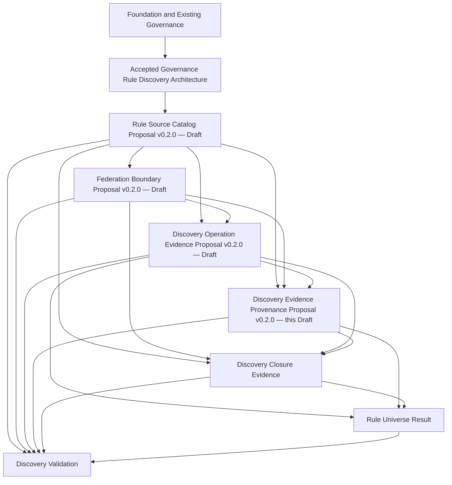

# Discovery Evidence Provenance Contract Proposal

## 1. Document Control

| Field | Value |
| --- | --- |
| Contract identity | `CADP-CONTRACT-DISCOVERY-EVIDENCE-PROVENANCE` |
| Title | Discovery Evidence Provenance Contract |
| Document type | Contract Proposal |
| Version | 0.2.0 |
| Status | Draft Contract Proposal |
| Review state | Maintenance Revision — Pending Contract Review Resolution Verification |
| Date | 2026-07-25 |
| Architecture domain | Governance Rule Discovery |
| Contract domain | Discovery Evidence Provenance |
| Primary responsibility | Canonical semantics of attributable lineage and identity, revision, and temporal continuity across discovery evidence |
| Proposed canonical semantic owner | This contract |
| Repository | `dchaschin79-sys/cliff-ai-development-platform` |
| Source baseline | `1f198213b186e1242b97f6849c460e33eb0b9f75` |
| Methodology constraint | Contract Governance Framework Version 0.3.0 and Contract Decomposition Plan Version 0.2.0 are fixed and are not revised or extended |
| Acceptance | Not created |
| Publication | Not created |
| Effectiveness | Not created |
| Normative effect | None |
| Implementation authority | None |
| Supersedes | Version 0.1.0 Draft Contract Proposal |
| Superseded by | None known |

This document is the fourth Draft Contract Proposal developed under the CADP Contract Governance Framework Version 0.3.0.

It is not Accepted, not Published, not Effective, not implementation-authorizing, and not a Design Freeze. Its existence, authorship, review, Git history, or repository publication does not create Contract Acceptance, Publication, Effectiveness, adoption, or normative authority.

Normative keywords describe the semantics this contract would require only if the proposal later completes the applicable Independent Review, Maintenance Revision where required, Verification, human Acceptance, semantic-equivalent Publication, and Effectiveness stages. They have no current normative effect.

## 2. Authoritative Source Bindings

| Authoritative input | Exact binding | Use |
| --- | --- | --- |
| [Foundation Architecture](../FOUNDATION_ARCHITECTURE.md) | Version 0.2.0; Git object `005f1e0a9fca7d4c75b69a013f0d24710348a866`; commit `84052beb7e7d270e2aeba797c039e5f3a0b3ccc4` | Canonical ownership, immutable revision binding, authority separation, confidentiality, historical preservation, provider neutrality, product independence, and fail-closed boundaries |
| [Governance Rule Discovery Architecture Decision Proposal](../architecture/GOVERNANCE_RULE_DISCOVERY_ARCHITECTURE_DECISION_PROPOSAL.md) | Version 0.1.1; Git object `5fc17613f5ef78fb5f546f17bdeded75465da9c0`; commit `e324fd4e84d7d08ea83c6cf6812596a6c0cb764e` | Accepted provenance, temporal binding, reproducibility, historical reconstruction, Decision Boundary, separation of concerns, and Category B containment |
| [Governance Rule Discovery Architecture Acceptance Record](../architecture/GOVERNANCE_RULE_DISCOVERY_ARCHITECTURE_ACCEPTANCE_RECORD.md) | Record `CADP-AAR-GRD-0001`, Version 1.0.0; Git object `19995bca6768b1de01c3db2055bc618404dbc9ec`; commit `b5feb2bd00f21e955070c8d8a202117972c5eb1f` | Architecture Acceptance and authorization for Contract Design and contract review only |
| [CADP Contract Governance Framework](../governance/CONTRACT_GOVERNANCE_FRAMEWORK.md) | Version 0.3.0 Draft; Git object `7d6ced000bb6135fe3ff6a4c3331fa9f6a458e74`; commit `24feb4baa0d89a91a157ab2746c9d4e175fa6c9d` | Contract ownership, lifecycle, review, Verification, human Acceptance, Publication, Effectiveness, versioning, change, and traceability methodology |
| [Governance Rule Discovery Contract Decomposition Plan](GOVERNANCE_RULE_DISCOVERY_CONTRACT_DECOMPOSITION_PLAN.md) | Version 0.2.0; Git object `c4c1fb6c459d72227b0f3342d6af388ba954a5cd`; commit `f26e52f63a9118991f8620cbe733bb6b80722664` | Discovery Evidence Provenance primary responsibility, supporting temporal coherence, dependency direction, exclusions, review order, and Category B impact |
| [Rule Source Catalog Contract Proposal](RULE_SOURCE_CATALOG_CONTRACT_PROPOSAL.md) | Version 0.2.0 Draft; Git object `f1c80b2d51b4e5e01eec14e30ff1a63cd0cf3f20`; commit `1e1e34ac7f7b53ea452536b3d303985df7bf286d` | Exact upstream semantic candidate for catalog and source identity, revision, declaration, participation, scope, eligibility-reference, lifecycle-reference, and metadata-ownership meanings |
| [Federation Boundary Contract Proposal](FEDERATION_BOUNDARY_CONTRACT_PROPOSAL.md) | Version 0.2.0 Draft; Git object `f9dff838f7ecbea1e9eea4e31fece117203799c1`; commit `f6d8b79f301531df7156659bbd4304c2f57a1a43` | Exact upstream semantic candidate for Federation Identity, Federation Boundary Revision, scope, root or root-set basis, membership, composition, Decision Context binding, and ownership preservation |
| [Discovery Operation Evidence Contract Proposal](DISCOVERY_OPERATION_EVIDENCE_CONTRACT_PROPOSAL.md) | Version 0.2.0 Draft; Git object `5c5f8447ef9aa49e8ecd869d928c530b85d7b868`; commit `f2f68a78b9c2427e1c23aff45381b1e6c56cab48` | Exact upstream semantic candidate for Discovery Operation Identity, Evidence Revision, Operation Context Binding, attribution, manifest, treatment evidence, activity evidence, observations, and historical operation evidence |

No other source is used to define this proposal.

The three upstream Contract Proposals remain Draft artifacts. This proposal consumes their exact Version 0.2.0 meanings only as fixed upstream design dependencies for Draft authoring. It does not accept them, publish them, make them Effective, repair missing governance evidence, or acquire their semantic ownership.

If an upstream proposal changes, does not complete required governance, or acquires a condition affecting this ownership boundary, this proposal must be reevaluated under the Contract Governance Framework before its own human Acceptance. Downstream review or acceptance cannot establish or repair missing upstream acceptance.

## 3. Purpose

The Discovery Evidence Provenance Contract establishes the canonical provider-neutral semantics by which discovery evidence remains attributable and reconstructable across exact source, federation, operation, closure, and result evidence identities and revisions.

The contract exists so downstream closure, result, validation, audit, review, and historical-reconstruction domains can consume one deterministic lineage boundary without:

- redefining any source, catalog, federation, operation, closure, result, validation, applicability, or Policy Decision meaning;
- treating repository location, custody, authorship, copying, technical access, or similarity as provenance;
- merging logical evidence identity with one exact evidence revision;
- allowing a later revision, representation, reassessment, or result to rewrite an earlier evidence state;
- collapsing creation, assertion, discovery, evaluation, effective, or decision times into one temporal meaning;
- treating an attributable assertion as authority, approval, eligibility, integrity proof, closure evidence, or validation;
- inferring a missing lineage relationship from model confidence, implementation behavior, or downstream success; or
- selecting an API, schema, database, graph technology, storage model, workflow, provider, or implementation topology.

This contract owns Discovery Evidence Provenance only.

## 4. Primary Responsibility and Ownership Boundary

### 4.1 Single Primary Responsibility

The single primary responsibility of this contract is:

> Define the canonical semantics of attributable lineage and identity, revision, and temporal continuity required to reconstruct discovery evidence provenance.

Temporal binding is a supporting responsibility only. It qualifies provenance relationships so lineage remains coherent across exact revisions and externally governed time meanings. It does not become an independent lifecycle, temporal-policy, closure, result, or validation responsibility.

Every owned concept is subordinate to attributable discovery evidence lineage. No owned concept evaluates closure, evidence sufficiency for closure, Rule Universe completeness, validation, applicability, conflict precedence, or Policy Decision outcomes.

### 4.2 Owned Semantic Concepts

This proposal defines the canonical meaning of:

1. Discovery Evidence Provenance;
2. Provenance Record Identity;
3. Provenance Record Revision;
4. Provenance Subject Binding;
5. Provenance Attribution;
6. Provenance Relationship;
7. Discovery Evidence Lineage;
8. Evidence Identity Continuity;
9. Evidence Revision Continuity;
10. Temporal Provenance Binding; and
11. Unresolved Required-Lineage Condition; and
12. Provenance Reconstruction Basis.

These are semantic concepts, not fields, types, objects, schemas, interfaces, APIs, files, records, messages, graphs, database structures, storage structures, services, jobs, or runtime components.

### 4.3 Explicit Ownership Boundary

This contract owns:

- the distinction between one logical Provenance Record Identity and one exact immutable Provenance Record Revision;
- the discovery-specific relationship binding provenance assertions to exact externally owned evidence subjects and revisions;
- attributable discovery evidence lineage across roots, declarations, sources, federation evidence, operation evidence, closure evidence, Complete Rule Universe Snapshots, and Incomplete Discovery Results;
- the closed provenance-relationship roles defined in Section 9;
- continuity relationships that preserve logical evidence identity without redefining that identity;
- continuity relationships that preserve exact predecessor and successor revision evidence without redefining revision identity, lifecycle, or supersession;
- Temporal Provenance Binding that qualifies lineage using exact externally governed temporal evidence;
- attributable, revision-bound Unresolved Required-Lineage Conditions that preserve missing, conflicting, stale, restricted, ambiguous, or unverifiable required lineage without representing it as supported; and
- the semantic evidence basis from which an eligible reviewer can reconstruct discovery evidence lineage.

This contract does not own:

- Rule Source, Catalog Identity, Catalog Revision, Catalog Scope, Source Identity, Exact Source Revision Binding, Source Declaration, Source Participation, Source Eligibility References, Source Lifecycle References, Canonical Logical Source Identity, or Source Metadata Ownership;
- Federation Identity, Federation Boundary Revision, Federation Boundary Scope, Federation Root, Federation Root Set, Federation Member, Federation Membership, Boundary Composition Relationship, or Boundary Ownership Preservation;
- Discovery Operation Identity, Discovery Operation Evidence Revision, Operation Context Binding, Operation Attribution, Discovery Operation Manifest, Presented Source Route, Source Route Treatment Evidence, Source Resolution Activity Evidence, Operation Observation, or Attempted Source Route Set;
- Decision Context identity, facts, construction, lifecycle, validation, scope vocabulary, purpose meaning, evaluation-time meaning, or applicable-baseline meaning;
- canonical artifact identity, revision identity, source-of-truth, integrity, or general derived-representation semantics;
- Universal Eligibility, confidentiality, purpose eligibility, provider eligibility, information-use eligibility, Governance Authority, delegation, approval, lifecycle, supersession, or Product Binding semantics;
- source-route closure relevance, Closure Evidence, closure assessment, closure sufficiency, completeness, or independent assurance;
- Complete Rule Universe Snapshot, Incomplete Discovery Result, Rule Corpus, or Rule Universe result semantics;
- validation or conformance outcomes;
- rule applicability, normative conflict precedence, or Policy Decision outcomes; or
- implementation.

## 5. Discovery Evidence Provenance

| Semantic aspect | Definition |
| --- | --- |
| Purpose | Establish the attributable lineage boundary for discovery evidence without acquiring the semantics of the evidence subjects it connects. |
| Canonical definition | Discovery Evidence Provenance is the immutable, attributable, revision-bound, and temporally qualified semantic evidence by which discovery evidence lineage can be reconstructed across exact externally owned evidence subjects. |
| Semantically required invariants | Discovery Evidence Provenance MUST have one Provenance Record Identity, one exact Provenance Record Revision, one exact governing Operation Context Binding where operation-bound evidence is involved, and either at least one explicit Provenance Relationship with attributable Provenance Attribution or at least one attributable Unresolved Required-Lineage Condition. A contract-conforming zero-supported-lineage state MUST contain at least one canonical Unresolved Required-Lineage Condition. Every relationship requiring temporal qualification MUST have a coherent Temporal Provenance Binding. Provenance MUST NOT be inferred from custody, location, content similarity, access, execution, repository history, implementation behavior, or a downstream result. |
| Relationships | Discovery Evidence Provenance is fixed by Provenance Record Revision, connects supported evidence through Provenance Subject Bindings and Provenance Relationships, preserves unsupported required lineage through Unresolved Required-Lineage Conditions, is attributable through Provenance Attribution, preserves continuity through identity and revision relationships, and is temporally qualified through Temporal Provenance Binding. |
| Ownership boundary | This contract owns provenance meaning, the discovery-specific lineage relationships, and the unresolved required-lineage conditions only. Every connected or partially identified evidence subject retains its upstream or downstream semantic owner. |
| Explicit non-goals | This concept does not define an audit store, evidence graph, event stream, ledger, log, trace, manifest, database record, query, schema, serialization, validation result, or closure proof. |

Provenance is evidence, not authority. A complete lineage assertion does not grant source authorization, eligibility, approval, effectiveness, closure, applicability, or Policy Decision authority.

Provenance is also not self-validating. A record, actor, source owner, repository owner, AI system, mechanism, or downstream artifact cannot establish the correctness of its own lineage merely by asserting it.

## 6. Provenance Record Identity and Revision

### 6.1 Provenance Record Identity

| Semantic aspect | Definition |
| --- | --- |
| Purpose | Distinguish one logical body of Discovery Evidence Provenance from every other body and from its revisions or representations. |
| Canonical definition | Provenance Record Identity is the stable logical identity of one discovery evidence lineage record across its Provenance Record Revisions and derived representations. |
| Semantically required invariants | One logical provenance record MUST have one Provenance Record Identity within its governed identity boundary. Equivalent subjects, relationships, contexts, or content MUST NOT establish identity equivalence. A change of representation, repository location, custodian, or Provenance Record Revision MUST NOT create a new logical identity. |
| Relationships | Provenance Record Identity is the subject of Provenance Record Revision and the stable lineage identity referenced by downstream consumers. |
| Ownership boundary | This contract owns the logical provenance-record identity meaning. Foundation canonical governance retains identity integrity, source-of-truth, and canonical-revision evidence. |
| Explicit non-goals | This concept does not define identifier syntax, namespaces, hashes, keys, addresses, repository paths, or identity-resolution algorithms. |

### 6.2 Provenance Record Revision

| Semantic aspect | Definition |
| --- | --- |
| Purpose | Distinguish one exact immutable semantic state of Discovery Evidence Provenance from earlier or later states. |
| Canonical definition | Provenance Record Revision is the exact immutable state of one Provenance Record Identity, including every Provenance Subject Binding, Provenance Attribution, Provenance Relationship, continuity relationship, Temporal Provenance Binding, and Unresolved Required-Lineage Condition asserted at that revision. |
| Semantically required invariants | A Provenance Record Revision MUST belong to exactly one Provenance Record Identity. A correction, clarification, supplementation, reassessment, or newly discovered relationship MUST create a new revision and MUST NOT mutate an earlier revision. Equivalent content MUST NOT be assumed to identify the same revision without canonical revision evidence. |
| Relationships | Provenance Record Revision fixes the exact supported lineage assertions and Unresolved Required-Lineage Conditions available for reconstruction at that revision. |
| Ownership boundary | This contract owns the distinction between logical provenance identity and exact provenance state. Foundation canonical governance retains revision identity, integrity, source-of-truth, and general lineage mechanisms. |
| Explicit non-goals | This concept does not define version numbering, hashes, commit mechanics, storage, synchronization, Publication, Effectiveness, supersession, archival, or retention mechanisms. |

A later Provenance Record Revision may add newly attributable evidence or correct a current assertion only by preserving the predecessor revision and declaring the exact continuity relationship. It cannot rewrite what an earlier revision asserted or what evidence was available to a historical operation or decision.

## 7. Provenance Subject Binding

| Semantic aspect | Definition |
| --- | --- |
| Purpose | Bind a provenance assertion to an exact externally owned evidence subject without duplicating that subject’s semantics. |
| Canonical definition | Provenance Subject Binding is the discovery-provenance-owned relationship that identifies one exact logical evidence subject and, where the assertion concerns a revisioned state, one exact immutable revision under its canonical upstream or downstream ownership. |
| Semantically required invariants | A subject binding MUST identify the subject’s canonical semantic owner, logical identity, exact revision where required, applicable scope, and exact context or boundary binding required to interpret the relationship. A label, location, copy, alias, content match, model output, or technical handle MUST NOT substitute for canonical identity and revision evidence. |
| Relationships | A Provenance Relationship connects exactly identified source and target Provenance Subject Bindings. Identity and revision continuity use those bindings without altering them. |
| Ownership boundary | This contract owns only the relationship to the subject. Rule Source Catalog, Federation Boundary, Discovery Operation Evidence, future Closure Evidence, Rule Universe Result, and other retained governance owners keep their respective subject meanings. |
| Explicit non-goals | This concept does not define source identity, federation identity, operation identity, closure identity, result identity, identifier formats, canonicalization, lookup, retrieval, or identity resolution. |

Eligible subject classes are limited to evidence subjects already established or planned by the accepted architecture:

- governed source and catalog declarations and their exact revisions;
- federation roots, boundary revisions, membership, and composition evidence;
- Discovery Operation identities, evidence revisions, manifests, route-treatment evidence, activity evidence, and observations;
- closure-supporting evidence;
- Complete Rule Universe Snapshots and Incomplete Discovery Results; and
- independently governed eligibility, authority, lifecycle, temporal, integrity, or canonical evidence referenced to explain the lineage of those discovery subjects.

This list establishes the provenance subject boundary only. It does not create, approve, validate, or define any listed subject.

## 8. Provenance Attribution

| Semantic aspect | Definition |
| --- | --- |
| Purpose | Make each supported or unresolved provenance assertion attributable without creating authority or redefining upstream Operation Attribution. |
| Canonical definition | Provenance Attribution is the explicit relationship associating one Provenance Record Revision, each asserted Provenance Relationship, and each Unresolved Required-Lineage Condition with the exact independently governed identity reference accountable for asserting that supported or unresolved lineage state. |
| Semantically required invariants | Attribution MUST be explicit, revision-bound, scope-bound, and bound to the same context and applicable Temporal Provenance Binding as the Provenance Relationship or Unresolved Required-Lineage Condition it qualifies. When an assertion consumes upstream Activity Actor Attribution or Evidence Asserter Attribution, those exact role-qualified meanings MUST remain unchanged. An asserter MUST remain distinguishable from an evidence subject, source owner, activity actor, custodian, author, repository owner, reviewer, validator, approver, or downstream consumer. |
| Relationships | Provenance Attribution qualifies Provenance Relationships and Unresolved Required-Lineage Conditions and may reference independently governed identity, authority, eligibility, integrity, custody, and temporal evidence without redefining them. |
| Ownership boundary | This contract owns the attributable relationship for provenance assertions. Identity eligibility, actor authority, delegation, authentication, integrity assurance, custody, and review eligibility remain externally owned. |
| Explicit non-goals | This concept does not define a person, user, organization, service account, AI system, agent, model, process identity, governance role, approver, validator, authority tier, signature, credential, or authentication method. |

Attribution is not authority and is not proof. A named identity does not acquire source, discovery, approval, validation, or policy authority merely because a provenance assertion is attributed to it.

Missing, ambiguous, conflicting, or unverifiable Provenance Attribution makes the affected Provenance Relationship `Indeterminate` and prevents an asserted unresolved state from qualifying as a canonical Unresolved Required-Lineage Condition. Attribution MUST NOT be inferred from repository authorship, file ownership, technical access, network identity, custody, model invocation, or prior behavior.

## 9. Provenance Relationship

### 9.1 Canonical Meaning

| Semantic aspect | Definition |
| --- | --- |
| Purpose | Express one attributable and reconstructable lineage relationship between exact discovery evidence subjects. |
| Canonical definition | A Provenance Relationship is one directed discovery-lineage assertion from an exact lineage-bearing subject binding to an exact antecedent or continuity subject binding under one closed relationship role. |
| Semantically required invariants | Every relationship MUST belong to one Provenance Record Revision, use exactly one relationship role from Section 9.2, bind exact source and target subjects, preserve direction, carry Provenance Attribution, and include a coherent Temporal Provenance Binding where temporally relevant. One relationship MUST NOT imply another role, transfer semantic ownership, or establish closure, result, validation, applicability, or Policy Decision meaning. |
| Relationships | Provenance Relationships compose Discovery Evidence Lineage and support evidence identity continuity, revision continuity, temporal coherence, and historical reconstruction. |
| Ownership boundary | This contract owns discovery-provenance relationship meaning. General source, boundary, operation, lifecycle, supersession, authority, and artifact-derivation meanings remain with their existing owners. |
| Explicit non-goals | This concept does not define a graph edge, database relationship, foreign key, link format, event, trace span, API association, traversal algorithm, or inference rule. |

### 9.2 Closed Relationship Roles

Each Provenance Relationship has exactly one of these roles:

1. **Evidence Basis Relationship** — asserts that one lineage-bearing discovery evidence subject directly cites, incorporates, or depends on one exact antecedent evidence subject as part of its stated evidence basis.
2. **Revision Continuity Relationship** — asserts that one exact evidence revision is the attributable successor of one exact predecessor revision for the same externally established logical evidence identity, without mutating or replacing the predecessor’s historical meaning.
3. **Representation Continuity Relationship** — asserts that a representation refers to the same externally established logical evidence identity and exact revision as its canonical evidence basis, without making the representation a second canonical owner.

The roles are mutually exclusive for one relationship. When more than one role applies, each role requires a separate attributable relationship.

The roles do not define:

- whether an antecedent is sufficient for closure;
- whether a revision is Approved, Effective, Adopted, Deprecated, Withdrawn, Superseded, Archived, or Retired;
- whether two aliases, mirrors, translations, or derived sources are canonically equivalent;
- whether a representation is authorized or eligible for a particular use;
- whether the lineage is independently validated; or
- whether a downstream result is complete, applicable, controlling, or permitted.

The Evidence Basis Relationship role does not distinguish or imply transformation, equivalence, authority, sufficiency, or any narrower antecedent semantics. A consumer MUST NOT infer those meanings from the consolidated role.

An unrecognized, ambiguous, multiply assigned, or unsupported role is `Indeterminate`. It cannot be converted into an Evidence Basis, Revision Continuity, or Representation Continuity Relationship by inference.

### 9.3 Relationship Direction and Composition

Relationship direction runs from the lineage-bearing subject whose provenance is being reconstructed to the exact antecedent or continuity subject it cites. This lineage-reference direction does not alter the upstream-to-downstream contract dependency direction in the Contract Decomposition Plan.

A Discovery Evidence Lineage is composed only from explicit Provenance Relationships. Transitive lineage MUST NOT be inferred across a missing, ambiguous, conflicting, stale, unauthorized, ineligible, or unverifiable relationship.

An Unresolved Required-Lineage Condition is preserved alongside the supported relationship composition for reconstruction. It is not a Provenance Relationship, does not enter supported Discovery Evidence Lineage, and cannot create a relationship endpoint, direction, or role by inference.

A repeated subject or relationship does not establish identity equivalence, completeness, or harmless cyclicity. A cycle that prevents deterministic reconstruction remains explicit and `Indeterminate`; this contract defines no general traversal, recursion, termination, or bounded-cycle policy.

## 10. Discovery Evidence Lineage

| Semantic aspect | Definition |
| --- | --- |
| Purpose | Preserve the reconstructable chain connecting discovery evidence to its exact antecedent evidence. |
| Canonical definition | Discovery Evidence Lineage is the directed composition of explicit Provenance Relationships associated with one Provenance Record Revision and interpreted under exact subject, context, revision, attribution, and temporal bindings. |
| Semantically required invariants | Every included relationship MUST satisfy this contract’s semantic boundary. The Provenance Reconstruction Basis accompanying the supported lineage MUST preserve every Unresolved Required-Lineage Condition. Supported lineage MUST NOT silently bridge a gap, drop an inconvenient condition, infer a source, or claim that the represented chain is complete for closure. |
| Relationships | Lineage connects roots, declarations, sources, boundary evidence, operation evidence, closure evidence, complete snapshots, and incomplete results without acquiring their meanings. |
| Ownership boundary | This contract owns discovery-lineage composition meaning only. Closure Evidence owns the use of provenance within a closure-supporting evidence basis; Rule Universe Result owns complete-versus-incomplete result meaning; Discovery Validation owns conformance outcomes. |
| Explicit non-goals | This concept does not define traversal, graph closure, route closure relevance, completeness, search, query, visualization, storage, or validation. |

Equivalent eligible subject bindings, Provenance Relationships, record revision, context, and temporal evidence MUST produce the same lineage interpretation independent of provider or representation.

Lineage may be represented across multiple eligible artifacts or systems without acquiring multiple canonical semantic owners. Every representation remains bound to one canonical provenance meaning and exact revision.

## 11. Evidence Identity Continuity

| Semantic aspect | Definition |
| --- | --- |
| Purpose | Preserve the same logical evidence subject across revisions and representations without manufacturing identity equivalence. |
| Canonical definition | Evidence Identity Continuity is the semantic continuity condition by which multiple exact subject bindings remain attributable to one externally governed logical evidence identity through exact canonical identity evidence and, where applicable, explicit Revision Continuity or Representation Continuity Relationships. |
| Semantically required invariants | Continuity MUST rely on exact canonical identity evidence from the subject’s semantic owner. Equivalent names, locations, contents, metadata, actors, custodians, repositories, or outputs MUST NOT establish continuity. Conflicting canonical identity claims MUST remain explicit and `Indeterminate`. |
| Relationships | Evidence Identity Continuity qualifies Revision Continuity and Representation Continuity Relationships. |
| Ownership boundary | This contract owns only preservation of identity continuity within lineage. Each upstream or downstream contract retains the canonical meaning and evidence for its subject identity. |
| Explicit non-goals | This concept does not define canonical identity, merge identities, reconcile aliases, approve equivalence, or select an identity provider. |

Identity continuity does not imply revision continuity. Two subject bindings may concern the same logical identity while referring to different exact revisions. The distinction must remain explicit.

## 12. Evidence Revision Continuity

| Semantic aspect | Definition |
| --- | --- |
| Purpose | Preserve attributable continuity among exact evidence revisions without rewriting history or redefining lifecycle. |
| Canonical definition | Evidence Revision Continuity is the provenance relationship that binds one exact evidence revision to its exact predecessor under the same externally governed logical identity. |
| Semantically required invariants | Both revisions MUST remain independently identifiable and immutable. A later revision MUST NOT alter an earlier assertion, context, temporal basis, Unresolved Required-Lineage Condition, or lineage. A missing, conflicting, circular, or unverifiable predecessor relationship is `Indeterminate`. |
| Relationships | Evidence Revision Continuity is expressed through a Revision Continuity Relationship and contributes to Provenance Reconstruction Basis. |
| Ownership boundary | This contract owns lineage continuity among exact revisions. The subject owner retains revision identity and meaning; governance lifecycle retains approval, effectiveness, adoption, disposition, supersession, archival, and retirement meanings. |
| Explicit non-goals | This concept does not define version numbering, compatibility, change classification, supersession policy, migration, synchronization, storage, or revision-generation mechanisms. |

A later correction, supplementation, reassessment, boundary change, source change, operation revision, closure assessment, or result creates prospective evidence. It cannot be used to backfill or reinterpret the lineage that supported an earlier operation or decision.

## 13. Temporal Provenance Binding

| Semantic aspect | Definition |
| --- | --- |
| Purpose | Qualify provenance relationships with exact externally governed time evidence required for coherent lineage reconstruction. |
| Canonical definition | Temporal Provenance Binding is the discovery-provenance-owned relationship connecting one Provenance Relationship or Unresolved Required-Lineage Condition and its Provenance Record Revision to the exact evaluation-time binding and every externally governed effective, lifecycle, source, boundary, operation, assertion, or decision-time reference required to interpret that supported or unresolved lineage state. |
| Semantically required invariants | The binding MUST preserve the identity, source revision, semantic time role, scope, and historical interval of every required temporal reference. Creation, assertion, discovery, evaluation, approval, effectiveness, adoption, supersession, and decision times MUST remain distinct where they are independently governed. A later temporal or lifecycle state MUST NOT silently mutate an earlier Provenance Record Revision. |
| Relationships | Temporal Provenance Binding qualifies Provenance Relationships, Unresolved Required-Lineage Conditions, Evidence Revision Continuity, and Provenance Reconstruction Basis. It consumes the exact evaluation time already present in the externally owned Decision Context binding where applicable. |
| Ownership boundary | This contract owns only the relationship that qualifies discovery provenance with external temporal evidence. Decision Context, lifecycle, approval, effectiveness, supersession, source validity, boundary validity, reevaluation, and legal-effect meanings remain externally owned. |
| Explicit non-goals | This concept does not define clocks, timestamps, time zones, effective intervals, lifecycle states, temporal policy, retroactivity, reevaluation obligations, legal effect, storage, transactions, or synchronization. |

Temporal Provenance Binding does not determine whether evidence was operationally valid, applicable, sufficient for closure, or legally effective. It preserves the exact external evidence needed for those independently owned determinations.

When required temporal evidence is missing, conflicting, stale, ambiguous, or unverifiable, the affected Provenance Relationship is `Indeterminate`, or the affected Unresolved Required-Lineage Condition preserves the exact missing temporal role under Section 14.2. This contract does not convert either state into a closure decision, Rule Universe result, validation outcome, applicability result, or Policy Decision.

## 14. Provenance Reconstruction and Historical Preservation

### 14.1 Provenance Reconstruction Basis

| Semantic aspect | Definition |
| --- | --- |
| Purpose | Define the semantic evidence basis from which an eligible reviewer can reconstruct discovery evidence lineage. |
| Canonical definition | Provenance Reconstruction Basis is the exact set of Provenance Record Revision, subject bindings, supported relationships, Unresolved Required-Lineage Conditions, attribution, identity continuity, revision continuity, and temporal bindings used to reconstruct one discovery evidence lineage state. |
| Semantically required invariants | The basis MUST remain bound to exact immutable revisions and MUST distinguish asserted, missing, conflicting, restricted, stale, ambiguous, and unverifiable lineage evidence. It MUST NOT claim closure, evidentiary sufficiency, independent validation, or legal completeness. |
| Relationships | The basis supports audit, review, historical reconstruction, downstream closure evidence, Rule Universe result evidence, and validation without determining their outcomes. |
| Ownership boundary | This contract owns the reconstruction-basis meaning for provenance. Access eligibility, review authority, assurance level, retention, closure, result, and validation remain externally owned. |
| Explicit non-goals | This concept does not define a query, report, graph traversal, replay process, audit procedure, storage package, export, interface, or validation algorithm. |

### 14.2 Unresolved Required-Lineage Condition

| Semantic aspect | Definition |
| --- | --- |
| Purpose | Preserve an attributable fail-closed provenance fact when a required Provenance Relationship cannot be supported at one exact Provenance Record Revision. |
| Canonical definition | An Unresolved Required-Lineage Condition is one explicit, immutable, attributable, context-bound, revision-bound, and temporally qualified provenance condition stating that a specific required lineage boundary cannot be represented as a supported Provenance Relationship from the evidence available at that revision. |
| Identity | Each condition MUST have one identity that distinguishes that specific unresolved lineage boundary within its exact Provenance Record Revision. The identity MUST NOT be reused to conflate different gaps, subjects, contexts, roles, reasons, or revisions. Identity syntax and generation remain implementation concerns. |
| Required bindings | The condition MUST bind to the exact Provenance Record Revision; the affected evidence subject or best available subject identity when any subject identity is supportable, or otherwise the explicit endpoint-unknown state; the expected, required, or unresolved relationship boundary; the exact applicable evidence context or Decision Context; Provenance Attribution for the accountable asserter; the reason and available evidence basis for the unresolved state; applicable temporal evidence; and every available source or target identity when an endpoint is only partially known. |
| Attribution requirements | The condition MUST have exact Provenance Attribution identifying the independently governed identity reference accountable for asserting the unresolved provenance state. That attribution does not grant authority, eligibility, approval, validation, or downstream decision ownership. |
| Temporal requirements | The condition MUST preserve the exact available temporal references needed to interpret when and for which evaluation state the lineage was unresolved. Missing required temporal evidence MUST be identified by its external semantic role and remains `Indeterminate`; it MUST NOT be invented, defaulted, or replaced by record creation time. |
| Revision behavior | The condition is immutable within its Provenance Record Revision. Correction, supplementation, reassessment, or later support for the required relationship creates a later Provenance Record Revision with explicit revision continuity. The later revision may reference the earlier condition and assert a supported relationship only when every relationship invariant is independently satisfied. |
| Consistency rules | Equivalent eligible immutable inputs under the same record revision, context, boundary, attribution, and temporal evidence MUST produce the same unresolved-condition interpretation. Conflicting conditions or evidence MUST remain explicit. Repetition, similarity, partial success, or a downstream outcome MUST NOT merge, suppress, or resolve a condition. |
| Reconstruction role | The condition participates in Provenance Reconstruction Basis as evidence of an unresolved required lineage boundary. It is preserved alongside, but never within, supported Discovery Evidence Lineage. |
| Fail-closed behavior | The condition cannot be interpreted as a supported Provenance Relationship, cannot supply a missing endpoint or role, and cannot establish absence of antecedent evidence. A contract-conforming Provenance Record Revision with zero supported Provenance Relationships MUST contain at least one canonical Unresolved Required-Lineage Condition. |
| Ownership boundary | This contract owns only the meaning and historical preservation of the unresolved provenance fact. It does not own or evaluate the downstream consequence of that fact. |
| Explicit exclusions | The condition does not establish Closure Evidence, coverage, completeness, sufficiency, a Rule Universe Result, Validation, Applicability, a Policy Decision, authority, approval, lifecycle state, or supersession outside provenance revision continuity. It defines no implementation model, schema, event, storage form, or runtime algorithm. |

Endpoint and role uncertainty are represented without manufacturing lineage:

- when neither endpoint can be supported, the condition binds the exact required lineage boundary and applicable evidence context, identifies both endpoints as unresolved, and MUST NOT create placeholder subject identities;
- when only one endpoint can be supported, the condition binds that exact available subject identity and identifies the unresolved endpoint without inferring it;
- when the expected relationship role is known, the condition records that exact role as the unresolved boundary without asserting a relationship;
- when the expected relationship role is not determinable, the condition records role uncertainty as `Indeterminate` and MUST NOT select a role by convenience;
- when relationship-support attribution is unavailable, the condition records that missing attribution only through a separately attributable accountable asserter; when no accountable asserter can be established for the condition itself, no canonical Unresolved Required-Lineage Condition and therefore no contract-conforming Provenance Record Revision can be established;
- when applicable temporal evidence is unavailable, the condition preserves every available temporal reference and the exact missing external temporal role as `Indeterminate`; when no temporal basis sufficient to interpret the condition can be established, the condition is not contract-conforming; and
- when a later Provenance Record Revision resolves the condition, the earlier condition remains immutable, the later revision preserves explicit revision continuity and references the earlier condition, and only the later revision may contain the newly supported Provenance Relationship.

Absence of support is not evidence that antecedent evidence is absent. It does not establish closure failure or closure success and does not determine a Rule Universe Result, Validation outcome, Applicability result, or Policy Decision consequence.

### 14.3 Historical Preservation

A historical Provenance Record Revision must preserve:

- its exact Provenance Record Identity and revision;
- every exact Provenance Subject Binding;
- every Provenance Relationship and relationship role;
- every Provenance Attribution;
- every identity and revision continuity assertion;
- every Temporal Provenance Binding;
- the exact Decision Context, Federation Boundary, and Discovery Operation evidence references it consumed;
- every Unresolved Required-Lineage Condition, including its identity, bindings, attribution, reason, evidence basis, and temporal state; and
- its relationship to any later Provenance Record Revision without changing the earlier record.

Later source, boundary, operation, closure, result, lifecycle, applicability, or Policy Decision evidence does not overwrite that record. A later assessment may reference it and create new evidence, but it cannot alter the historical lineage basis.

### 14.4 Reconstruction Boundary

Reconstruction demonstrates what lineage evidence an exact Provenance Record Revision asserted. It does not independently prove:

- that every closure-relevant route was discovered;
- that lineage assurance was sufficient for closure;
- that an evidence subject was eligible, authoritative, Approved, Effective, or applicable;
- that a Complete Rule Universe Snapshot was valid;
- that an Incomplete Discovery Result had a particular downstream consequence;
- that validation passed; or
- that a Policy Decision was correct.

## 15. Semantic Relationship Map

| From | Relationship | To | Ownership rule |
| --- | --- | --- | --- |
| Provenance Record Identity | is fixed at | Provenance Record Revision | This contract owns the provenance identity-to-revision distinction |
| Provenance Record Revision | contains attributable | Provenance Relationships | This contract owns the discovery-lineage relationship meaning |
| Provenance Record Revision | preserves attributable | Unresolved Required-Lineage Conditions | Conditions remain unresolved provenance facts and are not supported relationships |
| Provenance Relationship | connects | Exact Provenance Subject Bindings | Subject identities and revisions remain with their semantic owners |
| Provenance Relationship | is asserted through | Provenance Attribution | This contract owns attribution of the lineage assertion, not identity or authority |
| Unresolved Required-Lineage Condition | is asserted through | Provenance Attribution | Missing relationship support does not permit unattributed provenance evidence |
| Evidence Basis Relationship | points from | Lineage-bearing subject to exact antecedent evidence | The relationship does not transfer the antecedent’s ownership |
| Revision Continuity Relationship | points from | Exact successor revision to exact predecessor revision | Subject owner retains revision meaning; lifecycle retains supersession meaning |
| Representation Continuity Relationship | points from | Representation to exact canonical evidence identity and revision | Representation does not become a canonical semantic owner |
| Provenance Relationship or Unresolved Required-Lineage Condition | is qualified by | Temporal Provenance Binding | External time meanings remain externally owned |
| Discovery Evidence Lineage | composes | Explicit Provenance Relationships | Composition does not infer missing relationships or establish closure |
| Provenance Reconstruction Basis | preserves | Supported lineage evidence and Unresolved Required-Lineage Conditions | Reconstruction does not convert conditions into relationships or create validation or sufficiency |
| Discovery Closure Evidence | consumes | Discovery Evidence Provenance | Closure contract cannot redefine provenance |
| Rule Universe Result | consumes | Discovery Evidence Provenance and Closure Evidence | Result contract owns complete-versus-incomplete result meaning |
| Discovery Validation | evaluates conformance of | Discovery Evidence Provenance | Validation contract owns validation outcomes |

No relationship transfers canonical semantic ownership. A downstream reference to provenance cannot redefine lineage, and this contract cannot acquire the meaning of an upstream or downstream subject merely by relating it.

## 16. Contract Invariants

If later Accepted, Published, and made Effective, this contract would require:

1. **One primary responsibility:** attributable Discovery Evidence Provenance is the only primary responsibility.
2. **One provenance identity:** each logical provenance record has one Provenance Record Identity.
3. **Immutable provenance revision:** every provenance state is fixed by one exact revision and never silently mutated.
4. **Exact subject binding:** every lineage subject retains its canonical owner, logical identity, exact revision where required, scope, and context.
5. **Attributable relationships:** every Provenance Relationship has exact Provenance Attribution.
6. **Attribution is not authority:** provenance attribution creates no authority, eligibility, approval, validation, or policy ownership.
7. **Closed relationship roles:** every relationship has exactly one Evidence Basis, Revision Continuity, or Representation Continuity role.
8. **Explicit direction:** every relationship preserves its lineage-reference direction.
9. **No inferred relationship:** proximity, similarity, access, custody, implementation behavior, or downstream success cannot create lineage.
10. **Identity continuity evidence:** logical identity continuity depends on exact external canonical identity evidence.
11. **Revision continuity evidence:** successor and predecessor revisions remain explicit, immutable, and independently identifiable.
12. **Temporal qualification:** every temporally dependent Provenance Relationship or Unresolved Required-Lineage Condition preserves exact available external time evidence through Temporal Provenance Binding.
13. **Temporal role separation:** independently governed creation, assertion, discovery, evaluation, approval, effectiveness, adoption, supersession, and decision times are not collapsed.
14. **No lifecycle capture:** temporal provenance does not define or change lifecycle, effective intervals, supersession, or reevaluation obligations.
15. **No source capture:** provenance does not define or alter Rule Source Catalog meanings.
16. **No boundary capture:** provenance does not define or alter Federation Boundary meanings.
17. **No operation capture:** provenance does not define or alter Discovery Operation Evidence meanings.
18. **No closure capture:** provenance does not establish route closure relevance, closure evidence sufficiency, or closure outcome.
19. **No result capture:** provenance does not create or classify Complete Rule Universe Snapshots or Incomplete Discovery Results.
20. **No validation capture:** provenance does not validate itself or produce conformance outcomes.
21. **No applicability capture:** provenance cannot determine that a rule applies.
22. **No Policy Decision capture:** provenance cannot decide normative precedence or a Policy Decision outcome.
23. **Historical immutability:** later evidence creates a new revision and never rewrites historical lineage.
24. **Canonical unresolved evidence:** missing, conflicting, stale, restricted, ambiguous, or unverifiable required lineage is preserved through an attributable, exact-revision-bound Unresolved Required-Lineage Condition.
25. **No unsupported empty state:** a contract-conforming Provenance Record Revision with zero supported Provenance Relationships contains at least one canonical Unresolved Required-Lineage Condition.
26. **Condition attribution:** every Unresolved Required-Lineage Condition has exact Provenance Attribution; absence of an accountable asserter prevents a contract-conforming condition and record revision.
27. **Condition is not relationship:** an Unresolved Required-Lineage Condition cannot be interpreted as or enter supported lineage as a Provenance Relationship.
28. **No absence inference:** absence of relationship support does not prove absence of antecedent evidence.
29. **No downstream inference:** an Unresolved Required-Lineage Condition establishes neither closure failure nor closure success and determines no Rule Universe Result, Validation, Applicability, or Policy Decision consequence.
30. **Historical unresolved preservation:** later support creates a later Provenance Record Revision and never erases or mutates an earlier unresolved condition.
31. **Revision succession:** later resolution preserves explicit revision continuity and historical reconstruction of the earlier unresolved state.
32. **No silent omission:** an inconvenient or inaccessible required relationship or unresolved condition cannot be removed from the reconstruction basis.
33. **Deterministic interpretation:** equivalent eligible immutable inputs produce the same supported or unresolved provenance interpretation.
34. **Provider neutrality:** no model, repository host, graph engine, database, workflow system, storage product, or implementation owns supported or unresolved provenance semantics.
35. **Implementation independence:** files, logs, traces, messages, tables, services, and software behavior cannot redefine supported or unresolved provenance.

## 17. Consumed Semantics and Upstream Dependencies

| Upstream source or domain | Consumed meaning | Retained ownership boundary |
| --- | --- | --- |
| Foundation Architecture | Canonical identity, immutable revisions, source-of-truth separation, authority separation, confidentiality gating, provider neutrality, fail-closed behavior, and immutable history | Foundation meanings remain unchanged and outside this contract |
| Accepted Governance Rule Discovery architecture | Attributable provenance, exact revision and temporal binding, reproducibility, historical reconstruction, fail-closed incompleteness, and separation from applicability and Policy Decision | Architecture family and Decision Boundary remain unchanged |
| Architecture Acceptance Record | Authorization for Contract Design and review within the accepted architecture | Does not approve this contract or authorize implementation |
| Contract Governance Framework Version 0.3.0 | Contract identity, lifecycle, review, Verification, human Acceptance, Publication, Effectiveness, versioning, change, and traceability methodology | Framework remains unchanged and outside this contract |
| Contract Decomposition Plan Version 0.2.0 | Discovery Evidence Provenance ownership, supporting temporal coherence, dependency direction, exclusions, sequence, and Category B impact | Plan remains a fixed planning source and is not redefined |
| Rule Source Catalog Proposal Version 0.2.0 | Catalog and source identity, exact revision, declarations, participation, scope, eligibility references, lifecycle references, canonical logical source identity, and metadata ownership | Draft source-catalog proposal retains every source and catalog meaning |
| Federation Boundary Proposal Version 0.2.0 | Federation identity, exact boundary revision, scope, root or root set, membership, composition, Decision Context binding, eligibility references, and ownership preservation | Draft federation proposal retains every boundary meaning |
| Discovery Operation Evidence Proposal Version 0.2.0 | Discovery Operation Identity, Evidence Revision, Operation Context Binding, attribution, manifest, route treatment, resolution activity, observations, and immutable operation history | Draft operation proposal retains every operation-evidence meaning |
| Decision Context as retained by the accepted architecture and upstream proposals | Governed Operation or decision subject, target and requested scope, purpose, evaluation time, applicable baselines, and required eligibility and authority references | Decision Context identity, facts, construction, lifecycle, and validation remain externally owned |
| Universal Eligibility, confidentiality, and Governance Authority as retained by the listed authoritative sources | Source authorization, confidentiality, purpose, provider, information-use eligibility, authority, ownership, and approval evidence | This contract preserves exact references and creates no eligibility, disclosure, or authority semantics |
| Lifecycle and canonical governance as retained by Foundation and the listed authoritative sources | Approval, effectiveness, adoption, disposition, supersession, archival, retirement, canonical identity, revision, integrity, and source-of-truth evidence | This contract preserves lineage references and creates no lifecycle or canonical-artifact semantics |

Every consumed meaning is referenced at an exact immutable revision where required. This contract does not copy it into a second canonical owner, repair missing upstream evidence, or convert a Draft dependency into an Accepted, Published, or Effective Contract.

## 18. Downstream Consumers

The planned downstream consumers are:

1. **Discovery Closure Evidence Contract candidate** — consumes exact provenance lineage, identity and revision continuity, temporal bindings, and Unresolved Required-Lineage Conditions when defining closure-supporting evidence. It cannot redefine provenance, convert a condition into a supported relationship, or convert lineage into closure by itself.
2. **Rule Universe Result Contract candidate** — consumes exact provenance and closure evidence when owning Complete Rule Universe Snapshot and Incomplete Discovery Result semantics. It cannot reinterpret provenance or repair a lineage gap.
3. **Discovery Validation Contract candidate** — evaluates conformance of provenance evidence and cross-contract relationships without acquiring provenance ownership.
4. **Audit, review, and historical-reconstruction consumers** — reconstruct exact lineage under independently valid eligibility without treating reconstruction as Acceptance, closure, validation, implementation authority, or a Policy Decision.

No downstream consumer may:

- alter a Provenance Record Identity or Revision;
- create or infer a missing subject binding, attribution, relationship role, identity continuity, revision continuity, or temporal binding;
- convert an `Indeterminate` relationship into supported lineage;
- convert an Unresolved Required-Lineage Condition into a supported Provenance Relationship or infer a downstream consequence from it;
- treat a provenance record as proof of closure, completeness, validation, applicability, or Policy Decision correctness;
- mutate historical lineage through a later source, boundary, operation, closure, result, or lifecycle change;
- transfer upstream source, federation, operation, authority, eligibility, lifecycle, or canonical ownership to provenance; or
- treat a representation, report, graph, cache, index, or implementation as the canonical provenance owner.

This section defines semantic dependency direction only. It does not define software dependencies, calls, services, packages, messages, deployment, orchestration, traversal, or runtime sequence.

## 19. Cross-Contract Non-Overlap

### 19.1 Ownership Matrix

| Semantic concern | Upstream owner | Discovery Evidence Provenance owner | Downstream owner |
| --- | --- | --- | --- |
| Source and catalog identity, revision, participation, scope, and ownership | Rule Source Catalog | References exact meanings in lineage | References without redefinition |
| Federation identity, boundary revision, membership, composition, scope, and ownership preservation | Federation Boundary | References exact meanings in lineage | References without redefinition |
| Discovery Operation identity, evidence revision, context binding, attribution, manifest, treatment, activity, and observations | Discovery Operation Evidence | References and relates exact operation evidence | References without redefinition |
| Discovery evidence lineage | Does not own | Owns | Consumes |
| Provenance identity and record revision | Does not own | Owns | Consumes |
| Unresolved required lineage fact | Upstream owners supply available subject, context, and evidence meanings | Owns only the attributable, revision-bound Unresolved Required-Lineage Condition | Consumers preserve the condition and determine consequences only under their own contracts |
| Identity and revision continuity within lineage | Subject owner supplies canonical identity and revision evidence | Owns discovery-lineage continuity relationships | Consumes |
| Temporal evidence meaning | Decision Context, lifecycle, source, boundary, operation, and other retained owners | Owns only Temporal Provenance Binding | Consumes |
| Closure-supporting evidence and sufficiency relationship | Does not own | Does not own | Discovery Closure Evidence owns |
| Complete-versus-incomplete result meaning | Does not own | Does not own | Rule Universe Result owns |
| Conformance result | Does not own | Does not own | Discovery Validation owns |
| Rule applicability and Policy Decision | Governance Applicability and Policy Decision retain ownership | Does not own | Retained downstream owners |

### 19.2 Rule Source Catalog Separation

This contract does not define or alter a source or catalog concept.

Specifically:

- a Provenance Subject Binding does not create a Rule Source, Source Identity, Exact Source Revision Binding, Source Declaration, or Source Participation;
- Evidence Identity Continuity cannot reconcile an alias, mirror, translation, or derived source without exact externally governed canonical identity evidence;
- a Provenance Relationship does not authorize a source, make it Effective, or establish catalog participation;
- a source reference in lineage does not become source ownership; and
- lineage cannot repair missing or conflicting Source Metadata Ownership.

### 19.3 Federation Boundary Separation

This contract does not define or alter a federation concept.

Specifically:

- a provenance relationship cannot create a Federation Root, Federation Member, Federation Membership, or Boundary Composition Relationship;
- observed lineage cannot add, remove, narrow, expand, or reinterpret a Federation Boundary;
- Evidence Identity Continuity cannot merge independently governed boundaries;
- Temporal Provenance Binding cannot make a boundary revision valid or Effective; and
- provenance cannot repair missing authority, eligibility, scope, composition, or ownership-preservation evidence.

### 19.4 Discovery Operation Evidence Separation

This contract does not define or alter operation evidence.

Specifically:

- provenance consumes the exact Discovery Operation Identity and Evidence Revision without changing them;
- Provenance Attribution does not replace Activity Actor Attribution or Evidence Asserter Attribution;
- a Provenance Subject Binding does not create a Presented Source Route, treatment classification, activity assertion, observation, or Attempted Source Route Set;
- an Evidence Basis Relationship does not prove that a route was attempted or resolved; and
- lineage cannot convert silence, observation, or an `Indeterminate` operation assertion into `Attempted`, successful, or complete evidence.

### 19.5 Closure, Result, Validation, Applicability, and Policy Separation

This contract may supply provenance evidence to downstream domains, but it does not:

- determine source-route closure relevance;
- establish that all required routes or relationships were represented;
- decide closure-evidence or assurance sufficiency;
- classify discovery as complete or incomplete;
- create a Complete Rule Universe Snapshot or Incomplete Discovery Result;
- validate provenance or any connected evidence subject;
- decide remediation;
- determine rule applicability;
- choose normative precedence; or
- produce or reinterpret a Policy Decision.

If a semantic assertion cannot be assigned deterministically to one owner in this matrix, the proposal remains Draft and the ambiguity must be resolved through applicable contract review. No assertion may be duplicated for convenience.

## 20. Category B Unresolved Items

The Contract Decomposition Plan maps 13 accepted Category B items to Discovery Evidence Provenance. They remain unresolved.

| Category B item | Effect on this proposal | Preserved boundary |
| --- | --- | --- |
| GRD-04 — Trust evidence for negative source declarations | Provenance may preserve the exact claimant, evidence identity, revision, scope, temporal binding, and lineage of a negative declaration. | This proposal does not decide whether the declaration is trustworthy, independently assured, or sufficient for closure. |
| GRD-06 — Restricted sources not disclosed to the requester | Provenance may preserve an eligible non-disclosing lineage reference without exposing protected evidence. | This proposal defines no access, disclosure, redaction, confidentiality, or non-disclosing evidence-sufficiency rule. Restricted lineage cannot be silently omitted or treated as absent. |
| GRD-07 — External-incorporation decisions requiring legal or specialist review | Provenance may preserve exact references to externally governed specialist evidence and its lineage. | This proposal assigns no specialist role, authority, eligibility rule, or review requirement. |
| GRD-08 — Jurisdiction, customer, contract, and tenant scope expression | Provenance relationships remain qualified by exact externally owned scope references. | This proposal defines no scope vocabulary, value, hierarchy, inference, or product-specific meaning. |
| GRD-09 — Later-discovered historically effective obligations | Historical provenance remains immutable and later evidence creates a new prospective revision or reassessment reference. | This proposal does not decide retroactivity, legal effect, reevaluation obligations, or whether an earlier closure claim changes. |
| GRD-10 — Alias, mirror, translation, and derived-source reconciliation | Provenance preserves identity claims, lineage evidence, and conflicts among representations. | This proposal defines no equivalence, reconciliation, canonicalization, translation, or merge rule. Unsupported equivalence remains `Indeterminate`. |
| GRD-11 — Conflict evidence allocation | Provenance relates exact conflict evidence to its subjects and preserves attributable lineage. | This proposal does not decide source membership, identity reconciliation, normative precedence, applicability, or Policy Decision consequences. |
| GRD-12 — Exact scope relationships across governance layers | Provenance preserves exact externally governed scope-relationship references where they qualify lineage. | This proposal defines no relationship vocabulary, precedence, inheritance, overlay, or cross-layer composition rule. |
| GRD-13 — Minimum evidence for local completeness | Provenance preserves the lineage of evidence presented to downstream closure assessment. | This proposal defines no evidence threshold and does not decide local or combined completeness. |
| GRD-14 — Self-issued negative declarations or independent verification | Provenance keeps the claimant, assertion, antecedent evidence, and assurance references distinguishable. | This proposal does not establish independence, reviewer eligibility, assurance sufficiency, or closure. |
| GRD-15 — Emergency source incorporation | Provenance remains bound to exact historical and prospective source, boundary, operation, authority, lifecycle, and temporal evidence. | Urgency cannot mutate lineage, create standing authority, validate emergency evidence, or bypass independent governance. |
| GRD-17 — Legacy decisions without reconstructable boundaries | Missing historical lineage remains explicit and cannot be fabricated or backfilled from modern evidence. | This proposal defines no legacy classification, migration, presumption, legal consequence, or reconstruction substitute. |
| GRD-20 — Cross-repository snapshot consistency mechanism | Provenance requires exact revisions, common context identity, coherent temporal references, and explicit unresolved inconsistency. | This proposal selects no consistency, attestation, synchronization, transaction, storage, or coordination mechanism. |

No Category B classification, assumption, containment boundary, future owner, or reopening trigger is changed by this proposal.

Category B impact identifies where uncertainty must remain visible. It does not make this contract the canonical owner of the deferred question, import another contract’s primary responsibility, or authorize a resolution.

## 21. Decision Boundary

### 21.1 Inside the Proposal Boundary

This proposal includes only:

- Discovery Evidence Provenance identity and exact immutable record revision semantics;
- exact Provenance Subject Bindings to externally owned evidence identities and revisions;
- attributable Provenance Relationships under three closed relationship roles;
- Discovery Evidence Lineage composition without closure or completeness meaning;
- preservation of evidence identity continuity through external canonical identity evidence;
- preservation of evidence revision continuity without lifecycle or supersession ownership;
- Temporal Provenance Binding as an inseparable qualifier of lineage;
- attributable, exact-revision-bound Unresolved Required-Lineage Conditions that remain separate from supported Provenance Relationships;
- Provenance Reconstruction Basis and immutable historical preservation;
- fail-closed preservation of unsupported required provenance without inferring relationship support or downstream consequences;
- provider-neutral and implementation-independent semantics; and
- containment of the 13 mapped Category B items without resolution.

### 21.2 Outside the Proposal Boundary

This proposal excludes:

- changes to the accepted architecture family or Decision Boundary;
- changes to Foundation, the Contract Governance Framework, or the Contract Decomposition Plan;
- Acceptance, Publication, Effectiveness, adoption, approval, Design Freeze, Product Binding, or governance authority;
- resolution or reclassification of any Category B item;
- GRD-16 Cache Invalidation Detail and GRD-21 Formal Comparative Weighting;
- Rule Source Catalog semantics;
- Federation Boundary semantics;
- Discovery Operation Evidence semantics;
- Decision Context semantics;
- canonical artifact identity, revision identity, integrity, and source-of-truth semantics;
- Universal Eligibility, confidentiality, purpose eligibility, provider eligibility, information-use eligibility, Governance Authority, delegation, lifecycle, or approval semantics;
- source-route closure relevance, Closure Evidence, closure assessment, assurance, or completeness;
- Complete Rule Universe Snapshot, Incomplete Discovery Result, Rule Corpus, or Rule Universe result semantics;
- discovery validation or conformance outcomes;
- rule applicability, normative conflict precedence, or Policy Decision outcomes;
- product-specific, tenant-specific, repository-specific, or provider-specific rules; and
- implementation, runtime behavior, APIs, schemas, storage, or databases.

The accepted Governance Rule Discovery architecture Decision Boundary remains unchanged. This proposal decomposes one contract domain within it and creates no new architecture decision.

## 22. Explicit Non-Goals

This proposal does not define:

- Rule Sources or Rule Source Catalogs;
- source or catalog identity, revision, scope, declaration, participation, category, classification, eligibility references, lifecycle references, or metadata ownership;
- Federation Boundary identity, revision, scope, roots, members, membership, composition, or ownership preservation;
- Discovery Operation identity, Evidence Revision, Operation Context Binding, attribution roles, manifests, route treatment, resolution activity, observations, or attempted route sets;
- Decision Context;
- source-route closure relevance;
- Closure Evidence;
- closure assessment;
- evidence-sufficiency or assurance thresholds;
- completeness;
- Complete Rule Universe Snapshots;
- Incomplete Discovery Results;
- Rule Corpus;
- Rule Universe;
- discovery validation or conformance outcomes;
- rule applicability;
- conflict precedence;
- Policy Decision outcomes;
- authority assignment;
- delegation;
- approval;
- Acceptance;
- Publication;
- Effectiveness;
- adoption;
- lifecycle states;
- supersession semantics;
- archival or retirement;
- Design Freeze;
- Product Bindings;
- legal effect;
- reevaluation obligations;
- traversal;
- recursion;
- ordering;
- graph algorithms;
- identity-resolution algorithms;
- canonicalization;
- alias, mirror, translation, or derived-source reconciliation;
- clocks;
- timestamp formats;
- time zones;
- transactions;
- synchronization;
- caching;
- APIs;
- interfaces;
- schemas;
- fields;
- storage;
- databases;
- files;
- logs;
- events;
- telemetry;
- traces;
- serialization;
- protocols;
- services;
- source code;
- runtime behavior;
- repository layout;
- deployment;
- infrastructure;
- provider-specific behavior;
- registry values; or
- product-specific rules.

## 23. Fail-Closed Provenance Semantics

Discovery Evidence Provenance fails closed at its own semantic boundary.

When support for a required Provenance Relationship is missing, conflicting, stale, restricted, ambiguous, unauthorized, ineligible, or unverifiable within an otherwise attributable Provenance Record Revision:

- the candidate relationship state is `Indeterminate`, and no supported Provenance Relationship is asserted;
- the unsupported relationship cannot enter a supported Discovery Evidence Lineage;
- an attributable Unresolved Required-Lineage Condition under Section 14.2 must preserve the exact unresolved boundary, available subject identities, applicable context, reason, evidence basis, and temporal state;
- the missing relationship cannot be inferred from location, naming, content similarity, custody, technical access, repository history, model output, prior operations, later results, or implementation behavior;
- a representation cannot become canonical provenance through repetition or convenience;
- a later record cannot silently repair or mutate the earlier Provenance Record Revision;
- restricted or unavailable lineage cannot be silently omitted;
- downstream consumers must preserve the unresolved state; and
- this contract does not determine the resulting closure, Rule Universe, validation, applicability, or Policy Decision consequence.

When required Provenance Record Identity, Provenance Record Revision, applicable evidence context, or accountable attribution for the Unresolved Required-Lineage Condition itself is missing, ambiguous, conflicting, or unverifiable, no contract-conforming canonical condition can be established. If the record has no supported Provenance Relationship, no contract-conforming Provenance Record Revision can then be established. This failure cannot be converted into unattributed canonical provenance.

Fail-closed provenance does not treat inability to support a relationship as evidence that antecedent evidence is absent. It does not itself classify the overall discovery result as incomplete, determine closure failure or success, or produce a Rule Universe Result, Validation outcome, Applicability result, or Policy Decision consequence. It prevents only the unsupported provenance claim within this contract’s ownership boundary. The downstream owner applies its own contract to the preserved evidence state.

No amount of repetition, elapsed time, provider confidence, model confidence, implementation success, administrative convenience, downstream demand, or favorable outcome changes an `Indeterminate` provenance relationship or Unresolved Required-Lineage Condition into supported lineage.

## 24. Provider Neutrality and Implementation Independence

Discovery Evidence Provenance semantics do not depend on:

- an AI model or model provider;
- a repository host;
- a source-control system;
- a database;
- a graph database;
- a graph query language;
- a ledger;
- a storage system;
- an audit platform;
- a policy engine;
- a search engine;
- an identity provider;
- a workflow or orchestration product;
- an API style;
- a schema language;
- a serialization format;
- a service topology;
- a network protocol;
- a logging or telemetry platform;
- a synchronization mechanism;
- a transaction model;
- a deployment model;
- a user interface; or
- a programming language.

Different providers or future mechanisms may represent or process provenance only when separately authorized. Equivalent immutable evidence under the same exact bindings has the same semantic meaning regardless of producer, representation, or mechanism.

Files, logs, traces, messages, commits, database rows, graph edges, API payloads, model output, and generated summaries are not automatically Discovery Evidence Provenance. Their canonical relationship, integrity, eligibility, attribution, revision binding, and temporal qualification must be independently governed.

This proposal defines no implementation, runtime, API, schema, storage, algorithm, service, workflow, database, graph technology, or provider requirement.

## 25. Traceability

### 25.1 Architecture Traceability

| Proposal responsibility | Architecture or decomposition basis | Preserved boundary |
| --- | --- | --- |
| One Discovery Evidence Provenance domain | ADP Sections 5, 8.5, 9, 12, 15, 18, and 27; Decomposition Plan Sections 5.9, 6, and 7 | Lineage remains separate from source, boundary, operation, closure, result, validation, applicability, and Policy Decision |
| Exact identity and revision continuity | ADP Sections 8.5, 8.6, 9, 15, 18, and 19 | Subject owners and Foundation canonical governance retain identity and revision meanings |
| Temporal Provenance Binding | ADP Sections 5, 8.5, 8.6, 12, 15, and 18; Decomposition Plan Sections 5.10 and 6 | Temporal binding qualifies provenance only and does not redefine lifecycle or time policy |
| Attributable and reconstructable lineage | ADP Sections 4, 5, 8.5, 9, 12, 15, 18, and 24 | Reconstruction does not become closure, validation, or authority |
| Immutable historical provenance | Foundation immutable-history principle; ADP Sections 15 and 18 | Later evidence creates a new revision and cannot rewrite historical lineage |
| Fail-closed unresolved provenance | ADP Sections 8.9, 12, 13, 15, and 24; Decomposition Plan Section 13 | Missing lineage remains explicit without classifying downstream outcomes |
| Category B containment | ADP Section 20; Decomposition Plan Section 11 | All 13 mapped items remain unresolved and unreclassified |
| Provider neutrality and implementation independence | Foundation Sections 2.6 and 2.9; ADP Sections 8.8, 15, and 24; Decomposition Plan Section 14 | Mechanism cannot redefine provenance |

### 25.2 Contract Dependency Traceability

Rule Source Catalog, Federation Boundary, and Discovery Operation Evidence are each direct upstream dependencies of Discovery Evidence Provenance. These dependencies are not merely transitive. Section 17 of this proposal and the Governance Rule Discovery Contract Decomposition Plan Version 0.2.0 govern the authoritative dependency allocation.

The diagram represents semantic dependency direction, not implementation flow, runtime sequence, acceptance inheritance, or authority delegation. A downstream contract cannot repair an upstream Draft, missing Acceptance, invalid revision, or semantic ambiguity.

### 25.3 Required Future Traceability

Any later revision, review, Acceptance Record, Published Contract, or Effectiveness evidence for this contract must preserve:

- contract identity and semantic version;
- exact immutable source revision;
- accepted architecture and Architecture Acceptance Record bindings;
- Contract Governance Framework Version 0.3.0 and Contract Decomposition Plan Version 0.2.0 bindings;
- exact upstream Rule Source Catalog, Federation Boundary, and Discovery Operation Evidence proposal or future Effective Contract bindings;
- every owned and excluded semantic boundary;
- every Category B deferral and Category C exclusion;
- Decision Boundary;
- review, finding, resolution, Verification, and human Acceptance lineage;
- compatibility and supersession evidence; and
- explicit statements for Publication, Effectiveness, implementation authority, and Design Freeze.

## 26. Quality Gate Record

| Quality criterion | Proposal result |
| --- | --- |
| Bounded maintenance file scope | Satisfied — only this Contract Proposal is modified |
| Exactly one primary responsibility | Satisfied — attributable Discovery Evidence Provenance only |
| Deterministic semantic owner | Satisfied — every owned lineage concept maps to this contract |
| MAJ-01 — canonical unresolved required-lineage semantics | Resolved — Section 14.2 defines identity, bindings, attribution, temporal qualification, revision behavior, consistency, reconstruction, fail-closed behavior, and exclusions |
| MIN-01 — direct dependency traceability | Resolved — Section 25.2 represents all direct upstream edges and names the authoritative allocation sources |
| OBS-01 — broad Evidence Basis Relationship | Preserved — no role split; Section 9.2 prohibits inference of narrower semantics |
| Temporal Binding allocation | Supporting provenance-coherence responsibility only; lifecycle and temporal-policy ownership excluded |
| Rule Source Catalog overlap | None — exact source and catalog meanings are consumed only |
| Federation Boundary overlap | None — exact boundary meanings are consumed only |
| Discovery Operation Evidence overlap | None — exact operation-evidence meanings are consumed only |
| Discovery Closure Evidence overlap | None — conditions preserve provenance facts only and determine no closure consequence |
| Self-validating provenance | Prohibited — condition attribution is not proof, and no condition validates its own correctness or sufficiency |
| Closure ownership | Excluded |
| Rule Universe result ownership | Excluded |
| Validation ownership | Excluded |
| Applicability and Policy Decision ownership | Excluded |
| Provider neutrality | Preserved |
| Implementation independence | Preserved |
| Category B preserved unresolved | Satisfied — 13 mapped items |
| Category C excluded | Satisfied — GRD-16 and GRD-21 remain outside |
| Foundation changed | No |
| Accepted architecture changed | No |
| Decision Boundary changed | No |
| Contract Governance Framework changed | No |
| Contract Decomposition Plan changed | No |
| Upstream Contract Proposals changed | No |
| Acceptance created | No |
| Publication created | No |
| Effectiveness created | No |
| Implementation created or authorized | No |

## 27. Contract Lifecycle and Next Governance Action

| Lifecycle evidence | Current state |
| --- | --- |
| Proposal | Draft Contract Proposal Version 0.2.0 |
| Independent Review | Completed — `REQUIRES MAJOR REVISION`; MAJ-01, MIN-01, and OBS-01 recorded |
| Maintenance Revision | Completed — MAJ-01 and MIN-01 addressed; OBS-01 preserved without scope expansion |
| Verification | Not created |
| Acceptance Record | Not created |
| Acceptance | Not created |
| Publication | Not created |
| Effectiveness | Not created |
| Supersession | Version 0.2.0 replaces Version 0.1.0 for continued Draft review; no Accepted Contract is superseded |
| Archival | No |

The next permitted governance action is Contract Review Resolution Verification of this exact Version 0.2.0 Draft revision.

Contract Review Resolution Verification should verify:

- MAJ-01 is fully resolved through canonical, attributable, exact-revision-bound Unresolved Required-Lineage Condition semantics;
- MIN-01 is fully resolved through explicit direct dependency edges;
- OBS-01 remains preserved without relationship-role expansion;
- no new primary responsibility or overlap with Discovery Operation Evidence or Discovery Closure Evidence was introduced;
- Temporal Provenance Binding remains an inseparable supporting responsibility;
- unresolved provenance infers no downstream consequence;
- all 13 mapped Category B items remain unresolved and unreclassified;
- provider neutrality and implementation independence remain intact; and
- Foundation, architecture, Framework, Contract Decomposition, upstream contracts, and implementation remain unchanged.

Contract Review Resolution Verification does not create Acceptance, Publication, Effectiveness, implementation authority, adoption, or Design Freeze.

## 28. Methodology Validation Observations

None identified.

The fixed Contract Governance Framework Version 0.3.0 and Contract Decomposition Plan Version 0.2.0 were sufficient to establish this Draft Proposal’s lifecycle position, ownership boundary, dependency direction, temporal-support boundary, Category B containment, and review path. This statement does not approve, amend, reinterpret, or validate the methodology.

## 29. Revision History

| Version | Classification | Summary |
| --- | --- | --- |
| 0.1.0 | Initial Draft Contract Proposal | Establishes the Discovery Evidence Provenance semantic candidate under the accepted Governance Rule Discovery architecture, Contract Governance Framework Version 0.3.0, and revised Contract Decomposition Plan Version 0.2.0. Defines attributable lineage, evidence identity and revision continuity, supporting Temporal Provenance Binding, and reconstruction semantics while preserving upstream ownership, downstream closure/result/validation separation, all 13 mapped Category B deferrals, Category C exclusion, provider neutrality, implementation independence, and the accepted Decision Boundary. |
| 0.2.0 | Bounded Maintenance Revision | Resolves Independent Review MAJ-01 by defining canonical, attributable, exact-revision-bound Unresolved Required-Lineage Condition semantics and resolves MIN-01 by representing all direct provenance dependencies. Preserves OBS-01 without splitting the Evidence Basis Relationship role. Introduces no new primary responsibility, downstream consequence, Category B resolution, Framework change, architecture change, decomposition change, implementation, or provider-specific meaning. |
