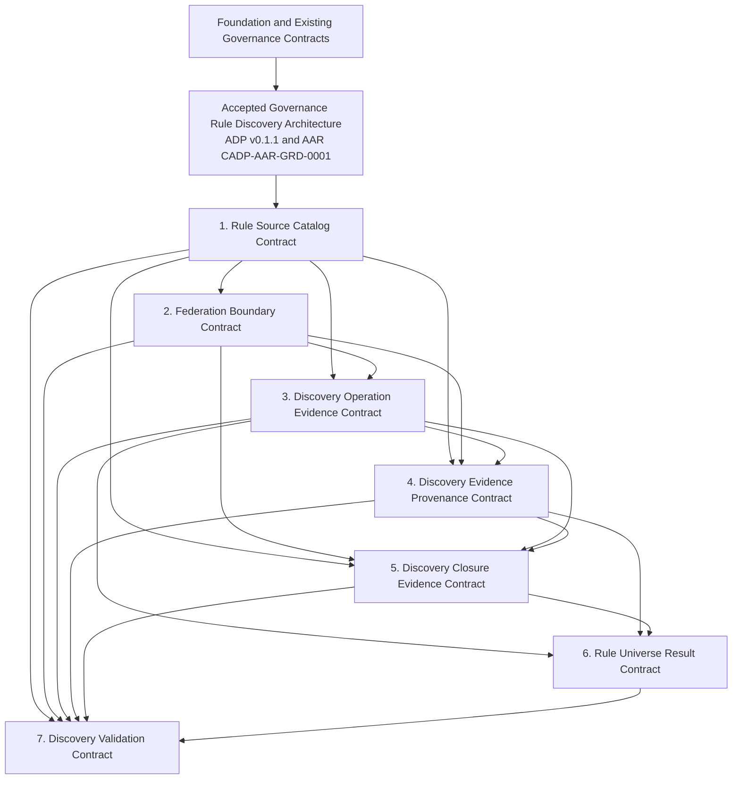

# Governance Rule Discovery Contract Decomposition Plan

## 1. Document Control

| Field | Value |
| --- | --- |
| Document type | Contract Decomposition Plan |
| Version | 0.2.0 |
| Status | Draft planning artifact |
| Date | 2026-07-25 |
| Architecture domain | Governance Rule Discovery |
| Repository | `dchaschin79-sys/cliff-ai-development-platform` |
| Branch | `main` |
| Planning baseline | `b5feb2bd00f21e955070c8d8a202117972c5eb1f` |
| Revision baseline | `cc6acb1a4242e048c44d00cdba3e6a9780e965dc` |
| Revision basis | Architecture Conformance Analysis final verdict: `SPLIT INTO TWO CONTRACTS` |
| Accepted architecture | Governed Bounded-Closed Federation |
| Architecture Acceptance Record | `CADP-AAR-GRD-0001`, Version 1.0.0, Git object `19995bca6768b1de01c3db2055bc618404dbc9ec` |
| Referenced ADP | Version 0.1.1, Git object `5fc17613f5ef78fb5f546f17bdeded75465da9c0` |
| Contract effect | None |
| Architecture effect | None |
| Implementation authority | None |

This document plans the authorized Contract Design phase. It is not a contract, does not create a contract, and does not define contract semantics, fields, schemas, interfaces, APIs, storage, runtime behavior, or implementation.

Candidate contract names in this plan are working labels for review. They do not establish canonical identities, repository locations, approval, effectiveness, or final packaging.

## 2. Purpose and Decision Boundary

The purpose of this plan is to allocate the accepted Governance Rule Discovery architecture into reviewable candidate contract domains while preserving one coherent semantic ownership boundary.

The plan identifies:

- candidate contract boundaries;
- proposed canonical ownership allocation;
- dependency direction;
- consolidation opportunities;
- authoring, review, and acceptance order;
- Category B impact; and
- implementation-independent sequencing.

The accepted architecture and Decision Boundary remain unchanged. The [Governance Rule Discovery Architecture Decision Proposal](../architecture/GOVERNANCE_RULE_DISCOVERY_ARCHITECTURE_DECISION_PROPOSAL.md), Version 0.1.1, remains the architecture source. The [Architecture Acceptance Record](../architecture/GOVERNANCE_RULE_DISCOVERY_ARCHITECTURE_ACCEPTANCE_RECORD.md) authorizes Contract Design only.

## 3. Decomposition Principles

The Contract Design phase shall preserve these planning constraints:

1. every semantic responsibility has one canonical owner;
2. no two contracts independently define the same semantic responsibility;
3. dependencies are directed and acyclic;
4. a downstream contract consumes upstream meanings without redefining them;
5. each recommended contract has one primary responsibility;
6. representation, evidence production, and validation may be distributed without distributing semantic ownership;
7. Foundation, Universal Eligibility, Governance Authority, Governance Applicability, Policy Decision, lifecycle, approval, Canonical Artifact, and Design Freeze ownership remain outside Governance Rule Discovery;
8. contract packaging does not create authority, lifecycle state, or implementation authority;
9. Category B uncertainty remains explicit and unresolved; and
10. Category C work remains outside the Decision Boundary.

## 4. Candidate Evaluation Method

The 12 requested candidates are evaluated as possible ownership domains. Evaluation considers:

- whether the candidate has an independent primary responsibility;
- whether separation would duplicate or fragment accepted semantics;
- whether consolidation produces a clearer canonical owner;
- whether dependency direction remains acyclic;
- review complexity;
- likely implementation impact, expressed only as relative planning impact; and
- whether the candidate can remain technology- and provider-independent.

Relative implementation impact does not authorize implementation and does not prescribe any implementation structure.

## 5. Candidate Contract Evaluation

### 5.1 Candidate Summary

| # | Candidate | Recommended treatment | Planned canonical owner |
| --- | --- | --- | --- |
| 1 | Rule Source Descriptor | Consolidate | Rule Source Catalog Contract |
| 2 | Rule Source Registry | Consolidate | Rule Source Catalog Contract |
| 3 | Federation Root | Consolidate | Federation Boundary Contract |
| 4 | Source Resolver | Consolidate | Discovery Operation Evidence Contract |
| 5 | Discovery Manifest | Consolidate | Discovery Operation Evidence Contract |
| 6 | Rule Universe Snapshot | Consolidate with complete and incomplete result ownership | Rule Universe Result Contract |
| 7 | Closure Evidence | Retain as a separate candidate | Discovery Closure Evidence Contract |
| 8 | Provenance Record | Consolidate with discovery-specific temporal coherence | Discovery Evidence Provenance Contract |
| 9 | Temporal Binding | Consolidate with discovery evidence lineage | Discovery Evidence Provenance Contract |
| 10 | Discovery Failure | Consolidate with result ownership | Rule Universe Result Contract |
| 11 | Cross Repository Composition | Consolidate | Federation Boundary Contract |
| 12 | Discovery Validation | Retain as a separate candidate | Discovery Validation Contract |

### 5.2 Rule Source Descriptor Candidate

| Planning concern | Assessment |
| --- | --- |
| Purpose | Bound the source-description responsibility needed by discovery. |
| Canonical semantic ownership | Consolidate under the Rule Source Catalog Contract. |
| Primary responsibility | Source identity and declaration boundary within the discovery catalog domain. |
| MUST NOT own | Authority, eligibility, approval, applicability, Policy Decision, discovery closure, result status, or canonical source content. |
| Expected dependencies | Foundation, accepted architecture, Canonical Artifact ownership, Universal Eligibility, Governance Authority, and applicable lifecycle evidence. |
| Consumers | Federation Boundary and Discovery Operation Evidence contract candidates. |
| Producers | Independently governed source owners and catalog-governance processes. |
| Future review complexity | Medium; identity and ownership boundaries require careful review against existing Canonical Artifact responsibilities. |
| Relative implementation impact | Medium; descriptive representations are likely to be broadly consumed, but no representation is selected here. |

Separate descriptor ownership would risk duplicating registry membership, identity, and lineage boundaries. Consolidation preserves one source-catalog owner while allowing distributed representations later.

### 5.3 Rule Source Registry Candidate

| Planning concern | Assessment |
| --- | --- |
| Purpose | Bound the catalog participation and governed source-reference responsibility. |
| Canonical semantic ownership | Consolidate under the Rule Source Catalog Contract. |
| Primary responsibility | Governed catalog membership and relationships among source declarations. |
| MUST NOT own | Source authority, approval, effectiveness, rule applicability, root authority, discovery closure, or implementation topology. |
| Expected dependencies | Rule Source Descriptor candidate responsibilities, Foundation registry boundaries, Canonical Artifact, Universal Eligibility, and Governance Authority. |
| Consumers | Federation Boundary and Discovery Operation Evidence contract candidates. |
| Producers | Independently governed catalog owners and source-declaration governance. |
| Future review complexity | High; registration must remain distinct from authority, canonical ownership, and adoption. |
| Relative implementation impact | High; registry projections may be widely used, but this plan selects no registry technology or topology. |

Descriptor and registry candidates should share one canonical source-catalog owner because their identity, membership, and relationship boundaries are inseparable for later federation review.

### 5.4 Federation Root Candidate

| Planning concern | Assessment |
| --- | --- |
| Purpose | Bound the starting discovery topology and its relationship to governed source catalogs. |
| Canonical semantic ownership | Consolidate under the Federation Boundary Contract. |
| Primary responsibility | Discovery-boundary topology and root or root-set participation. |
| MUST NOT own | Its own authority, source eligibility, source catalog identity, resolution activity, closure proof, result classification, or final rule applicability. |
| Expected dependencies | Rule Source Catalog Contract candidate, Governance Authority, Universal Eligibility, lifecycle, and accepted architecture. |
| Consumers | Discovery Operation Evidence, Discovery Evidence Provenance, and Discovery Closure Evidence contract candidates. |
| Producers | Separately governed boundary-authority processes. |
| Future review complexity | High; root authority, topology, and composition remain Category B concerns. |
| Relative implementation impact | High; topology affects discovery coordination, but no mechanism is selected here. |

Root and cross-repository composition responsibilities should be reviewed under one federation-boundary owner so local and composed boundaries cannot diverge.

### 5.5 Source Resolver Candidate

| Planning concern | Assessment |
| --- | --- |
| Purpose | Bound evidence about source-resolution activity without defining a resolver implementation. |
| Canonical semantic ownership | Consolidate under the Discovery Operation Evidence Contract. |
| Primary responsibility | Operation-bound evidence that governed source routes were processed. |
| MUST NOT own | Source authority, eligibility policy, canonical source identity, route membership, closure proof, applicability, or Policy Decision. |
| Expected dependencies | Rule Source Catalog and Federation Boundary contract candidates, Universal Eligibility, Canonical Artifact, and provenance ownership. |
| Consumers | Discovery Evidence Provenance, Discovery Closure Evidence, Rule Universe Result, and Discovery Validation contract candidates. |
| Producers | Future replaceable discovery mechanisms operating under approved contracts. |
| Future review complexity | Medium; review must keep activity evidence separate from claims of completeness. |
| Relative implementation impact | High; future mechanisms may vary substantially, but their variation cannot alter contract ownership. |

Resolution activity and Discovery Manifest evidence belong together. A separate resolver contract would risk converting an implementation responsibility into a semantic owner.

### 5.6 Discovery Manifest Candidate

| Planning concern | Assessment |
| --- | --- |
| Purpose | Bound the operation-level record of a discovery attempt. |
| Canonical semantic ownership | Consolidate under the Discovery Operation Evidence Contract. |
| Primary responsibility | Attributable evidence of one discovery attempt and its relationship to the fixed boundary. |
| MUST NOT own | Federation membership, source authority, closure meaning, complete or incomplete result meaning, applicability, or final decision outcomes. |
| Expected dependencies | Rule Source Catalog, Federation Boundary, and upstream eligibility and authority results. |
| Consumers | Discovery Evidence Provenance, Discovery Closure Evidence, Rule Universe Result, Discovery Validation, audit, and review. |
| Producers | Future discovery activity governed by the accepted contract set. |
| Future review complexity | Medium; manifest evidence must not prove its own completeness. |
| Relative implementation impact | High; evidence capture will affect later implementations, but no format or transport is selected here. |

### 5.7 Rule Universe Snapshot Candidate

| Planning concern | Assessment |
| --- | --- |
| Purpose | Bound the result-artifact responsibility associated with a discovery attempt. |
| Canonical semantic ownership | Consolidate under the Rule Universe Result Contract together with Discovery Failure. |
| Primary responsibility | Complete-versus-incomplete discovery result ownership as one coherent domain. |
| MUST NOT own | Closure evidence production, source authority, applicability, Policy Decision outcomes, lifecycle, storage, or serialization. |
| Expected dependencies | Discovery Operation Evidence, Discovery Evidence Provenance, and Discovery Closure Evidence contract candidates. |
| Consumers | Governance Applicability for eligible complete results; audit, remediation, review, and reassessment for incomplete results; Discovery Validation for both. |
| Producers | Future contract-conforming discovery processes. |
| Future review complexity | High; review must preserve the accepted complete/incomplete artifact separation. |
| Relative implementation impact | High; downstream consumers depend on the result boundary, but no artifact representation is selected here. |

A complete snapshot and an incomplete discovery result require one result owner. Separate semantic owners would recreate the inconsistency resolved during architecture review.

### 5.8 Closure Evidence Candidate

| Planning concern | Assessment |
| --- | --- |
| Purpose | Bound the evidence domain supporting a discovery closure assessment. |
| Canonical semantic ownership | Retain under the Discovery Closure Evidence Contract. |
| Primary responsibility | Evidence basis for closure assessment within the accepted discovery boundary. |
| MUST NOT own | Federation topology, source authority, eligibility, result classification, downstream applicability, or Policy Decision. |
| Expected dependencies | Rule Source Catalog, Federation Boundary, Discovery Operation Evidence, and Discovery Evidence Provenance contract candidates. |
| Consumers | Rule Universe Result and Discovery Validation contract candidates; audit and review. |
| Producers | Future eligible evidence sources and discovery processes. |
| Future review complexity | Very high; multiple Category B items affect evidence sufficiency and independence. |
| Relative implementation impact | High; evidence acquisition may be complex, but mechanisms remain undecided. |

### 5.9 Provenance Record Candidate

| Planning concern | Assessment |
| --- | --- |
| Purpose | Bound attributable lineage across discovery evidence. |
| Canonical semantic ownership | Consolidate under the Discovery Evidence Provenance Contract. |
| Primary responsibility | Discovery-specific lineage and attribution across discovery evidence. |
| MUST NOT own | Canonical Artifact identity, authority, approval, result classification, applicability, or storage technology. |
| Expected dependencies | Canonical Artifact ownership and every upstream discovery contract candidate whose evidence participates in lineage. |
| Consumers | Discovery Closure Evidence, Rule Universe Result, Discovery Validation, audit, review, and historical reconstruction. |
| Producers | Source catalogs, federation-boundary evidence, and discovery-operation evidence. |
| Future review complexity | High; boundaries with Canonical Artifact provenance must be explicit and non-duplicative. |
| Relative implementation impact | High; provenance is cross-cutting, but representation may remain distributed. |

Provenance may be represented across several artifacts without acquiring multiple semantic owners.

### 5.10 Temporal Binding Candidate

| Planning concern | Assessment |
| --- | --- |
| Purpose | Bound discovery-specific temporal and revision evidence. |
| Canonical semantic ownership | Consolidate under the Discovery Evidence Provenance Contract. |
| Primary responsibility | Temporal coherence of discovery evidence without redefining lifecycle or approval time. |
| MUST NOT own | Lifecycle states, effective intervals owned by lifecycle governance, approval validity, supersession, authority, or Policy Decision time semantics. |
| Expected dependencies | Governance Lifecycle, Approval Record, Canonical Artifact, Federation Boundary, and Discovery Operation Evidence ownership. |
| Consumers | Rule Universe Result, Discovery Validation, audit, and historical reconstruction. |
| Producers | Upstream canonical, lifecycle, authority, and discovery evidence sources. |
| Future review complexity | Very high; current, historical, cross-repository, and later-discovered evidence must remain orthogonal. |
| Relative implementation impact | High; consistent temporal evidence affects many future consumers, but no clock, transaction, or persistence model is selected. |

Temporal Binding remains a supporting responsibility within discovery evidence provenance because it qualifies the lineage and attribution of discovery evidence. It does not become a second primary responsibility: discovery-specific temporal and revision coherence has no independent meaning in this plan apart from the evidence lineage it qualifies. Discovery Closure Evidence consumes the resulting exact, temporally coherent provenance without owning or redefining it. Lifecycle state, approval validity, authority time, and other externally governed temporal meanings remain outside both contracts.

### 5.11 Discovery Failure Candidate

| Planning concern | Assessment |
| --- | --- |
| Purpose | Bound the result treatment of an unsuccessful or unresolved discovery attempt. |
| Canonical semantic ownership | Consolidate under the Rule Universe Result Contract. |
| Primary responsibility | Incomplete discovery result ownership alongside complete result ownership. |
| MUST NOT own | Failure detection mechanisms, closure-evidence sufficiency, authority, applicability, Policy Decision, retry behavior, resilience design, or operations. |
| Expected dependencies | Discovery Operation Evidence, Discovery Evidence Provenance, and Discovery Closure Evidence contract candidates. |
| Consumers | Eligible diagnostics, audit, remediation, review, reassessment, and Discovery Validation. |
| Producers | Future contract-conforming discovery processes. |
| Future review complexity | High; failure evidence must remain immutable and cannot become a permissive complete result. |
| Relative implementation impact | Medium to high; future error handling will consume this boundary, but no workflow is prescribed. |

Discovery Failure should not become a separate canonical result system. Consolidation with Rule Universe Snapshot preserves one complete-versus-incomplete owner.

### 5.12 Cross Repository Composition Candidate

| Planning concern | Assessment |
| --- | --- |
| Purpose | Bound composition across independently governed repository and shared-source boundaries. |
| Canonical semantic ownership | Consolidate under the Federation Boundary Contract. |
| Primary responsibility | Federated boundary composition across repository scopes. |
| MUST NOT own | Repository-local canonical artifacts, Product Binding semantics, synchronization, transport, transaction design, source authority, or result classification. |
| Expected dependencies | Rule Source Catalog, Canonical Artifact, Product Binding where separately approved, Governance Authority, and temporal evidence ownership. |
| Consumers | Discovery Operation Evidence, Discovery Evidence Provenance, and Discovery Closure Evidence contract candidates. |
| Producers | Independently governed repository and shared-boundary owners. |
| Future review complexity | Very high; cross-repository consistency remains Category B. |
| Relative implementation impact | Very high; coordination may be substantial, but no synchronization or service model is selected. |

### 5.13 Discovery Validation Candidate

| Planning concern | Assessment |
| --- | --- |
| Purpose | Bound independent conformance evaluation of Governance Rule Discovery contract evidence. |
| Canonical semantic ownership | Retain as the Discovery Validation Contract candidate. |
| Primary responsibility | Validation-result and conformance-evidence ownership for the discovery contract set. |
| MUST NOT own | The semantics it validates, authority, eligibility, closure, result meaning, lifecycle, approval, implementation control, or remediation policy. |
| Expected dependencies | Every accepted Governance Rule Discovery contract and applicable platform validation governance. |
| Consumers | Contract review, governance review, audit, and future operation-specific Policy Decision processes where separately authorized. |
| Producers | Independent validators operating under later approved validation governance. |
| Future review complexity | High; validation must remain non-authorizing and cannot redefine upstream contracts. |
| Relative implementation impact | Medium; validation can be implemented independently after contract acceptance, but no validation engine or test design is authorized here. |

## 6. Recommended Contract Set

The 12 evaluated candidates should be consolidated into seven planned canonical contract domains.

| Order | Working candidate name | Primary responsibility | Consolidated candidates |
| --- | --- | --- | --- |
| 1 | Rule Source Catalog Contract | Governed source declaration, identity, catalog membership, and catalog relationships for discovery | Rule Source Descriptor; Rule Source Registry |
| 2 | Federation Boundary Contract | Root or root-set discovery topology and cross-repository boundary composition | Federation Root; Cross Repository Composition |
| 3 | Discovery Operation Evidence Contract | Attributable evidence of one source-resolution and discovery attempt | Source Resolver; Discovery Manifest |
| 4 | Discovery Evidence Provenance Contract | Discovery-specific lineage, attribution, and the temporal and revision coherence that qualifies that lineage | Provenance Record; Temporal Binding |
| 5 | Discovery Closure Evidence Contract | Evidence basis supporting closure assessment within one accepted discovery boundary | Closure Evidence |
| 6 | Rule Universe Result Contract | One canonical complete-versus-incomplete discovery-result boundary | Rule Universe Snapshot; Discovery Failure |
| 7 | Discovery Validation Contract | Independent conformance evidence for the accepted discovery contract set | Discovery Validation |

Discovery Evidence Provenance and Discovery Closure Evidence are independent primary responsibilities. Provenance establishes attributable lineage and the temporal coherence that qualifies that lineage; closure evidence supports a closure assessment by consuming that provenance together with the bounded discovery evidence. Their dependency does not transfer or duplicate ownership. Their order in this plan follows dependency direction, not relative authority.

This recommendation is a decomposition decision for authoring and review planning only. It does not create the seven contracts, approve their names, define their contents, or prevent later consolidation during contract review if canonical ownership remains singular and the accepted architecture remains unchanged.

## 7. Canonical Semantic Ownership Map

| Semantic responsibility area | Planned owner | Explicit upstream or external owner retained |
| --- | --- | --- |
| Discovery source catalog boundary | Rule Source Catalog Contract | Canonical Artifact, Universal Eligibility, Governance Authority, lifecycle, and source-domain ownership |
| Federation discovery boundary | Federation Boundary Contract | Governance Authority, Universal Eligibility, Product Binding, Canonical Artifact, and repository-local governance |
| Discovery-attempt evidence | Discovery Operation Evidence Contract | Source and boundary meanings remain upstream |
| Discovery evidence lineage, attribution, and discovery-specific temporal coherence | Discovery Evidence Provenance Contract | Canonical Artifact provenance, lifecycle, approval, authority, eligibility, and externally governed time semantics retain their meanings |
| Closure-supporting evidence | Discovery Closure Evidence Contract | Discovery evidence provenance remains upstream; result classification, applicability, and Policy Decision remain downstream |
| Complete and incomplete discovery results | Rule Universe Result Contract | Closure evidence remains upstream; applicability and Policy Decision remain downstream |
| Contract conformance evidence | Discovery Validation Contract | Every validated semantic remains owned by its source contract |

No contract in this plan owns the full Governance Rule Discovery architecture independently. The seven candidates divide primary contract responsibilities beneath the single architecture-level semantic ownership boundary accepted by the AAR.

## 8. Dependency Graph

The graph records semantic dependency direction, not execution sequence or implementation topology. An upstream contract does not authorize a downstream contract, and downstream acceptance cannot repair missing upstream ownership or approval.

No reverse semantic dependency is permitted. Review feedback may require an upstream revision, but such revision follows change control and does not create cyclic ownership.

## 9. Contract Creation Order

### 9.1 Recommended Order

1. **Rule Source Catalog Contract**
2. **Federation Boundary Contract**
3. **Discovery Operation Evidence Contract**
4. **Discovery Evidence Provenance Contract**
5. **Discovery Closure Evidence Contract**
6. **Rule Universe Result Contract**
7. **Discovery Validation Contract**

### 9.2 Rationale

- The source catalog boundary must be stable before federation membership can be reviewed.
- The federation boundary must be stable before operation evidence can be assessed against a bounded domain.
- Operation evidence must be bounded before its discovery-specific lineage and attribution can be reviewed.
- Discovery evidence provenance must be stable before closure evidence can depend on that provenance without acquiring lineage ownership.
- Closure evidence ownership must be stable before complete and incomplete result ownership can be reviewed.
- Validation consumes the accepted meanings of all preceding contracts and therefore comes last.

This order is implementation-independent. It does not require sequential software delivery, select a workflow, or authorize parallel or sequential implementation.

## 10. Authoring, Review, and Acceptance Order

| Stage | Required sequence | Review focus | Acceptance dependency |
| --- | --- | --- | --- |
| Authoring | C1 → C2 → C3 → C4 → C5 → C6 → C7 | Establish one primary responsibility and explicit exclusions for each candidate. | Authoring creates no acceptance. |
| Internal contract review | C1 → C2 → C3 → C4 → C5 → C6 → C7 | Verify architecture traceability, ownership singularity, dependency direction, and non-duplication. | Each review consumes the current reviewed upstream revision. |
| Independent contract review | C1 → C2 → C3 → C4 → C5 → C6 → C7 | Challenge boundary integrity, cross-contract consistency, Category B containment, fail-closed preservation, and provider neutrality. | Downstream independent review begins only after relevant upstream findings are resolved or explicitly bounded. |
| Contract acceptance | C1 → C2 → C3 → C4 → C5 → C6 → C7 | Record a separate human-governed decision for an exact contract revision and scope. | Downstream acceptance cannot establish or repair missing upstream acceptance. |

Authoring may overlap only where no unresolved upstream ownership question can affect the downstream candidate. Review and acceptance evidence remain separately attributable for each exact candidate revision.

No contract becomes Approved, Effective, Adopted, implemented, or Design Frozen merely because it appears in this order.

## 11. Category B Impact Map

This section maps the 19 accepted Category B items to planned contract domains. It does not resolve, narrow, reclassify, or transfer any Category B item.

| Category B item | Impacted planned contracts | Planning treatment |
| --- | --- | --- |
| GRD-01 — Artifact class governing the source-of-sources | Rule Source Catalog; Federation Boundary | Preserve for contract review; no artifact class selected. |
| GRD-02 — Higher authority eligible to establish or revise the boundary | Federation Boundary; Discovery Validation | Consume future eligible authority evidence; no authority assigned. |
| GRD-03 — One global root or independently governed roots | Federation Boundary | Preserve topology alternatives; no topology selected. |
| GRD-04 — Trust evidence for negative source declarations | Rule Source Catalog; Discovery Evidence Provenance; Discovery Closure Evidence; Discovery Validation | Preserve evidence uncertainty and future assurance review. |
| GRD-05 — Acyclic relationships and harmless bounded cycles | Rule Source Catalog; Federation Boundary; Discovery Operation Evidence; Discovery Validation | Preserve graph-policy uncertainty; no traversal rule selected. |
| GRD-06 — Restricted sources not disclosed to the requester | Discovery Operation Evidence; Discovery Evidence Provenance; Discovery Closure Evidence; Rule Universe Result; Discovery Validation | Preserve confidentiality and non-disclosing evidence boundary. |
| GRD-07 — External-incorporation decisions requiring legal or specialist review | Rule Source Catalog; Federation Boundary; Discovery Evidence Provenance; Discovery Closure Evidence; Discovery Validation | Preserve specialist-review allocation as future governance work. |
| GRD-08 — Jurisdiction, customer, contract, and tenant scope expression | Rule Source Catalog; Federation Boundary; Discovery Evidence Provenance; Discovery Closure Evidence | Preserve scope-expression uncertainty; no vocabulary selected. |
| GRD-09 — Later-discovered historically effective obligations | Discovery Evidence Provenance; Discovery Closure Evidence; Rule Universe Result; Discovery Validation | Preserve historical evidence and future reassessment boundary. |
| GRD-10 — Alias, mirror, translation, and derived-source reconciliation | Rule Source Catalog; Discovery Evidence Provenance; Discovery Closure Evidence; Discovery Validation | Preserve identity-reconciliation uncertainty under Canonical Artifact ownership. |
| GRD-11 — Conflict evidence allocation | Discovery Operation Evidence; Discovery Evidence Provenance; Discovery Closure Evidence; Rule Universe Result; Discovery Validation | Preserve domain allocation for later contract review; no precedence rule selected. |
| GRD-12 — Exact scope relationships across governance layers | Rule Source Catalog; Federation Boundary; Discovery Evidence Provenance; Discovery Closure Evidence | Preserve relationship-model uncertainty and external ownership. |
| GRD-13 — Minimum evidence for local completeness | Discovery Evidence Provenance; Discovery Closure Evidence; Rule Universe Result; Discovery Validation | Preserve evidence-threshold uncertainty; no threshold selected. |
| GRD-14 — Self-issued negative declarations or independent verification | Discovery Evidence Provenance; Discovery Closure Evidence; Discovery Validation | Preserve assurance-independence question; no reviewer model selected. |
| GRD-15 — Emergency source incorporation | Federation Boundary; Discovery Operation Evidence; Discovery Evidence Provenance; Discovery Closure Evidence; Rule Universe Result | Preserve prospective-change and emergency-governance separation. |
| GRD-17 — Legacy decisions without reconstructable boundaries | Discovery Evidence Provenance; Discovery Closure Evidence; Rule Universe Result; Discovery Validation | Preserve missing historical evidence; do not fabricate modern records. |
| GRD-18 — Fundamental non-delegable human decisions | Federation Boundary; Discovery Validation | Consume Authority and Delegation governance; assign no delegability rule. |
| GRD-19 — Registry topology and granularity | Rule Source Catalog; Federation Boundary | Preserve central, federated, and hybrid representation alternatives. |
| GRD-20 — Cross-repository snapshot consistency mechanism | Federation Boundary; Discovery Evidence Provenance; Discovery Closure Evidence; Rule Universe Result; Discovery Validation | Preserve mechanism choice; require later review without selecting a consistency model. |

Category B ownership remains with the future governance forums identified by the accepted ADP. “Impacted planned contracts” identifies where unresolved questions must remain visible during authoring and review; it does not make those contracts the owner of the deferred question.

## 12. Category C Boundary

GRD-16, Cache Invalidation Detail, and GRD-21, Formal Comparative Weighting, remain outside the Decision Boundary.

No recommended contract may silently resolve or introduce either Category C topic during this Contract Design phase. A later separately authorized governance action is required before either topic may enter scope.

## 13. Cross-Contract Review Controls

Every candidate contract review should verify:

- one canonical semantic owner for each responsibility;
- no duplicated meanings across candidates;
- no reverse or cyclic semantic dependency;
- no redefinition of Foundation or existing contract ownership;
- no collapse of Universal Eligibility into Governance Authority;
- no collapse of Discovery into Governance Applicability or Policy Decision;
- preservation of complete-versus-incomplete result separation;
- preservation of fail-closed behavior, immutable history, provenance, deterministic composition, and provider neutrality;
- explicit visibility of impacted Category B items;
- continued exclusion of Category C;
- absence of implementation, schema, API, storage, service, workflow, or vendor design; and
- exact revision traceability.

These are review-planning criteria. They are not substitute contract semantics or acceptance decisions.

## 14. Implementation Independence

The recommended decomposition does not select or require:

- a programming language;
- an AI or model provider;
- a policy engine;
- a repository host;
- a database;
- a storage system;
- an API style;
- a schema language;
- a serialization format;
- a workflow engine;
- a service topology;
- a network protocol;
- a deployment model;
- a synchronization mechanism;
- a transaction model;
- a validation engine; or
- a user interface.

Future implementations may distribute representations and evidence processing across replaceable components. They may not change the canonical ownership or dependency direction established by later accepted contracts.

## 15. Plan Recommendation

Proceed with seven planned contract candidates in the order recorded in Sections 9 and 10:

1. Rule Source Catalog Contract;
2. Federation Boundary Contract;
3. Discovery Operation Evidence Contract;
4. Discovery Evidence Provenance Contract;
5. Discovery Closure Evidence Contract;
6. Rule Universe Result Contract; and
7. Discovery Validation Contract.

Continue with the Discovery Evidence Provenance Contract candidate only after a separate authoring task binds its exact scope to this revised plan and the accepted architecture. Existing completed contract artifacts remain unchanged.

This recommendation authorizes no contract content, approval, effectiveness, adoption, implementation, migration, deployment, production use, or Design Freeze.

## 16. Quality Gate Record

| Quality criterion | Plan result |
| --- | --- |
| Exactly one planning file modified | Satisfied |
| Contracts created | None |
| Contract semantics defined | None |
| Contract fields defined | None |
| Schemas defined | None |
| APIs defined | None |
| Storage defined | None |
| Implementation defined | None |
| Foundation Architecture changed | No |
| Contract Governance Framework changed | No |
| Accepted architecture changed | No |
| Decision Boundary changed | No |
| Category B resolved or reclassified | No |
| Category C moved into scope | No |
| One primary responsibility per planned contract | Satisfied |
| Dependency graph directed and acyclic | Satisfied |
| Duplicated semantic ownership introduced | No |
| Orphaned semantic responsibility introduced | No |
| Existing completed contracts changed | No |
| Next activity | Separate authoring task for the Discovery Evidence Provenance Contract candidate |
